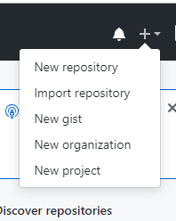

项目基础及工具
==========================

| Tedu Python 教学部 |
| --- |
| Author：吕泽|
| Days：3天|

-----------

[TOC]


## GIT简介

1. 什么是GIT

> git是一个开源的分布式版本控制系统，用于高效的管理各种大小项目和文件。

2. 代码管理工具的用途

>* 防止代码丢失，做备份
>* 项目的版本管理和控制，可以通过设置节点进行跳转
>* 建立各自的开发环境分支，互不影响，方便合并
>* 在多终端开发时，方便代码的相互传输

3. git的特点

>* git是开源的，多在*nix下使用，可以管理各种文件
>* git是分布式的项目管理工具(svn是集中式的)
>* git数据管理更多样化，分享速度快，数据安全
>* git 拥有更好的分支支持，方便多人协调

4. git安装

> sudo apt-get install git

## GIT使用


### 基本概念

* 工作区(workspace)：项目所在操作目录，实际操作项目的区域
* 暂存区(index): 用于记录工作区的工作（修改）内容
* 仓库区(repository): 用于备份工作区的内容
* 远程仓库(remote): 远程主机上的GIT仓库

>注意： 在本地仓库中，git总是希望工作区的内容与仓库区保持一致，而且只有仓库区的内容才能和其他远程仓库交互。

### 初始配置

>配置命令: git config

>* 配置所有用户： git config --system [选项]
>> 配置文件位置:  /etc/gitconfig

>* 配置当前用户： git config --global [选项]
>> 配置文件位置:  ~/.gitconfig

>* 配置当前项目： git config  [选项]
>> 配置文件位置:  project/.git/config

1. 配置用户名

```
e.g. 将用户名设置为Tedu
sudo git config --system user.name Tedu
```

2. 配置用户邮箱

```
e.g. 将邮箱设置为lvze@tedu.cn
git config --global user.email lvze@tedu.cn
```

3. 配置编译器

```
e.g. 配置编译器为pycharm
git config core.editor pycharm

```

4. 查看配置信息

```
git config --list
```

git配置:


初始化仓库:


### 基本命令

1. 初始化仓库

> git  init 
> 意义：将某个项目目录变为git操作目录，生成git本地仓库。即该项目目录可以使用git管理

2. 查看本地仓库状态

> git  status
> 说明: 初始化仓库后默认工作在master分支，当工作区与仓库区不一致时会有提示。
>
> 
>
> 
>
> 

3. 将工作内容记录到暂存区

> git add [files..]

```
e.g. 将 a ，b 记录到暂存区
git add  a b

e.g. 将所有文件（不包含隐藏文件）记录到暂存区
git add  *
```

#### @扩展延伸
在Git项目中可以通过在项目的某个文件夹下定义.gitignore文件的方式，规定相应的忽略规则，用来管理当前文件夹下的文件的Git提交行为。.gitignore 文件是可以提交到公有仓库中，这就为该项目下的所有开发者都共享一套定义好的忽略规则。在.gitignore 文件中，遵循相应的语法，在每一行指定一个忽略规则。

```python
.gitignore忽略规则简单说明

file            表示忽略file文件
*.a             表示忽略所有 .a 结尾的文件
!lib.a          表示但lib.a除外
build/          表示忽略 build/目录下的所有文件，过滤整个build文件夹；

```

4.取消文件暂存记录

>  git rm --cached [file] 

5. 将文件同步到本地仓库

> git commit [file] -m [message]
> 说明: -m表示添加一些同步信息，表达同步内容

```
e.g.  将暂存区所有记录同步到仓库区
git commit  -m 'add files'
```

6. 查看commit 日志记录

> git log
> git log --pretty=oneline

7. 比较工作区文件和仓库文件差异

> git diff  [file]
>
> 

8. 将暂存区或者某个commit点文件恢复到工作区

> git checkout [commit] -- [file]
>
> * --是为了防止误操作，checkout还有切换分支的作用

9. 移动或者删除文件

> git  mv  [file] [path]
> git  rm  [files]
> 注意: 这两个操作会修改工作区内容，同时将操作记录提交到暂存区。
>
> 

------------------------------

### 版本控制

1. 退回到上一个commit节点

> git reset --hard HEAD^
> 注意 ： 一个^表示回退1个版本，依次类推。当版本回退之后工作区会自动和当前commit版本保持一致
>
> 

2. 退回到指定的commit_id节点

> git reset --hard [commit_id]
>
> 

3. 查看所有操作记录

>git reflog
>注意:最上面的为最新记录，可以利用commit_id去往任何操作位置
>
>

4. 创建标签

>标签: 在项目的重要commit位置添加快照，保存当时的工作状态，一般用于版本的迭代。

> git  tag  [tag_name] [commit_id] -m  [message]
> 说明: commit_id可以不写则默认标签表示最新的commit_id位置，message也可以不写，但是最好添加。
>
> 

```
e.g. 在最新的commit处添加标签v1.0
git tag v1.0 -m '版本1'
```

5. 查看标签

>git tag  查看标签列表
>git show [tag_name]  查看标签详细信息

6. 去往某个标签节点

> git reset --hard [tag]

7. 删除标签

> git tag -d  [tag]
>
> 


### 保存工作区

1.  保存工作区内容

> git stash save [message]
> 说明: 将工作区未提交的修改封存，让工作区回到修改前的状态

2. 查看工作区列表

> git stash  list
> 说明:最新保存的工作区在最上面

3. 应用某个工作区

> git stash  apply  [stash@{n}]

4. 删除工作区

> git stash drop [stash@{n}]  删除某一个工作区
> git stash clear  删除所有保存的工作区


### 分支管理

>定义: 分支即每个人在原有代码（分支）的基础上建立自己的工作环境，单独开发，互不干扰。完成开发工作后再进行分支统一合并。

1. 查看分支情况

> git branch
> 说明: 前面带 * 的分支表示当前工作分支
>
> 

2. 创建分支

> git branch [branch_name]
> 说明: 基于a分支创建b分支，此时b分支会拥有a分支全部内容。在创建b分支时最好保持a分支"干净"状态。
>
> 

3. 切换工作分支

> git checkout [branch]
> 说明: 2,3可以同时操作，即创建并切换分支
>
> > git checkout -b [branch_name]
> >
> > 
> >
> > 

4. 合并分支

> git merge [branch]

> 冲突问题是合并分支过程中最为棘手的问题
> > 当分支合并时，原分支和以前发生了变化就会产生冲突
> > 当合并分支时添加新的模块（文件），这种冲突可以自动解决，只需自己决定commit操作即可。
> > 当合并分支时两个分支修改了同一个文件，则需要手动解决冲突。(**PS**:二次合并会产生冲突,需要git add 和commit一下,如果master发送改变,第二次合并失败-需要人为修改,完事在git add commit),避免同一个文件被多个分支修改.
> >
> > 
> >
> > 

5. 删除分支

> git branch -d [branch]  删除已经合并了的分支
>
> 
>
> git branch -D [branch]  删除没有被合并的分支


### 远程仓库

> 远程主机上的git仓库。实际上git是分布式结构，每台主机的git仓库结构类似，只是把别人主机上的git仓库称为远程仓库。

### GitHub介绍

>github是一个开源的项目社区网站，拥有全球最多的开源项目。开发者可以注册网站在github建立自己的项目仓库。

>网址： github.com

>代码管理工具：git

### 获取项目

* 在左上角搜索栏搜索想要的获取的项目


* 选择项目后复制项目git地址


* 在本地使用git clone方法即可获取

```
git clone https://github.com/xxxxxxxxx
```

> 注意： 获取到本地的项目会自动和github远程仓库建立连接。且获取的项目本身也是个git项目。
>
> 

### 创建删除git仓库

* 点击右上角加号下拉菜单，选择新的仓库



* 填写相应的项目信息即可

* github仓库相对本地主机就是一个远程仓库 通过remote连接，如果需要输入密码输入github密码即可。连接后即可使用远程仓库操作命令操作。readme文件会被自动作为项目介绍
  
* 如果是在自己的仓库界面选择settings，在最后可以选择删除仓库。


### 远程仓库操作命令

所有操作在本地git仓库下进行

1. 添加远程仓库

```python
git remote  add origin https://github.com/xxxxxxxxx
```

2. 查看连接的主机

>git remote
>注意: 一个git项目连接的远程主机名不会重复

3. 删除远程主机

>git remote rm [origin]

4. 将本地分支推送给远程仓库

将master分支推送给origin主机远程仓库，第一次推送分支使用-u表示与远程对应分支建立自动关联


```
git push -u origin  master
ps:首次上传必须得用-u建立起本地和远程的连接
```


5. 推送代码到远程仓库

```
git push
```

6. 推送标签

> git push origin [tag]  推送本地标签到远程

> git push origin --tags  推送本地所有标签到远程
>
> 

7. 推送旧的版本

> git push --force origin  用于本地版本比远程版本旧时强行推送本地版本(**原因1:本地git reset --head^前面的版本,所以本地的版本要比远程仓库里面的版本低,所以要强行推送,原因2:远程发生仓库修改,相对来说本地版本要比远程版本低,所以要进行强退,否则会发生如下内容:**)
>
> 

8. 删除远程分支和标签

> git branch -a  查看所有分支
> git push origin  [:branch]  删除远程分支
> git push origin --delete tag  [tagname]  删除远程仓库标签
>
> 

9. 从远程获取代码

获取远程分支代码
> git pull 

将远程分支master拉取到本地，作为tmp分支
> git fetch origin  master:tmp  

> **区别**
>
> > pull将远程内容直接拉取到本地，并和对应分支内容进行合并
> > fetch将远程分支内容拉取到本地，但是不会和本地对应分支合并，可以自己判断后再使用merge合并。
> >
> > 
> >
> > - 公钥 
> >
> > 
> >
> > 
> >
> > 
> >
> > 


## 软件项目开发流程

```
需求分析 ----》 概要设计  ---》 项目计划 ----》详细设计---》编码测试 -----》项目测试 ----》调试修改 ---》项目发布----》后期维护
```

>需求分析 ： 确定用户的真实需求 
>>1. 确定用户的真实需求，项目的基本功能
>>2. 确定项目的整体难度和可行性分析
>>3. 需求分析文档，用户确认

>概要设计：对项目进行初步分析和整体设计
>>1. 确定功能模块
>>2. 进行可行性分析 搭建整体架构图
>>3. 确定技术思路和使用框架
>>4. 形成概要文档指导开发流程

>项目计划 ： 确定项目开发的时间轴和流程
>>1. 确定开发工作的先后顺序
>>2. 确定时间轴  ，事件里程碑
>>3. 人员分工 
>>4. 形成甘特图和思维导图等辅助内容

>详细设计 ： 项目的具体实现
>
>>1.形成详细设计文档 ： 思路，逻辑流程，功能说明，技术点说明，数据结构说明，代码说明

>编码测试 ： 按照预定计划实现代码编写，并且做基本检测
>>1. 代码编写
>>2. 写测试程序
>>3. 技术攻关

>项目测试 ： 对项目按照功能进行测试
>>1. 跨平台测试 ，使用测试
>>2. 根据测试报告进行代码修改
>>3. 完成测试报告

>项目发布
>>1.项目交付用户进行发布
>>2.编写项目说明文档

>后期维护
>>1.维护项目正常运转
>>2.进行项目的迭代升级

### 项目注意事项
* 按时完成项目工作和项目时间不足之间的冲突
* 项目实施人员之间的冲突

### 项目工具的使用
编写文档： word  ppt  excel  markdown   LaTex
项目流程图 ： Mindmanager  visio
项目管理 ： project
代码管理 ： svn   git

## 在线词典

***参考代码：day18/dict***

### 功能说明

>用户可以登录和注册

	    * 登录凭借用户名和密码登录
	
	* 注册要求用户必须填写用户名，密码，其他内容自定
	* 用户名要求不能重复
	* 要求用户信息能够长期保存

>可以通过基本的图形界面print以提示客户端输入。
	* 程序分为服务端和客户端两部分
	* 客户端通过print打印简单界面输入命令发起请求
	* 服务端主要负责逻辑数据处理
	* 启动服务端后应该能满足多个客户端同时操作

>客户端启动后即进入一级界面，包含如下功能：登录    注册    退出

	* 退出后即退出该软件
	* 登录成功即进入二级界面，失败回到一级界面
	* 注册成功可以回到一级界面继续登录，也可以直接用注册用户进入二级界面

>用户登录后进入二级界面，功能如下：查单词    历史记录    注销

	* 选择注销则回到一级界面
	* 查单词：循环输入单词，得到单词解释，输入特殊符号退出单词查询状态
	* 历史记录：查询当前用户的查词记录，要求记录包含name   word   time。可以查看所有记录或者前10条均可。

设计方案:

```mysql
在线词典

  1. 建立整体的结构 （软件怎么用）

  2. 研究技术方案和确定细节

     确定并发方案？
       Process多进程

     什么样套接字？
       tcp 套接字

     二级界面结构？

  3. 数据库设计
     存什么 --》 怎么建立表 --》 建表

     用户信息： 用户名  密码
     单词 ： 单词  解释
     历史记录： 用户名  单词  时间

     words 建立索引：create index word_index on words(word);

     user: create table user (id int primary key auto_increment,name char(20) not null,passwd char(64) not null);
     历史记录（关系表）：create table user_words (id int primary key auto_increment,uid int,wid int,time datetime default now(),constraint `user_fk` foreign key (uid) references user(id),constraint `words_fk` foreign key (wid) references words(id));


  4. 结构设计： 如何封装，几个模块，每个模块功能

     客户端模块
     服务端逻辑功能模块
     服务端数据处理模块 （与数据库交互）

  5. 搭建通信 （通信协议）

  6. 具体功能分析，逐个实现模块

     并发通信
     注册
        客户端： 发送请求  等待结果  （失败/成功）
               R name passwd

        服务端： 接收请求判定请求类型
                根据请求类型调用功能函数
                (数据请求)
                将结果发送给客户端

     登录   L  name  passwd

     查单词  Q
         客户端  输入单词 发送请求 接收结果
         服务端  接收请求 查询单词 给客户端发送结果
                插入历史记录


     历史记录

cookie:

   hasattr(obj,attr)
   功能: 判定一个对象是否有某个属性


cookie

    import hashlib

    #生产hash对象
    hash = hashlib.md5()

    # 对密码进行加密
    hash.update(pwd.encode())

    # 提取加密后的密码
    pwd = hash.hexdigest()

cookie
    import getpass

    passwd = getpass.getpass()
    功能:隐藏输入

```


demon.py:

```python
def er():
    while True:
        print("二级界面")
        cmd = input(">>")
        if cmd == '1':
            print('lalal')
        elif cmd == '2':
            break

while True:
    print("一级界面")
    cmd = input(">>")
    if cmd == '1':
        er()
    elif cmd == '2':
        er()
    elif cmd == '3':
        break
```

demon1.py:

```python
import hashlib
import getpass

# pwd = input(">>")
pwd = getpass.getpass()

# 生产hash对象
# hash = hashlib.md5()
hash = hashlib.md5("*#06#".encode())  # 加盐生产对象

# 对密码进行加密
hash.update(pwd.encode())

# 提取加密后的密码
pwd = hash.hexdigest()

print(pwd)
```


dict_server.py:

```python
"""
dict  服务端
功能 ： 业务逻辑
模型 ： 多进程tcp并发
"""
from socket import *
from multiprocessing import Process
import sys,signal,time
from dict_db import Database

# 全局变量
HOST = '0.0.0.0'
PORT = 8888
ADDR = (HOST,PORT)
# 数据库链接对象
db = Database(user='root',passwd='123456',database='dict')

# 处理注册
def do_register(connfd,name,passwd):
    if db.register(name,passwd):
        connfd.send(b'OK')
    else:
        connfd.send(b'FAIL')

# 处理登录
def do_login(connfd,name,passwd):
    if db.login(name,passwd):
        connfd.send(b'OK')
    else:
        connfd.send(b'FAIL')


# 查询单词
def do_query(connfd,name,word):
    mean = db.query(word) # 负责查询单词
    # 查不到返回一个空
    if mean:
        msg = "%s : %s"%(word,mean)
        connfd.send(msg.encode())
        db.insert_history(name, word)  # 插入历史记录
    else:
        connfd.send("没有找到该单词".encode())


# 历史记录
def do_history(connfd,name):
    r = db.history(name) # ((word,time),())
    if not r:
        connfd.send(b"FAIL")
        return
    connfd.send(b'OK')
    for word,tm in r:
        msg = "%s   %-16s   %s"%(name,word,tm)
        time.sleep(0.1)
        connfd.send(msg.encode())
    time.sleep(0.1)
    connfd.send(b'##')


# 接收请求，调用具体功能函数处理
def request(connfd):
    db.create_cursor()
    while True:
        data = connfd.recv(1024).decode()
        tmp = data.split(' ')
        if not data or tmp[0] == 'E':
            return
        elif tmp[0] == 'R':
            # R name passwd
            do_register(connfd,tmp[1],tmp[2])
        elif tmp[0] == 'L':
            # L name passwd
            do_login(connfd,tmp[1],tmp[2])
        elif tmp[0] == 'Q':
            # Q name word
            do_query(connfd,tmp[1],tmp[2])
        elif tmp[0] == 'H':
            # H name
            do_history(connfd,tmp[1])


def main():
    # 创建tcp套接字
    s = socket()
    s.setsockopt(SOL_SOCKET, SO_REUSEADDR, 1)
    s.bind(ADDR)
    s.listen(3)

    signal.signal(signal.SIGCHLD, signal.SIG_IGN)
    print("Listen the port 8888...")
    # 循环接收客户端链接
    while True:
        try:
            c, addr = s.accept()
            print("Connect from", addr)
        except KeyboardInterrupt:
            db.close()
            sys.exit('服务器退出')
        except Exception as e:
            print(e)
            continue

        #  创建进程处理
        p = Process(target=request, args=(c,))
        p.daemon = True  # 父程退出其他线程也退出
        p.start()

if __name__ == '__main__':
    main()
```


dict_db.py:

```python
"""
dict 数据库处理功能
给server提供所有数据支持
"""
import pymysql
import hashlib

# 加密函数
def change_passwd(passwd):
    # 生产hash对象
    hash = hashlib.md5("*#06#".encode())  # 加盐生产对象
    # 对密码进行加密
    hash.update(passwd.encode())
    # 提取加密后的密码
    return hash.hexdigest()

class Database:
    def __init__(self,host='localhost',
                 port = 3306,
                 user=None,
                 passwd=None,
                 database=None,
                 charset='utf8'):
        self.host = host
        self.port = port
        self.user = user
        self.passwd = passwd
        self.database = database
        self.charset = charset
        self.connect_db() # 链接数据库

    def connect_db(self):
        self.db=pymysql.connect(host=self.host,
                              port=self.port,
                              user=self.user,
                              passwd=self.passwd,
                              database=self.database,
                              charset=self.charset)

    # 创建游标
    def create_cursor(self):
        self.cur = self.db.cursor()

    # 关闭数据库
    def close(self):
        # 如果有 cur这个属性则执行关闭
        if hasattr(self,'cur'):
            self.cur.close()
        if hasattr(self,'db'):
            self.db.close()

    # 处理注册
    def register(self,name,passwd):
        # 判断名是否重复
        sql = "select name from user where name='%s'" % name
        self.cur.execute(sql)
        result = self.cur.fetchone()  # 查不到返回None
        if result:
            return False
        try:
            # 密码转换
            passwd = change_passwd(passwd)
            sql = "insert into user (name,passwd) values (%s,%s);"
            self.cur.execute(sql, [name, passwd])
            self.db.commit()
            return True
        except:
            self.db.rollback()
            return False

    # 处理登录
    def login(self,name,passwd):
        passwd = change_passwd(passwd)
        sql = "select name from user " \
              "where name=%s and passwd=%s;"
        self.cur.execute(sql, [name, passwd])
        result = self.cur.fetchone()  # 如果查到说明用户存在
        if result:
            return True
        else:
            return False

    # 查询单词
    def query(self,word):
        sql = "select mean from words where word='%s'"%word
        self.cur.execute(sql)
        r = self.cur.fetchone() # (xxxxx) / None
        if r:
            return r[0]

    # 插入历史
    def insert_history(self,name,word):
        sql = "select id from user where name='%s'"%name
        self.cur.execute(sql)
        uid = self.cur.fetchone()[0]

        sql = "select id from words where word='%s'"%word
        self.cur.execute(sql)
        wid = self.cur.fetchone()[0]

        sql = "insert into user_words (uid,wid) values (%s,%s)"
        try:
            self.cur.execute(sql,[uid,wid])
            self.db.commit()
        except:
            self.db.rollback()

    # 查询历史记录
    def history(self,name):
        sql = "select word,h.time from words inner join (select wid,time from user_words where uid=(select id from user where name=%s) order by time desc limit 10) as h on words.id=h.wid;"
        self.cur.execute(sql,[name])
        # ((word,time),())
        return self.cur.fetchall()
    
if __name__ == '__main__':
    my_db = Database(user='root',passwd='123456',database='stu')
    my_db.close()
```


dict_client.py:

```python
"""
dict 客户端
功能： 根据用户输入，发送请求，得到结果，展示结果
"""
from socket import *
import sys
from getpass import getpass

# 服务器地址
ADDR = ('127.0.0.1',8888)

# 几乎所有函数都要使用s --》全局变量
s = socket()
try:
    s.connect(ADDR)
except:
    sys.exit()

# 查单词
def do_query(name):
    while True:
        word = input("单词:")
        if word == '##':
            break
        msg = "Q %s %s"%(name,word)
        s.send(msg.encode())
        # 接收结果
        data = s.recv(2048).decode()
        print(data)

# 历史记录 （最近10条）
def do_history(name):
    msg = "H "+name
    s.send(msg.encode())
    data = s.recv(128).decode() # 反馈
    if data == 'OK':
        # 不确定接收次数
        while True:
            data = s.recv(1024).decode()
            if data == '##':
                break
            print(data)
    else:
        print("您还没有查询记录")


def login(name):
    while True:
        print("""
        ==============Query==============
         1. 查单词   2. 历史记录    3. 注销
        =================================
        """)
        cmd = input("输入选项：")
        if cmd == '1':
            do_query(name)
        elif cmd == '2':
            do_history(name)
        elif cmd == '3':
            return
        else:
            print("请输入正确选项")

# 处理注册
def do_register():
    while True:
        name = input("User:")
        passwd = getpass()
        passwd_ = getpass("Again:")
        if passwd != passwd_:
            print("两次密码不一致!")
            continue
        if (' ' in name) or (' ' in passwd):
            print("用户名密码请不要加入空格")
            continue

        msg = "R %s %s"%(name,passwd)
        s.send(msg.encode()) # 发送请求
        data = s.recv(128).decode() # 收到结果
        if data == 'OK':
            print("注册成功")
        else:
            print("注册失败")
        return

# 处理登录
def do_login():
    name = input("User:")
    passwd = getpass()
    msg = "L %s %s" % (name, passwd)
    s.send(msg.encode())  # 发送请求
    data = s.recv(128).decode()  # 收到结果
    if data == 'OK':
        print("登录成功")
        login(name)
    else:
        print("登录失败")

# 程序启动函数
def main():
    while True:
        print("""
        ============Welcome============
         1. 注册    2. 登录     3. 退出
        ===============================
        """)
        cmd = input("输入选项：")
        if cmd == '1':
            do_register()
        elif cmd == '2':
            do_login()
        elif cmd == '3':
            s.send(b'E')
            sys.exit("谢谢使用")
        else:
            print("请输入正确选项")

if __name__ == '__main__':
    main()
```

加密:


/day17/1.png)

/day17/2.png)

/day17/branch.png)

/day17/git.png)


/day17/项目设计框架.png)

## HTTPServer

***参考代码：day19/HTTPServer***

### 功能 

>httpserver部分
>>获取http请求 
>>解析http请求
>>将请求发送给WebFrame
>>从WebFrame接收反馈数据
>>将数据组织为Response格式发送给客户端

>WebFrame部分
>>从httpserver接收具体请求
>>根据请求进行逻辑处理和数据处理
>>将需要的数据反馈给httpserver

>特点 
>>采用httpserver和应用处理分离的模式,降低了耦合度
>>采用了用户配置文件的思路
>>webframe部分采用了模拟后端框架的处理方法

>技术点
>>httpserver部分需要与两端建立通信
>>webFrame部分采用多路复用接收并发请求
>>数据传递使用json格式


项目结构： 
``` mysql
           |--httpserver --HttpServer.py (主程序)      
           |             --config (httpserver配置)   
  project--|
           |
           |
           |--WebFrame   --WebFrame.py (主程序代码)
                         --static （存放静态网页）
                         --views.py （ 应用处理程序） 
                         --urls.py （存放路由）
                         --settings （框架配置）
```

>交互数据格式协议

```mysql
httpserver-->webframe  {method:'GET',info:'/'}

webframe-->httpserver {status:'200',data:'ccccc'}
```

代码实现/home/tarena/teacher/month02/day19/httpserver.py:

```python
"""
httpserver部分主程序
获取http请求
解析http请求
将请求发送给WebFrame
从WebFrame接收反馈数据
将数据组织为Response格式发送给客户端
"""
"""
思路:
		1.服务启动函数sever_forever(多线程并发)
		2.handle处理函数,接受请求
"""
from socket import *
from threading import Thread
from config import *
import re
import json

# 与后端应用交互
def connect_frame(env):
    """
    将请求发送给WebFrame
    从WebFrame接收反馈数据
    """
    s = socket()
    try:
        s.connect((frame_ip, frame_port))
    except Exception as e:
        print(e)
        return
    # 发送json请求
    data = json.dumps(env)
    s.send(data.encode())
    # 获取返回的数据 (json格式)
    data = s.recv(1024 * 1024 * 10).decode()
    if data:
        try:
            result = json.loads(data)  # 返回字典
        except:
            pass
        return result


# 主体功能写入类
class HTTPServer:
    def __init__(self):
        self.address = (HOST, PORT)
        self.create_socket()
        self.bind()

    # 1.创建套接字
    def create_socket(self):
        self.sock = socket()
        self.sock.setsockopt(SOL_SOCKET,
                             SO_REUSEADDR,
                             DEBUG)

    # 2.绑定地址
    def bind(self):
        # 有些属性可以在调用函数时再生产
        self.host = HOST
        self.port = PORT
        self.sock.bind(self.address)

    # 服务启动函数 (多线程并发)
    def serve_forever(self):
        self.sock.listen(3)
        print("Listen the port %d" % self.port)
        while True:
            connfd, addr = self.sock.accept()
            print("Connect from", addr)
            t = Thread(target=self.handle,
                       args=(connfd,))
            t.setDaemon(True)
            t.start()

    # 处理具体的浏览器请求
    def handle(self, connfd):
        # http请求
        request = connfd.recv(4096).decode()
        pattern = r"(?P<method>[A-Z]+)\s+(?P<info>/\S*)"
        try:
            env = re.match(pattern, request).groupdict()
        except:
            connfd.close()
            return
        else:
            # 与webframe交互 (数据字典/None)
            data = connect_frame(env)
            if data:
                self.response(connfd, data)

    # 组织响应格式
    def response(self, connfd, data):
        # data->{'status':'200','data':'zzzz'}
        if data['status'] == '200':
            res="HTTP/1.1 200 OK\r\n"
            res+="Content-Type:text/html\r\n"
            res+="\r\n"
            res+=data['data']
        elif data['status'] == '404':
            res="HTTP/1.1 404 Not Found\r\n"
            res+="Content-Type:text/html\r\n"
            res+="\r\n"
            res+=data['data']
        connfd.send(res.encode()) # 响应给浏览器


if __name__ == '__main__':
    httpd = HTTPServer()
    httpd.serve_forever()  # 启动服务

```

代码实现/home/tarena/teacher/month02/day19/config.py:

```python
"""
httpserver部分配置文件
"""

# [http server address]  被浏览器访问
HOST           = '0.0.0.0'
PORT           = 8000

# 是否调试模式
DEBUG          = True

# [后端应用地址] 表明配合的webframe地址
frame_ip       = '127.0.0.1'
frame_port     = 8080
```

代码实现/home/tarena/teacher/month02/day19/httpserver/http_test.py:

```python
from socket import *
import json

s = socket()
s.bind(('127.0.0.1',8080))
s.listen(3)

while True:
    c,addr = s.accept()
    data = c.recv(1024).decode()
    print(data)
    data = json.dumps({'status':'200','data':'OK'})
    c.send(data.encode())
```

代码实现/home/tarena/teacher/month02/day19/webframe/webframe.py:

```python
"""
webframe  模拟网站应用做数据处理

从httpserver接收具体请求
根据请求进行逻辑处理和数据处理
将需要的数据反馈给httpserver
"""
from socket import *
import json
from threading import Thread
from settings import *
from urls import *


# 应用类
class Application:
    def __init__(self):
        self.host = frame_ip
        self.port = frame_port
        self.address = (frame_ip, frame_port)
        self.sock = socket()
        self.sock.setsockopt(SOL_SOCKET,
                             SO_REUSEADDR,
                             DEBUG)
        self.sock.bind(self.address)

    def start(self):
        self.sock.listen(3)
        print("Running web frame %d" % self.port)
        while True:
            connfd, addr = self.sock.accept()
            print("Connect from", addr)
            t = Thread(target=self.handle,
                       args=(connfd,))
            t.setDaemon(True)
            t.start()

    # 具体处理请求
    def handle(self, connfd):
        request = connfd.recv(1024).decode()
        request = json.loads(request)  # 请求字典
        # request --> {'method':'GET','info':'XXX'}
        # 判定请求类型
        if request['method'] == 'GET':
            if request['info'] == '/' or request['info'][-5:] == '.html':
                response = self.get_html(request['info'])
            else:
                response = self.get_data(request['info'])
        elif request['method'] == 'POST':
            pass
        # 将数据/网页给 httpserver
        # response => {'status':'200','data':'xxx'}
        response = json.dumps(response)
        connfd.send(response.encode())
        connfd.close()

    # 网页处理
    def get_html(self,info):
        if info == '/':
            filename = STATIC_DIR + '/index.html'
        else:
            filename = STATIC_DIR + info
        try:
            f = open(filename)
        except Exception as e:
            with open(STATIC_DIR+"/404.html") as fd:
                data = fd.read()
            return {'status':'404','data':data}
        else:
            data = f.read()
            f.close()
            return {'status':'200','data':data}

    # 其他处理
    def get_data(self,info):
        for url,func in urls:
            if url == info:
                return {'status':'200','data':func()}
        return {'status':'404','data':"Sorry..."}


if __name__ == '__main__':
    app = Application()
    app.start()  # 启动应用

```

代码实现/home/tarena/teacher/month02/day19/webframe/settings.py:

```python
"""
webframe 配置文件
"""
# [frame address]
frame_ip = '0.0.0.0'
frame_port = 8080

# [debug]
DEBUG = True

# [save html pages]
STATIC_DIR = "./static"


```

代码实现/home/tarena/teacher/month02/day19/webframe/urls.py:

```python
"""
路由选择模块
"""
from views import *

urls = [
    # 如果你访问'/time'这个路径，我有数据，
    # 用show_time这个方法给你提供
    ("/time",show_time),
    ("/hello",hello),
    ("/bye",bye),
]

```

代码实现/home/tarena/teacher/month02/day19/webframe/views.py:

```python
"""
路由选择模块
"""
from views import *

urls = [
    # 如果你访问'/time'这个路径，我有数据，
    # 用show_time这个方法给你提供
    ("/time",show_time),
    ("/hello",hello),
    ("/bye",bye),
]
```

阶段总结:

```python

cookie

    JSON ---> JavaScript
  (数据格式)

    "{'a':1,'b':'hello'}"
    "[1,2,3,4,5]"

    import json

    d = {'a':1,'b':'hello'}
    s = json.dumps(d)  # 将字典或者列表转换为json格式
    json.loads(s) # 将json转换会Python数据
    {'a': 1, 'b': 'hello'}

结课总结

    后端基础课程

    Linux ： 命令  vi   ssh

    IO处理 : 文件IO  网络IO   数据库操作   re

    并非处理 ：  进程   线程   IO多路复用

    git

    代码: 1.tcp,udp传输  进程线程并非  基本的多路复用模型
         2.聊天室
         3.ftp文件服务
         4.httpserver 2.0
         5.在线词典
         6.httpserver 3.0

    重点： 
    tcp协议
          1.http协议
          2.进程线程
          3.IO多路复用方法
          4.Linux的使用
          5.Mysql数据处理（索引，优化，表关联，数据库设计）

作业： 1. 建立一个合理的复习规划
      2. 梳理下之前的重点代码和综合程序
         （文件服务器能同时下载多个文件，最多4个）

      3. 自由扩展

         装饰器 （带参数的装饰器）

         @tm(a,c)
         def fun()

         更多的魔法方法 （__init__）

         __lt__
         __doc__
         __getitem__
         __getiter__
         __new__
         __str__

         元类 （不建议） 
```


json:

```python
In [1]: import json

In [3]: d={'a':1,'b':'hello'}

In [4]: s=json.dumps(d)				#将字典或者列表转换为而json格式

In [5]: type(s)
Out[5]: str

In [6]: s
Out[6]: '{"a": 1, "b": "hello"}'

In [7]: json.load(s)

In [8]: json.loads(s)
Out[8]: {'a': 1, 'b': 'hello'}

In [9]:  
```

