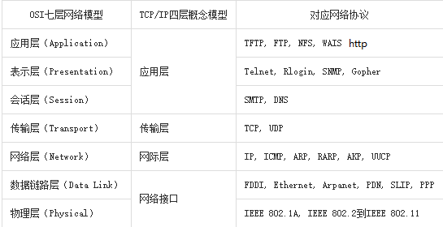
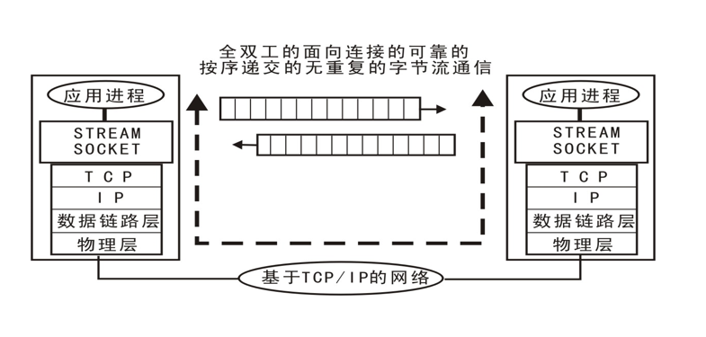

IO网络编程
==========================

| Tedu Python 教学部 |
| --- |
| Author：吕泽|

-----------

[TOC]


## IO 

1. 定义

>IO指数据流的输入输出，从计算机应用层编程层面来说，在内存中存在数据交换的操作一般认为是IO操作,比如和终端交互 ,和磁盘交互，和网络交互等.

2. 程序分类

>* IO密集型程序：在程序执行中有大量IO操作，而cpu运算较少。消耗cpu较少，耗时长。

>* 计算密集型程序：程序运行中计算较多，IO操作相对较少。cpu消耗多，执行速度快，几乎没有阻塞。

## 文件

文件是保存在持久化存储设备(硬盘、U盘、光盘..)上的一段数据。从格式编码角度分为文本文件（打开后会自动解码为字符）、二进制文件(视频、音频等)。在Python里把文件视作一种类型的对象，类似之前学习过的其它数据类型。

### 字节串（bytes）

在python3中引入了字节串的概念，与str不同，字节串以字节序列值表达数据，更方便用来处理二进程数据。因此在python3中字节串是常见的二进制数据展现方式。

* 普通的ascii编码字符串可以在前面加b转换为字节串，例如：b'hello'
* 字符串转换为字节串方法 ：str.encode()
* 字节串转换为字符串方法 : bytes.decode() 


### 文件读写

对文件实现读写的基本操作步骤为：**打开**文件，读写文件，关闭文件

***代码实现：  day2/file_open.py***

```python
"""
file_open.py
文件打开方式
"""
# 打开文件
"""
文本文件可以用文本或者二进制方式打开
二进制文件一定要用二进制方式打开
"""
f = open('file','r')  # 只读
f = open('file','w')  # 只写
f = open('file','a')  # 追加(add)
print(f)
# 读写
# 关闭文件
f.close()
```

***代码实现：  day2/file_read.py***

```python
"""
file_read.py
读文件操作
"""
# 打开文件
f = open('/home/tarena/examples.desktop','r')    # 默认r
# 读文件
"""
每次读取100字符  读主目录下 examples.desktop文件内容，并打印出来
"""
# while True:
#     s = f.read(100)
#     if not s:
#         # 当s为空则到了文件结尾
#         break
#     print(s,end='')
# s = f.read(100)
# s = f.read()
# print("读取内容:",s)
# 读取一行
data = f.readline()
print("一行内容：",data)
# 读取若干行
data = f.readlines(24)
print("多行内容：",data)
# 迭代特性
for i in f:
    print(i)  # 每次获取一行
f.close()
```

***代码实现：  day2/file_write.py***

```python
"""
file_write.py
文件写演示
"""
# f = open('file','wb')
f = open('file','a')
# 写操作
# f.write("hi,死鬼\n".encode())
# f.write("哎呀，干啥\n".encode())
f.writelines(['hahaha\n','呵呵呵\n','嘿嘿嘿'])
f.close()
```

函数三要素：功能、参数、返回值。

1. 打开文件

```python
file_object = open(file_name, access_mode='r', buffering=-1)
功能：打开一个文件，返回一个文件对象。
参数：file_name  文件名；
     access_mode  打开文件的方式,如果不写默认为‘r’ 
          文件模式                        操作
              r                    以读方式打开 文件必须存在
              w                    以写方式打开
                                   文件不存在则创建，存在清空原有内容 
              a                    以追加模式打开 
              r+                   以读写模式打开 文件必须存在
              w+                   以读写模式打开文件
                                   不存在则创建，存在清空原有内容
              a+                   以读写模式打开 追加模式
              rb                   以二进制读模式打开 同r
              wb                   以二进制写模式打开 同w
              ab                   以二进制追加模式打开 同a
              rb+                  以二进制读写模式打开 同r+
              wb+                  以二进制读写模式打开 同w+
              ab+                  以二进制读写模式打开 同a+
     buffering  1表示有行缓冲，默认则表示使用系统默认提供的缓冲机制。
返回值：成功返回文件操作对象。
```

   2.读取文件（3种方法）

>read([size])
>功能： 来直接读取文件中字符。
>参数： 如果没有给定size参数（默认值为-1）或者size值为负，文件将被读取直至末尾，给定size最多读取给定数目个字符（字节）。
>返回值： 返回读取到的内容
>
>* 注意：文件过大时候不建议直接读取到文件结尾，读到文件结尾会返回空字符串。

>readline([size])
>功能： 用来读取文件中一行
>参数： 如果没有给定size参数（默认值为-1）或者size值为负，表示读取一行，给定size表示最多读取制定的字符（字节）。
>返回值： 返回读取到的内容

>readlines([sizeint])
>功能： 读取文件中的每一行作为列表中的一项
>参数： 如果没有给定size参数（默认值为-1）或者size值为负，文件将被读取直至末尾，给定size表示读取到size字符所在行为止。
>返回值： 返回读取到的内容列表


>文件对象本身也是一个可迭代对象，在for循环中可以迭代文件的每一行。
```python
for line in f:
     print(line)
```

```python
"""
练习 ： 编写一个程序，从终端使用input输入一个单词，打印出这个单词及其解释
       * 每个单词一行
       * 单词和解释之间有空格
       * 单词按照升序（从小到大）排列
"""
word = input("单词:")  # 要查找单词
f = open('dict.txt') # 文本方式打开
# 每次获取一行
for line in f:
    w = line.split(' ')[0]
    if w > word:            #不是字符串长度的比较
        print("没有该单词")
        break
    elif word == w:
        # 查到单词
        print(line)
        break
else:
    print("没有该单词")
f.close()
```

  3.写入文件

>write(string)
>功能: 把文本数据或二进制数据块的字符串写入到文件中去
>参数：要写入的内容
>返回值：写入的字符个数
>
>* 如果需要换行要自己在写入内容中添加\n

>writelines(str_list)
>功能：接受一个字符串列表作为参数，将它们写入文件。
>参数: 要写入的内容列表

4. 关闭文件

打开一个文件后我们就可以通过文件对象对文件进行操作了，当操作结束后使用close（）关闭这个对象可以防止一些误操作，也可以节省资源。

>file_object.close()

5. with操作

python中的with语句使用于对资源进行访问的场合，保证不管处理过程中是否发生错误或者异常都会执行规定的“清理”操作，释放被访问的资源，比如有文件读写后自动关闭、线程中锁的自动获取和释放等。

with语句的语法格式如下：

```python
with context_expression [as obj]:
    with-body
```

通过with方法可以不用close(),因为with生成的对象在语句块结束后会自动处理，所以也就不需要close了，但是这个文件对象只能在with语句块内使用。

```python
with open('file','r+') as f:
    f.read()
```

>注意
>> 1. 加b的打开方式读写要求必须都是字节串
>> 2. 无论什么文件都可以使用二进制方式打开，但是二进制文件使用文本方式打开读写会出错.

作业：day03/copy_file.py

```python
"""
 写一个程序，实现对一个文件进行拷贝
       * input() 输入一个文件位置
       * 将该文件'拷贝'到主目录下
       * 文件可能是文本文件也可能是二进制文件   ----->暗示只能用二进制方式打开读写
       * 文件可能比较大，不允许一次性读取-------------->限定每次读取的大小
温馨提示： 从源文件读取内容，写入到目标新文件中
字符串函数，进制转换
逻辑分析：先打开源文件（边打边读）--->再打开新的文件（边打边写入前面读取的内容）
"""
home = "/home/tarena/"
# input() 输入一个文件位置
img = input(">>")
# 打开源文件
fr = open(img,'rb')    									 #边打边读
#提取文件名称
filename = img.split('/')[-1] 					 #img文件位置>>/home/tarena/teacher/month02/day03/timg.jpg
# 打开新的文件											 #边打边写
fw = open(home+filename,'wb')    	   #相当于把它写入到这个文件夹下面>>/home/tarena/timg.jpg
# 边读边写
while True:
    data = fr.read(1024)
    if not data:
        break
    fw.write(data)
fr.close()
fw.close()
```

### 其他操作

#### 刷新缓冲区

缓冲:系统自动的在内存中为每一个正在使用的文件开辟一个缓冲区，从内存向磁盘输出数据必须先送到内存缓冲区，再由缓冲区送到磁盘中去。从磁盘中读数据，则一次从磁盘文件将一批数据读入到内存缓冲区中，然后再从缓冲区将数据送到程序的数据区。

刷新缓冲区条件：

1. 缓冲区被写满
2. 程序执行结束或者文件对象被关闭
3. 行缓冲遇到换行
4. 程序中调用flush()函数

***代码实现：  day3/buffer.py***

```python
"""
buffer.py
缓冲区示例
"""
f = open('file','w',1) 					# buffering=1表示行缓冲
while True:
    data = input(">>")
    if not data:
        break
    f.write("abc\n")
    # f.flush() # 自己刷新缓冲
f.close()
```

>flush()
该函数调用后会进行一次磁盘交互，将缓冲区中的内容写入到磁盘。

#### 文件偏移量

***代码实现：  day3/seek.py***

```python
"""
seek.py 文件偏移量
注意： r  w 打开文件默认文件偏移量在开头
      a 打开文件偏移量在结尾
      读写使用的是同一个偏移量
"""
f = open('file','w+') # 读写
f.write('hello world')
f.flush()
print("文件偏移量:",f.tell())			 # 查看偏移量
# 移动一下偏移量
f.seek(5,0)												# 0代表从开头算起
# f.write('你好')
data = f.read()
print(data)
f.close()
```

1. 定义
>打开一个文件进行操作时系统会自动生成一个记录，记录中描述了我们对文件的一系列操作。其中包括每次操作到的文件位置。文件的读写操作都是从这个位置开始进行的。

2. 基本操作
   
>tell()
功能：获取文件偏移量大小

>seek(offset[,whence])
>功能:移动文件偏移量位置
>参数：offset  代表相对于某个位置移动的字节数。负数表示向前移动，正数表示向后移动。
>     whence是基准位置的默认值为 0，代表从文件开头算起，1代表从当前位置算起，2 代表从文件末尾算起。
>
>* 必须以二进制方式打开文件时基准位置才能是1或者2

```python
"""
空洞文件：提前占地方然后再填充，类似于迅雷下载文件，就是提前先占好地方。
"""
f = open('file','wb')
f.write(b'START')
# 末尾向后移动了10M
f.seek(1024*1024*10,2)
f.write(b'END')
f.close()
```

#### 文件描述符

1. 定义
>系统中每一个IO操作都会分配一个整数作为编号，该整数即这个IO操作的文件描述符。

2. 获取文件描述符
   
>fileno()
通过IO对象获取对应的文件描述符


### 文件管理函数

1. 获取文件大小  
>os.path.getsize(file)

2. 查看文件列表  
>os.listdir(dir)

3. 查看文件是否存在
>os.path.exists(file)

4. 判断文件类型
>os.path.isfile(file)

5. 删除文件
>os.remove(file)

```python
#     文件描述符示例
import os
print("文件大小：",os.path.getsize('file'))
print("查看目录内容：",os.listdir('.'))  #.代表当前目录
print("文件存在吗：",os.path.exists('./file'))
print("是一个普通文件：",os.path.isfile('file'))
print("删除一个文件：",os.remove('file'))
```

## 网络编程基础

计算机网络功能主要包括实现资源共享，实现数据信息的快速传递。
### OSI七层模型

>制定组织： ISO（国际标准化组织）

>作用：使网络通信工作流程标准化

>应用层 ： 提供用户服务，具体功能由应用程序实现
>表示层 ： 数据的压缩优化加密
>会话层 ： 建立用户级的连接，选择适当的传输服务
>传输层 ： 提供传输服务 
>网络层 ： 路由选择，网络互联 
>链路层 ： 进行数据交换，控制具体数据的发送
>物理层 ： 提供数据传输的硬件保证，网卡接口，传输介质

>优点 
>1. 建立了统一的工作流程
>2. 分部清晰，各司其职，每个步骤分工明确
>3. 降低了各个模块之间的耦合度，便于开发


### 四层模型（TCP/IP模型）

背景 ： 实际工作中工程师无法完全按照七层模型要求操作，逐渐演化为更符合实际情况的四层。





#### 数据传输过程

1. 发送端由应用程序发送消息，逐层添加首部信息，最终在物理层发送消息包。
2. 发送的消息经过多个节点（交换机，路由器）传输，最终到达目标主机。
3. 目标主机由物理层逐层解析首部消息包，最终到应用程序呈现消息。
   



微信消息是一种即时通讯；消息即时传递和用户交互性。

#### **即时通信原理（微信消息举例）**

即时通信是一种基于网络 的通信技术, 涉及**到IP/TCP/UDP/Sockets、P2P、C/S、多媒体音视频编解码/传送、Web Service等**多种技术手段。无论即时通信系统的功能如何复杂，它们大都基于相同的技术原理，主要包括客户/服务器(C/S)通信模式和对等通信(P2P)模式。（来自百度文库）这里主要说说**C/S架构的通讯模式**（微信就是基于这种模式）。 


如图，假设一种情景。用户A登录微信后，连接到**IM服务器（即微信通讯服务器）**，同时用户B也登录上来了。用户A要给用户B发送一条消息，这个消息会先发送到IM服务器，再由IM服务器发送给B。用户A并没有直接和用户B建立连接的。这个消息数据包里面包含了哪些信息呢？必须要告诉IM服务器，这个消息是发给谁的，即用户B。用户B要发送消息给用户A同样的原理。

​      说说消息内容，数据包的消息不可能是明文直接发送的。那样的话，别人拿到数据包后，直接可以读取到消息内容，这样也就太不安全了。必须经过加密，是的。用户A和用户B都具有加密解密的功能。用户A在发送之前把消息加密处理，封装成数据包发给服务器，服务器解密读取要发送的用户，即用户B。然后再把用户A的加密数据包发给B。这样简单的通讯就完成了，当然，事实中要比这复杂百倍。

​      图片，语音，视频这些消息发送与简单的消息发送稍微复杂一点。即用户A要给用户B发送一段语音。首先这段语音它是个文件，用户A会先把这个文件上传到**文件服务器**（不是IM服务器，它是专门存放临时文件的服务器），文件服务器返回给用户A这个语音文件在服务器上的地址，用户A再把地址封装起来，通过IM服务器发送给用户B。用户B拿到数据包后，发现是语音文件，会根据地址去文件服务器上下载下来，这样一段语音就发送到用户B 了。图片，视频以及文件都可以这样传输。

​    安装完微信并注册后，使用微信时，应先登录：
​     不管UDP还是TCP，最终登陆成功之后，微信都会有一个TCP连接来保持在线状态。这个TCP连接的远程端口一般是80，采用UDP方式登陆的时候，端口是8000 。因此，假如你所在的网络开放了80端口，但没有屏蔽腾讯的服务器IP，恭喜你，你是可以登陆成功微信的。
聊天消息通信
​    采用 UDP 协议，通过服务器中转方式。因此，现在的IP侦探在你仅仅跟对方发送聊天消息的时候是无法获取到IP的。UDP协议是不可靠协议，它只管发送，不管对方是否收到的，但它的传输很高效。但是，作为聊天软件，怎么可以采用这样的不可靠方式来传输消息呢？于是，腾讯公司采用了**上层协议来保证可靠传输**：如果客户端使用UDP协议发出消息后，服务器收到该包，需要使用UDP协议发回一个应答包。如此来保证消息可以无遗漏传输。之所以会发生在客户端明明看到 “消息发送失败”但对方又收到了这个消息的情况，就是因为客户端发出的消息服务器已经收到并转发成功，但客户端由于网络原因没有收到服务器的应答包引起的。

**IM系统中最核心的部分是消息系统，消息系统中最核心的功能是消息的同步和存储：**

**1）消息的同步：**将消息完整的、快速的从发送方传递到接收方，就是消息的同步。消息同步系统最重要的衡量指标就是消息传递的实时性、完整性以及能支撑的消息规模。从功能上来说，一般至少要支持在线和离线推送，高级的IM系统还支持『多端同步』；

**2）消息的存储：**消息存储即消息的持久化保存，这里不是指消息在客户端本地的保存，而是指**云端的保存**，功能上对应的就是『消息漫游』。『消息漫游』的好处是可以实现账号在任意端登陆查看所有历史消息，这也是高级IM系统特有的功能之一。

#### 网络协议

>在网络数据传输中，都遵循的规定，包括建立什么样的数据结构，什么样的特殊标志等。


### 网络基础概念

* IP地址
>功能：确定一台主机的网络路由位置

>查看本机网络地址命令： ifconfig

>结构
>>IPv4  点分十进制表示 172.40.91.185 每部分取值范围0--255
>>IPv6  128位 扩大了地址范围
>>
>>


* 域名
>定义： 给网络服务器地址起的名字

>作用： 方便记忆，表达一定的含义

>ping ip : 测试和某个主机是否联通

* 端口号（port）
>作用：端口是网络地址的一部分，用于区分主机上不同的网络应用程序。

>特点：一个系统中的应用监听端口不能重复

>取值范围： 1 -- 65535
>>1--1023  系统应用或者大众程序监听端口
>>1024--65535 自用端口


## 传输层服务

### 面向连接的传输服务（基于TCP协议的数据传输）

1. 传输特征 ： 提供了可靠的数据传输，可靠性指数据传输过程中无丢失，无失序，无差错，无重复。
   
2. 实现手段 ： 在通信前需要建立数据连接，通信结束要正常断开连接。

> 三次握手（建立连接）-----------------
>>客户端向服务器发送消息报文请求连接
>>服务器收到请求后，回复报文确定可以连接
>>客户端收到回复，发送最终报文连接建立


					
>四次挥手（断开连接）
>>主动方发送报文请求断开连接
>>被动方收到请求后，立即回复，表示准备断开
>>被动方准备就绪，再次发送报文表示可以断开
>>主动方收到确定，发送最终报文完成断开


3. 适用情况 ： 对数据传输准确性有明确要求，传数文件较大，需要确保可靠性的情况。比如：网页获取，文件下载，邮件收发。


### 面向无连接的传输服务（基于UDP协议的数据传输）

1. 传输特点 ： 不保证传输的可靠性，传输过程没有连接和断开，数据收发自由随意。

2. 适用情况 ： 网络较差，对传输可靠性要求不高。比如：网络视频，群聊，广播

***面试要求***

* OSI七层模型介绍一下，tcp/ip模型是什么？（一般回答步骤：1、是什么？2、到底是什么？3、引申，比如实际工作当中我们常用的是四层模型等等。4、工作实践结合）

* tcp服务和udp服务有什么区别？

* 三次握手和四次挥手指什么，过程是怎样的？

  #### **一、OSI七层网络模型**（理解参考）

  ​		OSI是Open System Interconnection的缩写，意为开放式系统互联。国际标准化组织（ISO）制定了OSI模型，该模型定义了不同计算机互联的标准，是设计和描述计算机网络通信的基本框架。OSI模型把网络通信的工作分为7层，分别是物理层、数据链路层、网络层、传输层、会话层、表示层和应用层。

  因为是从事开发工作，所以从上往下进行梳理。

  面向程序员

  ##### **1、应用层**

  ​		应用层指的是能够产生网络流量并能够和用户交互的应用程序。这一层其实没什么好说，就好比微信，QQ，公司的Link都是面向用户的应用产品，从计算机网络分层结构上来说，这些应用都是属于应用层，用户通过这些产品来进行网络访问，信息交流。

  ##### **2、表示层**

  ​		表示层指的是对通讯数据进行加密，压缩这个层面的过程。这一过程主要面向的是程序员，这可以让我联想到的是在开发的过程中我们时常需要对前后端通讯数据进行控制，比如前后端通讯格式使用的是json，使用nginx或者自定义http请求头对http请求报文做压缩，使用谷歌浏览器对ajax请求的监控等等操作，应该就是在表示层上面做工作，表示层的数据不直接面向用户，如json不可能直接显示，这一层面的东西就是表示层。

  ##### **3、会话层**

  ​		会话层指的是服务器端与客户端建立的会话这一层面的东西。其实在最开始的时候我就在想这个会话是不是就是web这边的session的概念，后面细想了之后觉得应该不是，session是基于cookies的，cookies的传输是在http请求头中实现的，那这应该是表示层的东西。后面看了讲解之后讲到是服务器端与客户端建立会话，那应该就是平常我们使用netstate、ss里面看到的东西，这个会话应该指的是TCP或UDP建立起来的会话，不是http协议，而是更加底层，讲起来比较抽象，但是在实际的业务中http协议发生的问题总是容易排查，而底层的TCP/UDP发生的问题很难定位，容易联想到的就是之前开发的爬虫程序，因为没有处理好异常问题，导致电脑中出现大量的time_wait。

  网络工程师

  ##### **4、传输层(典型设备：网关)**

  ​		传输层指的是控制可靠传输与不可靠传输，以及流量控制的问题，在看完视频之后，其实这一层主要的核心就是tcp，udp协议，因为学习的课程在这一章没有详细的讲述，质量效果不好，所以后期我打算通过两本书来巩固这一层的知识内容，立一个flag。

  《TCP/IP协议卷一》：三卷之中、卷一是讲述基础理论，卷二讲述的是实现，卷三讲的是事务，对我来说我觉得看卷一应该就够了，卷二是C/C++写的，也看不懂

  《图解TCP/IP》：看过《图解HTTP》，这系列的书对读者来说还是比较容易接受的，因为图比较多，对晦涩的知识能够通过图来讲解

  虽然这一层了解不多，但是至少还是要记得几个知识点：

  TCP与UDP有什么区别？

  ​		TCP是可靠传输，是通过会话的形式进行的，需要通信的两方都参与的，通讯时需要不断的确认数据段会被对方收到，如果收不到的话需要重传，在下一层的IP协议等都是不可靠传输，数据链路都不提供可靠性保障，只复制传输。可以说应用的大多数协议都是基于TCP协议的，教程中有一句话大概是这么说的，应用层的协议就是基于TCP协议+应用+端口来构建的，那我应该可以理解为，其实应用层是特殊化的TCP协议吧。

  UDP是一次性传输，不可靠传输。我把它理解为，我发一个包给你，你收到没受到与我无关，发了便完事。

  TCP socket状态 变化总结->能理解难背诵呀

  ##### **5、网络层（典型设备：路由器，网桥路由器）**

  ​		网络层指的是IP地址编址、选择最佳路径等，这里已经涉及到路由器这一方面的到东西了，在计算机网络通讯中如何找到计算机，这一块内容我也得加深了解。在看完教程后知道了这一层的核心是IP协议，关于IP协议教程提及到主要要记得以下的结构

  IP协议 ICMP协议 ICMP协议

  \- - - - - - - -

  ARP协议 反向ARP协议

  懒得画图，直接用这么一个表示方法表示，什么意思呢?就是说IP协议的基础是ARP协议与反向ARP协议，在IP协议的范围里涵盖了ICMP协议与ICMP协议

  ARP协议：地址解析协议，在互联网中我们都是通过IP进行交流的，但是IP并不能唯一标志一台计算机呀！所以我们需要一个协议把IP解析成MAC地址，MAC地址是全球唯一标志你计算的地址，从你的网卡并生产出来的时候就被打上标志，就好像你的身份证一样，硬件产商都会被严格分配一个地址头，所以我们也可以通过mac地址来看出网卡产商。需要把IP转换成MAC地址才能被下一层转发。

  反向ARP协议：很简单呀，就是ARP协议反向，也就是把MAC地址转换成IP地址，再由路由转发。

  ICMP协议：Internet控制报文协议，从理论上来理解不知道怎么描述，说白了就是你可以通过一个ICMP数据报来知道你的网络能不能通到对方网路过去，ping命令知道把？ping命令就是通过这个协议的报文来反馈你能不能通，这个协议也是基于IP协议的。

  IGMP协议：是用于多播或广播的协议，在互联网上有时候也需要广播，比如说发一条广播让网段内的计算机都反馈一下IP地址等

  IP协议：说白了就是通过IP来转发下一层的数据帧，在互联网中IP是有限的…. 真的不知道怎么描述了，还是看教程，有时候真的觉得知识这种东西很难三言两语就记录下来….

  在网络层的学习中，让我收获很大的地方是我知道了

  A类网络：1~128.0.0.0

  B类网络：129~191.0.0

  C类网络：192~223.0.0

  知道一些网段是只能在内网中使用的

  局域网的地址范围分三类：

  C类：192.168.0.0-192.168.255.255

  B类：172.16.0.0-172.31.255.255

  A类：10.0.0.0-10.255.255.255

  这三类地址不能在广域网中出现的，只是局域网中传播

  另外还有一些比较特殊的IP地址

  如：169.254.x.x ： window 机子获取不到IP的时候自动显示这个IP，在工作中就遇到这个问题，接上wifi，IP地址显示这个，说明这个wifi有问题

  还有对子网的划分方法，子网掩码是什么，网关的作用等，在实际工作用立刻能用到的是这样：

  平常在工作中同时需要链接外网网络(通过网线接电脑)，需要链接客户的内网网络(通过特殊的手机热点)

  以前是当链接两个网络时，要么上不了外网，要么上不了内网，现在我可以通过配置路由的方式来让我的机子同时去到两个网络，说白了就是通过路由的方式，如果我去到某个内网的网段那么就走手机热点的网关，如果走互联网的话，那就走外网的网关。

  ##### **6、数据链路层（典型设备：交换机、网桥、网卡）**

  ​		数据链路层主要是进行数据的分装，添加物理层地址，MAC地址等，这一层看完知识点已经很久了 大概也记不得很起来，作为一个软件工程师其实我觉得要求了解比较低，主要提及了一些传输差错校验的方法，如什么冗余法，还有一些链接的协议如点对点协议（Point-to-Point Protocol)

  硬件

  ##### **7、物理层**

  ​		主要指电压、接口标准等 

  ------

  

  #### **二、TCP/IP四层网络模型**

  TCP/IP四层网络模型是应用层、传输层、网络层、网络访问层。是对OSI七层网络模型的一个简化。

  应用层->OSI 应用层、表示层、会话层

  传输层->OSI 传输层

  网络层->OSI 网络层

  网络接口层->OSI 数据链路层、物理层

  ------

  

  #### **三、总结**

  其实从这篇简述中，可以看出我对会话层这一块的内容只是简单的了解，但是实际业务中却经常遇到这方面的难题，遇到时没有足够的知识可以去应对解决。

  对于传输层、网络层、数据链路层几乎是没什么了解，这里虽然说是网络工程师需要解决的问题，但是认识这一层面的东西对日后服务器的维护也是有重大帮助。

  物理层的话对自己的要求是能简单了解，能讲出来即可。

  ------

  


## socket套接字编程

### 套接字介绍

1. 套接字 ： 实现网络编程进行数据传输的一种技术手段

2. Python实现套接字编程：import  socket

3. 套接字分类
>**流式套接字**(SOCK_STREAM): 以字节流方式传输数据，实现tcp网络传输方案。(面向连接--tcp协议--可靠的--流式套接字)

>数据报套接字(SOCK_DGRAM):以数据报形式传输数据，实现udp网络传输方案。(无连接--udp协议--不可靠--数据报套接字)


### tcp套接字编程

#### 服务端流程


***代码实现：day4/tcp_server.py***

```python
"""
tcp_server.py 服务端
"""
import socket
# 1.创建tcp套接字
sockfd = socket.socket(socket.AF_INET,socket.SOCK_STREAM)
# 2.绑定地址
sockfd.bind(('176.234.10.31',8888))         #绑定的是服务端 (本机)的IP地址以及端口
# 3.设置监听  (监听队列,队列里面每次最多只能有3个)
sockfd.listen(3)
# 4.处理客户端链接
print("Waiting for connect...")
connfd,addr = sockfd.accept()                    #
print("Connect from",addr)
#5. 收发消息
data = connfd.recv(1024)    								  #收到客户端发来的请求
print("Recv:",data)
n = connfd.send(b"OK\n") # 发送字节串   		#服务端收到客户端请求后回应给客户端消息    
# 6.关闭套接字
connfd.close()    #关闭客户端套接字
sockfd.close()	  #关闭服务端套接字
# 客户端测试命令 telnet 127.0.0.1 8888
总结:
    		在tcp服务端流程里面收发消息都是connfd.recv/send()
        	等待客户端链接:connfd,addr = sockfd.accept()    
             connfd  客户端连接套接字
         	 addr  连接的客户端地址
```

1. 创建套接字

```python
sockfd=socket.socket(socket_family=AF_INET,socket_type=SOCK_STREAM,proto=0)
功能：创建套接字
参数：  socket_family  网络地址类型 AF_INET表示ipv4
	socket_type  套接字类型 SOCK_STREAM(流式)  SOCK_DGRAM(数据报)
	proto  通常为0  选择子协议
返回值： 套接字对象
```
2. 绑定地址

>本地地址 ： 'localhost' -内部带了特殊字符串, '127.0.0.1'-本地测试地址；假如选择这俩，则代表你的程序是测试程序，则你不能被别的主机客户端访问。自己主机可以开俩终端进行连接测试。
>网络地址 ： '172.40.91.185'----自己的ip地址，如果绑定的是你自己的ip地址，则你的服务端可以被别的主机客户端访问了，也可以通过你自己的主机客户端访问。
>自动获取地址： '0.0.0.0'-万金油，如果绑定的是这个地址，则你自己的主机可以访问，也可以用别人的主机用你的IP地址访问。


```python
sockfd.bind(addr)
功能： 绑定本机网络地址
参数： 二元元组 (ip,port)  ('0.0.0.0',8888)
```

3. 设置监听

```python
sockfd.listen(n)
功能 ： 将套接字设置为监听套接字，确定监听队列大小
参数 ： 监听队列大小,比如为3(每次只能排3个)
```
4. 等待处理客户端连接请求

```python
connfd,addr = sockfd.accept()
功能： 阻塞等待处理客户端请求
返回值：  connfd  客户端连接套接字
         			addr  连接的客户端地址
```
5. 消息收发

```python
data = connfd.recv(buffersize)
功能 : 接受客户端消息
参数 ：每次最多接收消息的大小
返回值： 接收到的内容

n = connfd.send(data)
功能 : 发送消息
参数 ：要发送的内容  bytes格式
返回值： 发送的字节数
```

6. 关闭套接字

```python
sockfd.close()
功能：关闭套接字
```


***代码实现：day4/tcp_client.py***

```python
"""
tcp_client.py  tcp客户端
"""
from socket import *
# 1.创建tcp套接字
sockfd = socket()  # 默认参数--》 tcp
# 2.连接服务器
server_addr = ('127.0.0.1',8888)  # 服务端地址,而在服务端是绑定本机地址: sockfd.bind(('176.234.10.31',8888)) 
sockfd.connect(server_addr)       #请求连接,而在服务端则是等待连接:  connfd,addr = sockfd.accept()   
data = input("Msg>>")
#3. 发送给服务端
sockfd.send(data.encode()) # 转换为字节串    	 -----将消息发送给客户端
data = sockfd.recv(1024)		#								  ------收到来自服务端处理完消息的回执
print("Server:",data.decode()) # 转换为字符串打印出来
#4. 关闭套接字
sockfd.close()
```

#### 客户端流程


		  
1. 创建套接字
>注意:只有相同类型的套接字才能进行通信

2. 请求连接

```python
sockfd.connect(server_addr)
功能：连接服务器
参数：元组  服务器地址
```

3. 收发消息
>注意： 防止两端都阻塞，recv send要配合

4. 关闭套接字


#### tcp 套接字数据传输特点

>* tcp连接中当一端退出，另一端如果阻塞在recv，此时recv会立即返回一个空字串。

>* tcp连接中如果一端已经不存在，仍然试图通过send发送则会产生BrokenPipeError

>* 一个监听套接字可以同时连接多个客户端，也能够重复被连接

#### 网络收发缓冲区

1. 网络缓冲区有效的协调了消息的收发速度

2. send和recv实际是向缓冲区发送接收消息，当缓冲区不为空recv就不会阻塞。
	
#### tcp粘包

>原因：tcp以字节流方式传输，没有消息边界。多次发送的消息被一次接收，此时就会形成粘包。

>影响：如果每次发送内容是一个独立的含义，需要接收端独立解析此时粘包会有影响。

>处理方法
>>1. 人为的添加消息边界
>>2. 控制发送速度(sleep)


### UDP套接字编程

#### 服务端流程


***代码实现：day4/udp_server.py***

```python
"""
udp_server.py  udp服务端流程
重点代码
"""
from socket import *
# 1.创建udp套接字
sockfd = socket(AF_INET,SOCK_DGRAM)
# 2.绑定地址
server_addr = ('0.0.0.0',8888)
sockfd.bind(server_addr)
# 3.收发消息
while True:
    data,addr = sockfd.recvfrom(1024)								 #   sockfd.sendto(data.encode(),ADDR) :客户端发送服务端接受
    print("From %s Msg:%s"%(addr,data.decode()))
    sockfd.sendto(b'Thanks',addr)										#   msg,addr = sockfd.recvfrom(1024):服务端发送回应客户端接受
# 4.关闭套接字
sockfd.close()  
总结:
    		只要是发送后面是addr
       		只要是接受后面得写接受字符串大小比如1024
```

1. 创建数据报套接字
```python
sockfd = socket(AF_INET,SOCK_DGRAM)
```
2. 绑定地址

```python
sockfd.bind(addr)
```

3. 消息收发

```python		    
data,addr = sockfd.recvfrom(buffersize)
功能： 接收UDP消息
参数： 每次最多接收多少字节
返回值： data  接收到的内容
	addr  消息发送方地址

n = sockfd.sendto(data,addr)
功能： 发送UDP消息
参数： data  发送的内容 bytes格式
			  addr  目标地址
返回值：发送的字节数
```

4. 关闭套接字
```python
sockfd.close()
```
#### 客户端流程


***代码实现：day4/udp_client.py***

```python
"""
udp_client.py udp客户端流程
"""
from socket import *
# 服务端地址
ADDR = ('127.0.0.1',8888)
# 创建udp套接字
sockfd = socket(AF_INET,SOCK_DGRAM)
# 循环发送消息
while True:
    data = input("Msg>>")
    if not data:
        break
    # 向服务器发送
    sockfd.sendto(data.encode(),ADDR)
    msg,addr = sockfd.recvfrom(1024)
    print("From Server:",msg.decode())
sockfd.close()
```

1. 创建套接字
2. 收发消息
3. 关闭套接字

---------------
>总结 ：tcp套接字和udp套接字编程区别
>>1. 流式套接字是以字节流方式传输数据，数据报套接字以数据报形式传输
>>2. tcp套接字会有粘包，udp套接字有消息边界不会粘包
>>3. tcp套接字保证消息的完整性，udp套接字则不能
>>4. tcp套接字依赖listen accept建立连接才能收发消息，udp套接字则不需要
>>5. tcp套接字使用send，recv收发消息，udp套接字使用sendto，recvfrom
---------------------

tcp_udp四大流程：


### socket套接字属性

***代码实现：day4/sock_attr.py***

```python
"""
套接字属性
"""
from socket import *
s = socket()
# 设置端口立即重用
s.setsockopt(SOL_SOCKET,SO_REUSEADDR,1)
s.bind(('172.40.91.233',8800))
s.listen(3)
c,addr = s.accept()
print("套接字类型:",s.type)
print("套接字地址类型:",s.family)
print("绑定地址：",s.getsockname())
print("文件描述符:",s.fileno())
# 链接套接字调用
print("客户端地址:",c.getpeername())
c.recv(1024)
```

【1】 sockfd.type  套接字类型

【2】 sockfd.family 套接字地址类型

【3】 sockfd.getsockname() 获取套接字绑定地址

【4】 sockfd.fileno() 获取套接字的文件描述符

【5】 sockfd.getpeername() 获取连接套接字客户端地址

【6】 sockfd.setsockopt(level,option,value)
		功能：设置套接字选项
		参数： level  选项类别   SOL_SOCKET
			option 具体选项内容
			value  选项值


## struct模块进行数据打包

***代码实现：day4/struct_test.py***

```python
"""
struct_test.py
struct模块示例
"""
import struct
# 生成格式对象i-->int  f-->float  s-->bytes
st = struct.Struct('i4sif')
# 数据打包
data = st.pack(1,b'Lily',172,8)
# print(data)
# st = struct.Struct('i3sif')
# print(st.unpack(data))
print(struct.unpack('i4sif',data))
```

***代码实现：day5/struct_recv.py***

```python

```

***代码实现：day5/struct_send.py***

```python

```

1. 原理： 将一组简单数据进行打包，转换为bytes格式发送。或者将一组bytes格式数据，进行解析。
2. 接口使用

```python
Struct(fmt)
功能: 生成结构化对象
参数：fmt  定制的数据结构

st.pack(v1,v2,v3....)
功能: 将一组数据按照指定格式打包转换为bytes
参数：要打包的数据
返回值： bytes字节串

st.unpack(bytes_data)
功能： 将bytes字节串按照指定的格式解析
参数： 要解析的字节串
返回值： 解析后的内容

struct.pack(fmt,v1,v2,v3...)
struct.unpack(fmt,bytes_data)
```

> 说明： 可以使用struct模块直接调用pack unpack。此时这两函数第一个参数传入fmt。其他用法功能相同


# 练习课

代码实现1：/home/tarena/wb/month02/day05/copy_file_exercise.py

```python
'''
练习2：
        一个目录，在目录下有若干个文件（有子目录和普通文件）。编程将该目录下的普通文件复制到
        家目录下的'电子书'这个目录中。
       文件dict.txt位置>>:/home/tarena/wb/month02/dict.txt
'''
import os
home = "/home/tarena/电子书/"
# input() 输入一个文件位置
file_addr= input(">>")
# 打开源文件
fr = open(file_addr,'rb')
#提取文件名称
filename = file_addr.split('/')[-1]     #文件位置>>/home/tarena/wb/month02/dict.txt
# 打开新的文件
fw = open(home+filename,'wb')           #相当于把它写入到这个文件夹下面>>/home/tarena/备份/dict.txt
# 边读边写
while True:
    data = fr.read(1024)
    if not data:
        break
    fw.write(data)
fr.close()
fw.close()
#老师的代码 ---------------------------------------------------------------------->
import os
DIR = "/home/tarena/备份/"   #目标文件路径
dir = input(">>")           # 要备份的目录
if dir[-1] != '/':
    dir += '/'
# 拷贝文件
def copy(file):
    fr = open(dir+file,'rb')
    fw = open(DIR+file,'wb')
    while True:
        data = fr.read(1024)
        if not data:
            break
        fw.write(data)
    fr.close()
    fw.close()
# 选择要拷贝的文件
def main():
    file_list = os.listdir(dir)         # os.listdir(dir)查看文件列表
    for file in file_list:
        if os.path.isfile(dir+file):    # os.path.isfile(file)判断文件类型
            copy(file)                  # 调用copy()函数
if __name__ == '__main__':
    main()
```

代码实现2：/home/tarena/wb/month02/day05/file_split_exercise.py

```python
'''
1. 文件分离练习
   一个文件，文件名： "talk.txt"。在文件中保存着一些对话信息，格式如下   ​
老王：吃了么
老李：没那，您呢？
老张：您二位干什么呢
老李：遛弯啊，刚买菜回来啊
老张：是啊
​     通过程序将该文件进行分离，每个任务的说话内容，重新写入到一个新的文件中，文件以这个人的
名字命名。
'''
f=open('talk.txt','r')
for line in f:
#获取文件名称和文件内容
        file_name,file_content= line.split('：',1)
#重新写入到一个新的文件中，并且文件以这个人的名字命名
        f=open(file_name, 'a')
        f.write(file_content)
# 老师的代码--------------------------------------------------------->
# 存储说话的人{name:['abc','def','hahah']}
person = {}
f = open('talk.txt','r')
for line in f:
    if line != '\n': # 如果不是空行
        role,line_spoken=line.split(":",1)
        if role not in person:
            person[role] = [line_spoken]
        else:
            person[role].append(line_spoken)
f.close()
for name in person:
    with open(name+'.txt','w') as fw:
        fw.writelines(person[name])
```

代码实现3：/home/tarena/wb/month02/day04/homework_client.py

```python
'''
作业: 使用udp和struct完成
     1. 从客户端循环录入学生信息
        信息包含
        id  姓名  年龄  身高
     2. 将信息打包发送给服务端
     3. 在服务端将学生信息写到一个文件中，每个
     学生的信息占1行
'''
from socket import *
import struct
# 服务端地址
ADDR = ('127.0.0.1', 8887)
# 创建udp套接字
sockfd = socket(AF_INET, SOCK_DGRAM)
st = struct.Struct('i16sif')
# 循环录入学生信息
while True:
    id = int(input("请输入学生id:"))
    name = (input("请输入学生姓名:"))
    age = int(input("请输入学生年龄:"))
    height = float(input("请输入学生身高:"))
# 数据打包发送
    data = st.pack(id,name.encode(),age,height)
    print(data)
# 向服务器发送
    sockfd.sendto(data, ADDR)
    sockfd.close()
# 老师的代码----------------------------------------------------->
from socket import *
import struct
ADDR = ('127.0.0.1',8888)
# 定义数据格式
st = struct.Struct('i16sif')
s = socket(AF_INET,SOCK_DGRAM)
while True:
    print("===========================")
    id = int(input('ID:'))
    name = input("Name:").encode()
    age = int(input("Age:"))
    height = float(input("Height:"))
    # 数据打包发送
    data = st.pack(id,name,age,height)
    s.sendto(data,ADDR)
```

```python
代码实现3：/home/tarena/wb/month02/day04/homework_client.py
from socket import *
import struct
# 1.创建数字格式对象
st = struct.Struct('i16sif')
# 2.创建udp套接字
sockfd = socket(AF_INET,SOCK_DGRAM)
# 3.绑定地址
server_addr=('0.0.0.0',8887)
sockfd.bind(server_addr)
# 4.打开文件
f=open('student.txt','a')
while True:
    data,addr = sockfd.recvfrom(1024)
# 对数据解包操作
    data=st.unpack(data)
# 将数据写入文件
    info="%d   %-10s  %d   %.2f\n"% (data[0],data[1].decode().strip('\0'),data[2],data[3])
    f.write(info)
    f.flush()
# 关闭套接字
    f.close()
    sockfd.close()
# 老师的代码--------------------------------------------------------------------------------------------------->
from socket import *
import struct
# 创建数据格式对象
st = struct.Struct('i16sif')
# 创建udp套接字
s = socket(AF_INET, SOCK_DGRAM)
s.bind(('127.0.0.1', 8888))
# 打开一个文件
f = open('student.txt', 'a')
while True:
    data, addr = s.recvfrom(1024)
    # 对数据解包操作 (1,b'Lily',15,1.66)
    data = st.unpack(data)
    # 将数据写入文件
    info = "%d   %-10s  %d   %.2f\n"%(data[0],data[1].decode().strip('\0'),data[2],data[3])
    f.write(info)
    f.flush()
f.close()
s.close()
```

代码实现(提高练习)：/home/tarena/teacher/month02/exercise_1/exercise_4_client.py

```python
from socket import *
from time import sleep
ADDR = ('127.0.0.1',8000)
filename = input(">>")
f = open(filename,'rb')
s = socket()
s.connect(ADDR)
while True:
    data = f.read(1024)
    if not data:
        sleep(0.5)
        s.send(b'##')
        break
    s.send(data)
f.close()
msg = s.recv(1024).decode()
print("检测结果:",msg)
s.close()
```

代码实现(提高练习)：/home/tarena/teacher/month02/exercise_1/exercise_4_server.py

```python
from socket import *
# 容器
class Mylist:
    def __init__(self):
        self._elem = []
    def push(self, val):
        self._elem.append(val)
    def pop(self):
        return self._elem.pop()
    def empty(self):
        return self._elem == []
class Ver:
    def __init__(self):
        self.parens = "{}[]()"  # 需要验证的字符
        self.left_parens = "{[("
        # 　验证配对是否正确
        self.opposite = {'}': '{', ']': '[', ')': '('}
        self.vessel = Mylist()
    # 负责提供遍历到的括号
    def parent(self, text):
        """
        遍历字符串,提供括号字符和其位置
        """
        # 　ｉ记录索引位置
        i, text_len = 0, len(text)
        while True:
            # 循环遍历字符串
            # 到结尾结束，遇到括号提供给ｖｅｒ
            while i < text_len and text[i] not in self.parens:
                i += 1
            if i >= text_len:
                return
            else:
                yield text[i], i
                i += 1
    # 　字符是否匹配的验证工作
    def ver(self, text):
        for pr, i in self.parent(text):
            if pr in self.left_parens:
                self.vessel.push((pr, i))  # 左括号入栈
            elif self.vessel.empty() or self.vessel.pop()[0] != self.opposite[pr]:
                return "Unmatching is found at %d for %s" % (i, pr)
       # for循环正常结束
        if self.vessel.empty():
            return "All parentheses are matched"
        else:
       # 　剩下左括号了
            p = self.vessel.pop()
            return "Unmatching is found at %d for %s" % (p[1], p[0])
def main():
    s = socket()
    s.bind(('0.0.0.0', 8000))
    s.listen(3)
    while True:
        text = ""
        c, addr = s.accept()
        while True:
            data = c.recv(1024).decode()
            if data == '##':
                break
            text += data
        # 验证括号
        v = Ver()
        msg = v.ver(text)
        c.send(msg.encode()) # 回复结果
# 主程序只负责做括号的验证
if __name__ == '__main__':
    main()
```

##  HTTP传输

###  HTTP协议 （超文本传输协议）----应用层网络协议

1. 用途 ： 网页获取，数据的传输

2. 特点
>* 应用层协议，传输层使用tcp传输
>* 简单，灵活，很多语言都有HTTP专门接口
>* 无状态，协议不记录传输内容
>* http1.1 支持持久连接，丰富了请求类型

3. 网页请求过程

>1.客户端（浏览器）通过tcp传输，发送http请求给服务端
>2.服务端接收到http请求后进行解析
>3.服务端处理请求内容，组织响应内容
>4.服务端将响应内容以http响应格式发送给浏览器
>5.浏览器接收到响应内容，解析展示


###  HTTP请求（request）

***代码实现：day5/http_test.py***

```python
"""
获取http请求
回复相应
"""
from socket import *
# http使用tcp协议
s = socket()
s.bind(('0.0.0.0',8000))
s.listen(3)
c,addr = s.accept() # 链接了浏览器
print("Connect from",addr)
request = c.recv(4096).decode() # 接受请求
print(request)
response="""HTTP/1.1 200 OK
Content-Type:text/html;charset=UTF-8

人生苦短，我用Python。
"""
# response="""HTTP/1.1 404 Not Found
# Content-Type:text/html;charset=UTF-8
#
# Sorry...
# """
c.send(response.encode()) # 发送响应
c.close()
s.close()
```

***代码实现：day5/http_server.py***

```python
"""
编写一个服务端http程序，在客户端发起request请求时
将网页按照http响应格式发送给浏览器展示
温馨提示： 网页的内容是响应体,注意协调响应格式
         对请求做一定的解析判断，如果请求内容是
         / 则发送这个网页
         如果是其他的则 用 404 进行响应
"""
from socket import *
# 处理具体请求
def handle(connfd):
    # http请求
    request = connfd.recv(4096).decode()
    if not request:
        return
    # 从http请求中提取请求内容
    request_line = request.split('\n')[0]
    info = request_line.split(' ')[1]

    # 根据请求内容组织响应
    if info == '/':
        response = "HTTP/1.1 200 OK\r\n"
        response += "Content-Type:text/html\r\n"
        response += '\r\n'
        with open('index.html') as f:
            response += f.read()
    else:
        response = "HTTP/1.1 404 Not Found\r\n"
        response += "Content-Type:text/html\r\n"
        response += '\r\n'
        response += 'Sorry.....'
    # 将响应发送给浏览器
    connfd.send(response.encode())

# 搭建tcp网络
def main(addr):
    sockfd = socket()
    sockfd.setsockopt(SOL_SOCKET,SO_REUSEADDR,1)
    sockfd.bind(addr)
    sockfd.listen(3)
    while True:
        try:
            # 等浏览器链接
            connfd,addr = sockfd.accept()
        except KeyboardInterrupt:
            break
        handle(connfd) # 处理浏览器请求

    sockfd.close()
    
if __name__ == '__main__':
    main(('0.0.0.0',8000))
```

* 请求行 ： 具体的请求类别和请求内容

```
	GET         			/        					HTTP/1.1
	请求类别   		请求内容    		 协议版本
```

- 请求类别：每个请求类别表示要做不同的事情 


```		
		GET : 获取网络资源
		POST ：提交一定的信息，得到反馈
		HEAD ： 只获取网络资源的响应头
		PUT ： 更新服务器资源
		DELETE ： 删除服务器资源
		CONNECT
		TRACE ： 测试
		OPTIONS ： 获取服务器性能信息
```

* 请求头：对请求的进一步解释和描述---------------键值对（每一个键值对占一行）
```
Accept-Encoding: gzip
```
* 空行   ----------> \r,\n
* 请求体: 请求参数或者提交内容

### http响应（response）

1. 响应格式：响应行，响应头，空行，响应体

* 响应行 ： 反馈基本的响应情况

```	    
HTTP/1.1     200       OK
版本信息    响应码   附加信息
```

响应码 ： 
```
1xx  提示信息，表示请求被接收
2xx  响应成功
3xx  响应需要进一步操作，重定向
4xx  客户端错误
5xx  服务器错误
```
* 响应头：对响应内容的描述
```		    
Content-Type: text/html
```

* 响应体：响应的主体内容信息

  
