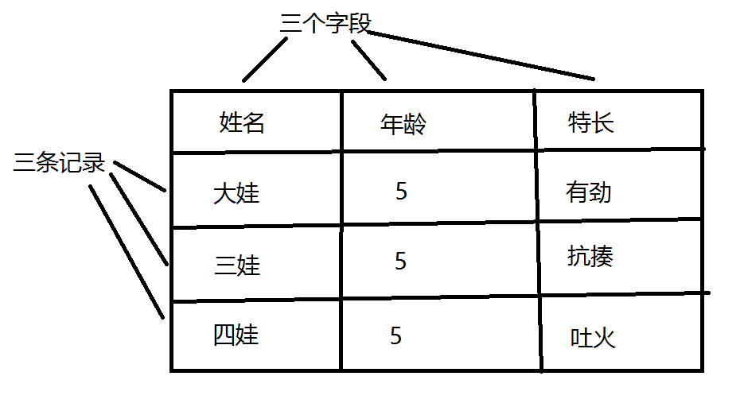
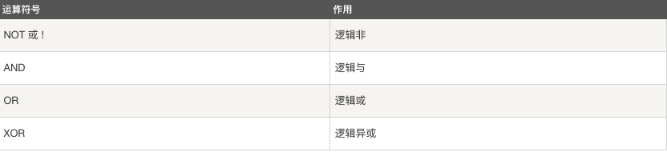

+

MySQL数据库

| Tedu Python 教学部 |
| --- |
| Author：吕泽|

-----------

[TOC]

## 数据库概述

### 数据存储阶段 

【1】 人工管理阶段

缺点 ：  数据无法共享,不能单独保持,数据存储量有限

【2】 文件管理阶段 （.txt  .doc  .xls）
    
优点 ： 数据可以长期保存,可以存储大量的数据,使用简单

缺点 ：  数据一致性差,数据查找修改不方便,数据冗余度可能比较大

【3】数据库管理阶段

优点 ： 数据组织结构化降低了冗余度,提高了增删改查的效率,容易扩展,方便程序调用，做自动化处理

缺点 ：需要使用sql 或者 其他特定的语句，相对比较复杂

### 数据库应用

>融机构、游戏网站、购物网站、论坛网站 ... ... 


### 基础概念

>数据 ： 能够输入到计算机中并被识别处理的信息集合

>数据结构 ：研究一个数据集合中数据之间关系的

>数据库 ： 按照数据结构，存储管理数据的仓库。数据库是在数据库管理系统管理和控制下，在一定介质上的数据集合。

>数据库管理系统 ：管理数据库的软件，用于建立和维护数据库

>数据库系统 ： 由数据库和数据库管理系统，开发工具等组成的集合 


### 数据库分类和常见数据库

* 关系型数据库和非关系型数据库
      
>关系型： 采用关系模型（二维表）来组织数据结构的数据库 

>非关系型： 不采用关系模型组织数据结构的数据库------------键值

* 开源数据库和非开源数据库

> 开源：MySQL、SQLite、MongoDB

> 非开源：Oracle、DB2、SQL_Server

* 常见的关系型数据库
  
> MySQL、Oracle、SQL_Server、DB2 SQLite  


### 认识关系型数据库和MySQL

1. 数据库结构

>数据元素 --> 记录 -->数据表 --> 数据库


2. 数据库概念解析

>数据表（table） ： 存放数据的表格 

>字段（column）： 每个列，用来表示该列数据的含义

>记录（row）： 每个行，表示一组完整的数据



3. MySQL特点

* 是开源数据库，使用C和C++编写 
* 能够工作在众多不同的平台上
* 提供了用于C、C++、Python、Java、Perl、PHP、Ruby众多语言的API
* 存储结构优良，运行速度快
* 功能全面丰富

4. MySQL安装

>Ubuntu安装MySQL服务
>>安装服务端: sudo apt-get install mysql-server
>>安装客户端: sudo apt-get install mysql-client
>>* 配置文件：/etc/mysql
>>* 命令集： /usr/bin
>>* 数据库存储目录 ：/var/lib/mysql

>Windows安装MySQL
>>下载MySQL安装包(windows)  https://dev.mysql.com/downloads/mysql/
  mysql-installer***5.7.***.msi
>>安装教程去安装

5. 启动和连接MySQL服务

>服务端启动
>>* 查看MySQL状态: sudo /etc/init.d/mysql status
>>* 启动服务：sudo /etc/init.d/mysql start | stop | restart  或者 service mysql   start|stop|restart

>客户端连接
>>命令格式 
>>* mysql -h主机地址 -u用户名 -p密码
>>* mysql -hlocalhost -uroot -p123456
>>* 本地连接可省略 -h 选项: mysql -uroot -p123456

>关闭连接
>> ctrl-D
>> exit


## SQL语句

> 什么是SQL
>
> >结构化查询语言(Structured Query Language)，一种特殊目的的编程语言，是一种数据库查询和程序设计语言，用于存取数据以及查询、更新和管理关系数据库系统。

> SQL语句使用特点
>* SQL语言基本上独立于数据库本身
>* 各种不同的数据库对SQL语言的支持与标准存在着细微的不同
>* 每条命令必须以 ; 结尾
>* SQL命令（除了数据库名和表名）可以不区分字母大小写


## 建立数据库和数据表

### 数据库操作

1.查看已有库
>show databases;

2.创建库

>create database 库名 [character set utf8];

```sql
e.g. 创建stu数据库，编码为utf8
create database stu character set utf8;
create database stu charset=utf8;
```

3.查看创建库的语句

>show create database 库名;

```sql
e.g. 查看stu创建方法
show create database stu;
```

4.查看当前所在库
>select database();

5.切换库
>use 库名;

```sql
e.g. 使用stu数据库
use stu;
```

6.删除库
>drop database 库名;

```sql
e.g. 删除test数据库
drop database test;
```

7.库名的命名规则
>* 数字、字母、下划线,但不能使用纯数字
>* 库名区分字母大小写
>* 不能使用特殊字符和mysql关键字

```python
tarena@tedu:~$ sudo /etc/init.d/mysql start
[ ok ] Starting mysql (via systemctl): mysql.service.
tarena@tedu:~$ sudo /etc/init.d/mysql stop
[ ok ] Stopping mysql (via systemctl): mysql.service.
tarena@tedu:~$ mysql -h127.0.0.1 -utarena -p123456
mysql: [Warning] Using a password on the command line interface can be insecure.
ERROR 2003 (HY000): Can't connect to MySQL server on '127.0.0.1' (111)
tarena@tedu:~$ mysql -uroot -p123456
mysql: [Warning] Using a password on the command line interface can be insecure.
ERROR 2002 (HY000): Can't connect to local MySQL server through socket '/var/run/mysqld/mysqld.sock' (2)
tarena@tedu:~$ mysql -uroot-p123456
ERROR 2002 (HY000): Can't connect to local MySQL server through socket '/var/run/mysqld/mysqld.sock' (2)
tarena@tedu:~$ mysql -uroot -p123456
mysql: [Warning] Using a password on the command line interface can be insecure.
ERROR 2002 (HY000): Can't connect to local MySQL server through socket '/var/run/mysqld/mysqld.sock' (2)
tarena@tedu:~$ mysql -uroot -p123456
mysql: [Warning] Using a password on the command line interface can be insecure.
ERROR 2002 (HY000): Can't connect to local MySQL server through socket '/var/run/mysqld/mysqld.sock' (2)
tarena@tedu:~$ sudo /etc/init.d/mysql start
[ ok ] Starting mysql (via systemctl): mysql.service.
tarena@tedu:~$ mysql -uroot -p123456
mysql: [Warning] Using a password on the command line interface can be insecure.
Welcome to the MySQL monitor.  Commands end with ; or \g.
Your MySQL connection id is 2
Server version: 5.7.28-0ubuntu0.18.04.4 (Ubuntu)

Copyright (c) 2000, 2019, Oracle and/or its affiliates. All rights reserved.

Oracle is a registered trademark of Oracle Corporation and/or its
affiliates. Other names may be trademarks of their respective
owners.

Type 'help;' or '\h' for help. Type '\c' to clear the current input statement.

mysql> exit
Bye
tarena@tedu:~$ mysql -uroot -p123456
mysql: [Warning] Using a password on the command line interface can be insecure.
Welcome to the MySQL monitor.  Commands end with ; or \g.
Your MySQL connection id is 3
Server version: 5.7.28-0ubuntu0.18.04.4 (Ubuntu)

Copyright (c) 2000, 2019, Oracle and/or its affiliates. All rights reserved.

Oracle is a registered trademark of Oracle Corporation and/or its
affiliates. Other names may be trademarks of their respective
owners.

Type 'help;' or '\h' for help. Type '\c' to clear the current input statement.

mysql> ^DBye
tarena@tedu:~$ mysql -u root -p
Enter password: 
Welcome to the MySQL monitor.  Commands end with ; or \g.
Your MySQL connection id is 4
Server version: 5.7.28-0ubuntu0.18.04.4 (Ubuntu)

Copyright (c) 2000, 2019, Oracle and/or its affiliates. All rights reserved.

Oracle is a registered trademark of Oracle Corporation and/or its
affiliates. Other names may be trademarks of their respective
owners.

Type 'help;' or '\h' for help. Type '\c' to clear the current input statement.

mysql> ^DBye
tarena@tedu:~$ mysql -uroot -p123456
mysql: [Warning] Using a password on the command line interface can be insecure.
Welcome to the MySQL monitor.  Commands end with ; or \g.
Your MySQL connection id is 5
Server version: 5.7.28-0ubuntu0.18.04.4 (Ubuntu)

Copyright (c) 2000, 2019, Oracle and/or its affiliates. All rights reserved.

Oracle is a registered trademark of Oracle Corporation and/or its
affiliates. Other names may be trademarks of their respective
owners.

Type 'help;' or '\h' for help. Type '\c' to clear the current input statement.

mysql> show databases
    -> show databases;
ERROR 1064 (42000): You have an error in your SQL syntax; check the manual that corresponds to your MySQL server version for the right syntax to use near 'show databases' at line 2
mysql> show databases;
+--------------------+
| Database           |
+--------------------+
| information_schema |
| mysql              |
| performance_schema |
| sys                |
+--------------------+
4 rows in set (0.03 sec)

mysql> show databases;
+--------------------+
| Database           |
+--------------------+
| information_schema |
| mysql              |
| performance_schema |
| sys                |
+--------------------+
4 rows in set (0.00 sec)

mysql> create database stu;
Query OK, 1 row affected (0.00 sec)

mysql> show databases;
+--------------------+
| Database           |
+--------------------+
| information_schema |
| mysql              |
| performance_schema |
| stu                |
| sys                |
+--------------------+
5 rows in set (0.00 sec)

mysql> show databases;
+--------------------+
| Database           |
+--------------------+
| information_schema |
| mysql              |
| performance_schema |
| stu                |
| sys                |
+--------------------+
5 rows in set (0.00 sec)

mysql> show create database stu;
+----------+----------------------------------------------------------------+
| Database | Create Database                                                |
+----------+----------------------------------------------------------------+
| stu      | CREATE DATABASE `stu` /*!40100 DEFAULT CHARACTER SET latin1 */ |
+----------+----------------------------------------------------------------+
1 row in set (0.00 sec)

mysql> show create database stu;
+----------+----------------------------------------------------------------+
| Database | Create Database                                                |
+----------+----------------------------------------------------------------+
| stu      | CREATE DATABASE `stu` /*!40100 DEFAULT CHARACTER SET latin1 */ |
+----------+----------------------------------------------------------------+
1 row in set (0.00 sec)

mysql> show create database stu;
+----------+----------------------------------------------------------------+
| Database | Create Database                                                |
+----------+----------------------------------------------------------------+
| stu      | CREATE DATABASE `stu` /*!40100 DEFAULT CHARACTER SET latin1 */ |
+----------+----------------------------------------------------------------+
1 row in set (0.00 sec)

mysql> use sys;
Reading table information for completion of table and column names
You can turn off this feature to get a quicker startup with -A

Database changed
mysql> use stu;
Database changed
mysql> select database();
+------------+
| database() |
+------------+
| stu        |
+------------+
1 row in set (0.00 sec)

mysql> select database()
    -> fhfgh
    -> 

^C
mysql> create database Test;
Query OK, 1 row affected (0.00 sec)

mysql> show databases;
+--------------------+
| Database           |
+--------------------+
| information_schema |
| Test               |
| mysql              |
| performance_schema |
| stu                |
| sys                |
+--------------------+
6 rows in set (0.00 sec)

mysql> drop database Test;
Query OK, 0 rows affected (0.00 sec)

mysql> show databases;
+--------------------+
| Database           |
+--------------------+
| information_schema |
| mysql              |
| performance_schema |
| stu                |
| sys                |
+--------------------+
5 rows in set (0.00 sec)

mysql> show databases;
+--------------------+
| Database           |
+--------------------+
| information_schema |
| mysql              |
| performance_schema |
| stu                |
| sys                |
+--------------------+
5 rows in set (0.00 sec)

mysql> 
```


### 数据表的管理

####  表结构设计初步

【1】 分析存储内容
【2】 确定字段构成
【3】 设计字段类型

#### 数据类型支持

>数字类型：
>>整数类型（精确值） - INTEGER，INT，SMALLINT，TINYINT，MEDIUMINT，BIGINT
>>定点类型（精确值） - DECIMAL
>>浮点类型（近似值） - FLOAT，DOUBLE
>>比特值类型 - BIT


>对于精度比较高的东西，比如money，用decimal类型提高精度减少误差。列的声明语法是DECIMAL(M,D)。
>>M是数字的最大位数（精度）。其范围为1～65，M 的默认值是10。
>>D是小数点右侧数字的数目（标度）。其范围是0～30，但不得超过M。
>>比如 DECIMAL(6,2)最多存6位数字，小数点后占2位,取值范围-9999.99到9999.99。

> 比特值类型指0，1值表达2种情况，如真，假

----------------------------------

>字符串类型：
>>CHAR和VARCHAR类型
>>BLOB和TEXT类型
>>ENUM类型和SET类型


* char 和 varchar
>char：定长，效率高，一般用于固定长度的表单提交数据存储，默认1字符
>varchar：不定长，效率偏低 ，但是节省空间。

* text 和blob
>text用来存储非二进制文本
>blob用来存储二进制字节串

* enum 和 set
>enum用来存储给出的一个值,enum("y","x","z")
>set用来存储给出的值中一个或多个值

-------------------------------------------


1. 表的基本操作

>创建表
>>create table 表名(
	字段名 数据类型,
	字段名 数据类型,
	...
	字段名 数据类型
	);

>>* 如果你想设置数字为无符号则加上 unsigned
>>* 如果你不想字段为 NULL 可以设置字段的属性为 NOT NULL， 在操作数据库时如果输入该字段的数据为NULL ，就会报错。
>>* DEFAULT 表示设置一个字段的默认值
>>* AUTO_INCREMENT定义列为自增的属性，一般用于主键，数值会自动加1。
>>* PRIMARY KEY 关键字用于定义列为主键。主键的值不能重复,且不能为空。

```sql
e.g.  创建班级表
create table class_1 (id int primary key auto_increment,name varchar(32) not null,age tinyint unsigned not null,sex enum('w','m'),score float default 0.0);

e.g. 创建兴趣班表
create table interest (id int primary key auto_increment,name varchar(32) not null,hobby set('sing','dance','draw'),level char not null,price decimal(6,2),remark text);
```

> 查看数据表
>
> >show tables；

>查看已有表的字符集
>
>>show create table 表名;

>查看表结构
>
>>desc 表名;

>删除表
>
>>drop table 表名;


## 数据操作基础

### 插入(insert)

```SQL
insert into 表名 values(值1),(值2),...;
insert into 表名(字段1,...) values(值1),...;
```

```sql
e.g. 
insert into class_1 values (2,'Baron',10,'m',91),(3,'Jame',9,'m',90);
```

### 查询(select)

```SQL
select * from 表名 [where 条件];
select 字段1,字段2 from 表名 [where 条件];
```

```sql
e.g. 
select * from class_1;

select name,age from class_1;
```

综合练习:

```sql
mysql> show database stu character set utf8;
ERROR 1064 (42000): You have an error in your SQL syntax; check the manual that corresponds to your MySQL server version for the right syntax to use near 'database stu character set utf8' at line 1
mysql> create database stu character set utf8;
Query OK, 1 row affected (0.00 sec)

mysql> show databases;
+--------------------+
| Database           |
+--------------------+
| information_schema |
| mysql              |
| performance_schema |
| stu                |
| sys                |
+--------------------+
5 rows in set (0.00 sec)

mysql> use stu;
Database changed
mysql> create table class_1 (id int primary key auto_increment,name varchar(32) not null,age tinyint unsigned not null,sex enum('w','m'),score float default 0.0);
Query OK, 0 rows affected (0.29 sec)

mysql> create table interest (id int primary key auto_increment,name varchar(32) not null,hobby set('sing','dance','draw'),level char not null,price decimal(6,2),remark text);
Query OK, 0 rows affected (0.29 sec)

mysql> insert into class_1 values (1,'Benny Wei',18,'m',92.5);
Query OK, 1 row affected (0.04 sec)

mysql> insert into class_1 values (2,'Abby',17,'w',86),(3,'Tom',17,'m',77);
Query OK, 2 rows affected (0.09 sec)
Records: 2  Duplicates: 0  Warnings: 0

mysql> insert into interest values (1,'Joy','sing,dance','B',56800.00,'骨骼惊奇,练武奇才');
ERROR 1264 (22003): Out of range value for column 'price' at row 1
mysql> insert into interest values (1,'Joy','sing,dance','B',5680.00,'骨骼惊奇,练武奇才');
Query OK, 1 row affected (0.05 sec)

mysql> select * from interest;
+----+------+------------+-------+---------+---------------------------+
| id | name | hobby      | level | price   | remark                    |
+----+------+------------+-------+---------+---------------------------+
|  1 | Joy  | sing,dance | B     | 5680.00 | 骨骼惊奇,练武奇才         |
+----+------+------------+-------+---------+---------------------------+
1 row in set (0.00 sec)

mysql> select * from class_1;
+----+-----------+-----+------+-------+
| id | name      | age | sex  | score |
+----+-----------+-----+------+-------+
|  1 | Benny Wei |  18 | m    |  92.5 |
|  2 | Abby      |  17 | w    |    86 |
|  3 | Tom       |  17 | m    |    77 |
+----+-----------+-----+------+-------+
3 rows in set (0.00 sec)

mysql> 
```


### where子句

where子句在sql语句中扮演了重要角色，主要通过一定的运算条件进行数据的筛选

MySQL 主要有以下几种运算符：
>算术运算符
>比较运算符
>逻辑运算符
>位运算符

#### 算数运算符


```sql
e.g.
select * from class_1 where age % 2 = 0;
```


#### 比较运算符


```sql
e.g.
select * from class_1 where age > 8;
select * from class_1 where  age between 8 and 10;
select * from class_1 where age in (8,9);
```

#### 逻辑运算符


```sql
e.g.				异或:相同为0,不同为1
select * from class_1 where sex='m' and age>9;
```

#### 位运算符


### 更新表记录(update)

```SQL
update 表名 set 字段1=值1,字段2=值2,... where 条件;

注意:update语句后如果不加where条件,所有记录全部更新
```

```sql
e.g.
update class_1 set age=11 where name='Abby';
```


###　删除表记录（delete）

```SQL
delete from 表名 where 条件;

注意:delete语句后如果不加where条件,所有记录全部清空
```
```sql
e.g.
delete from class_1 where name='Abby';
```

综合练习(作业):

```python
tarena@tedu:~$ mysql -hlocalhost -uroot -p123456
mysql: [Warning] Using a password on the command line interface can be insecure.
Welcome to the MySQL monitor.  Commands end with ; or \g.
Your MySQL connection id is 7
Server version: 5.7.28-0ubuntu0.18.04.4 (Ubuntu)

Copyright (c) 2000, 2019, Oracle and/or its affiliates. All rights reserved.

Oracle is a registered trademark of Oracle Corporation and/or its
affiliates. Other names may be trademarks of their respective
owners.

Type 'help;' or '\h' for help. Type '\c' to clear the current input statement.

mysql> insert into book values (1,'python从入门到放弃','小泽玛利亚',35,'中国教育出版社','版权所^C               

^C
mysql> show databases;
+--------------------+
| Database           |
+--------------------+
| information_schema |
| books              |
| mysql              |
| performance_schema |
| stu                |
| sys                |
+--------------------+
6 rows in set (0.00 sec)

mysql> use books;
Reading table information for completion of table and column names
You can turn off this feature to get a quicker startup with -A

Database changed
mysql> show table book;
ERROR 1064 (42000): You have an error in your SQL syntax; check the manual that corresponds to your MySQL server version for the right syntax to use near 'book' at line 1
mysql> show tables;
+-----------------+
| Tables_in_books |
+-----------------+
| book            |
+-----------------+
1 row in set (0.00 sec)

mysql> use book;
ERROR 1049 (42000): Unknown database 'book'
mysql> desc book;
+-------------+--------------+------+-----+---------+----------------+
| Field       | Type         | Null | Key | Default | Extra          |
+-------------+--------------+------+-----+---------+----------------+
| id          | int(11)      | NO   | PRI | NULL    | auto_increment |
| title       | varchar(64)  | NO   |     | NULL    |                |
| author      | varchar(32)  | YES  |     | NULL    |                |
| price       | decimal(3,1) | YES  |     | NULL    |                |
| publication | varchar(32)  | YES  |     | NULL    |                |
| comment     | text         | YES  |     | NULL    |                |
+-------------+--------------+------+-----+---------+----------------+
6 rows in set (0.00 sec)

mysql> select * from book;
+----+--------------------------+-----------------+-------+-----------------------+---------------------------------+
| id | title                    | author          | price | publication           | comment                         |
+----+--------------------------+-----------------+-------+-----------------------+---------------------------------+
|  1 | python从入门到放弃       | 小泽玛利亚      |  35.0 | 中国教育出版社        | 版权所有,不可私自出售           |
+----+--------------------------+-----------------+-------+-----------------------+---------------------------------+
1 row in set (0.00 sec)
       mysql> select * from book;                                                              +----+--------------------------+-----------------+-------+-----------------------+---------------------------------+
| id | title                    | author          | price | publication           | comment                         |
+----+--------------------------+-----------------+-------+-----------------------+---------------------------------+
|  1 | python从入门到放弃       | 小泽玛利亚      |  35.0 | 中国教育出版社        | 版权所有,不可私自出售           |
+----+--------------------------+-----------------+-------+-----------------------+---------------------------------+
1 row in set (0.00 sec)

mysql> select * from book;
+----+--------------------------+-----------------+-------+-----------------------+---------------------------------+
| id | title                    | author          | price | publication           | comment                         |
+----+--------------------------+-----------------+-------+-----------------------+---------------------------------+
|  1 | python从入门到放弃       | 小泽玛利亚      |  35.0 | 中国教育出版社        | 版权所有,不可私自出售           |
+----+--------------------------+-----------------+-------+-----------------------+---------------------------------+
1 row in set (0.00 sec)

mysql> insert into book values (2,'重构','小齐',40,'机械工业出版社','好好学习天天向上');
Query OK, 1 row affected (0.04 sec)

mysql> select * from book;
+----+--------------------------+-----------------+-------+-----------------------+---------------------------------+
| id | title                    | author          | price | publication           | comment                         |
+----+--------------------------+-----------------+-------+-----------------------+---------------------------------+
|  1 | python从入门到放弃       | 小泽玛利亚      |  35.0 | 中国教育出版社        | 版权所有,不可私自出售           |
|  2 | 重构                     | 小齐            |  40.0 | 机械工业出版社        | 好好学习天天向上                |
+----+--------------------------+-----------------+-------+-----------------------+---------------------------------+
2 rows in set (0.00 sec)

mysql> delete from book where name='小泽玛利亚';
ERROR 1054 (42S22): Unknown column 'name' in 'where clause'
mysql> delete from book where author='小泽玛利亚';
Query OK, 1 row affected (0.04 sec)

mysql> delete from book where author='小齐';
Query OK, 1 row affected (0.04 sec)

mysql> insert into book values (1,'四世同堂','老舍',35,'中国教育出版社','不知道备注啥');
Query OK, 1 row affected (0.06 sec)

mysql> insert into book values (2,'朝花夕拾','鲁迅',40,'机械工业出版社','好好学习天天向上');
Query OK, 1 row affected (0.04 sec)

mysql> insert into book values (3,'平凡的世界','路遥',68,'人民教育出版社','喜欢文学的朋友们强烈推荐');
Query OK, 1 row affected (0.04 sec)

mysql> insert into book values (4,'茶花女','小仲马',56,'中国教育出版社','');
Query OK, 1 row affected (0.05 sec)

mysql> insert into book values (5,'百年孤独','加西亚·马尔克斯',49,'人民教育出版社','备注2');
Query OK, 1 row affected (0.04 sec)

mysql> insert into book values (6,'骆驼祥子','老舍',98,'中国教育出版社','');
Query OK, 1 row affected (0.03 sec)

mysql> insert into book values (7,'野草','鲁迅',68,'人民教育出版社','好好学习天天向上');
Query OK, 1 row affected (0.04 sec)

mysql> insert into book values (8,'红高粱','莫言',68,'人民教育出版社','');
Query OK, 1 row affected (0.05 sec)

mysql> select * from book;
+----+-----------------+-------------------------+-------+-----------------------+--------------------------------------+
| id | title           | author                  | price | publication           | comment                              |
+----+-----------------+-------------------------+-------+-----------------------+--------------------------------------+
|  1 | 四世同堂        | 老舍                    |  35.0 | 中国教育出版社        | 不知道备注啥                         |
|  2 | 朝花夕拾        | 鲁迅                    |  40.0 | 机械工业出版社        | 好好学习天天向上                     |
|  3 | 平凡的世界      | 路遥                    |  68.0 | 人民教育出版社        | 喜欢文学的朋友们强烈推荐             |
|  4 | 茶花女          | 小仲马                  |  56.0 | 中国教育出版社        |                                      |
|  5 | 百年孤独        | 加西亚·马尔克斯         |  49.0 | 人民教育出版社        | 备注2                                |
|  6 | 骆驼祥子        | 老舍                    |  98.0 | 中国教育出版社        |                                      |
|  7 | 野草            | 鲁迅                    |  68.0 | 人民教育出版社        | 好好学习天天向上                     |
|  8 | 红高粱          | 莫言                    |  68.0 | 人民教育出版社        |                                      |
+----+-----------------+-------------------------+-------+-----------------------+--------------------------------------+
8 rows in set (0.00 sec)

mysql> select * from book where price between 30 and 40;
+----+--------------+--------+-------+-----------------------+--------------------------+
| id | title        | author | price | publication           | comment                  |
+----+--------------+--------+-------+-----------------------+--------------------------+
|  1 | 四世同堂     | 老舍   |  35.0 | 中国教育出版社        | 不知道备注啥             |
|  2 | 朝花夕拾     | 鲁迅   |  40.0 | 机械工业出版社        | 好好学习天天向上         |
+----+--------------+--------+-------+-----------------------+--------------------------+
2 rows in set (0.00 sec)

mysql> select * from book where publication='中国教育出版社';
+----+--------------+-----------+-------+-----------------------+--------------------+
| id | title        | author    | price | publication           | comment            |
+----+--------------+-----------+-------+-----------------------+--------------------+
|  1 | 四世同堂     | 老舍      |  35.0 | 中国教育出版社        | 不知道备注啥       |
|  4 | 茶花女       | 小仲马    |  56.0 | 中国教育出版社        |                    |
|  6 | 骆驼祥子     | 老舍      |  98.0 | 中国教育出版社        |                    |
+----+--------------+-----------+-------+-----------------------+--------------------+
3 rows in set (0.00 sec)

mysql> select * from book where publication='中国教育出版社' and author='老舍';
+----+--------------+--------+-------+-----------------------+--------------------+
| id | title        | author | price | publication           | comment            |
+----+--------------+--------+-------+-----------------------+--------------------+
|  1 | 四世同堂     | 老舍   |  35.0 | 中国教育出版社        | 不知道备注啥       |
|  6 | 骆驼祥子     | 老舍   |  98.0 | 中国教育出版社        |                    |
+----+--------------+--------+-------+-----------------------+--------------------+
2 rows in set (0.00 sec)

mysql> select * from book where comment is NULL;
Empty set (0.00 sec)

mysql> select * from book where comment is null;
Empty set (0.00 sec)

mysql> select * from book where price>60;
+----+-----------------+--------+-------+-----------------------+--------------------------------------+
| id | title           | author | price | publication           | comment                              |
+----+-----------------+--------+-------+-----------------------+--------------------------------------+
|  3 | 平凡的世界      | 路遥   |  68.0 | 人民教育出版社        | 喜欢文学的朋友们强烈推荐             |
|  6 | 骆驼祥子        | 老舍   |  98.0 | 中国教育出版社        |                                      |
|  7 | 野草            | 鲁迅   |  68.0 | 人民教育出版社        | 好好学习天天向上                     |
|  8 | 红高粱          | 莫言   |  68.0 | 人民教育出版社        |                                      |
+----+-----------------+--------+-------+-----------------------+--------------------------------------+
4 rows in set (0.00 sec)

mysql> delete * from book where title='骆驼祥子';
ERROR 1064 (42000): You have an error in your SQL syntax; check the manual that corresponds to your MySQL server version for the right syntax to use near '* from book where title='骆驼祥子'' at line 1
mysql> delete from book where title='骆驼祥子';
Query OK, 1 row affected (0.05 sec)

mysql> insert into book values (6,'骆驼祥子','老舍',98,'中国教育出版社');
ERROR 1136 (21S01): Column count doesn't match value count at row 1
mysql> insert into book values (6,'骆驼祥子','老舍',98,'中国教育出版社','');
Query OK, 1 row affected (0.04 sec)

mysql> select * from book;
+----+-----------------+-------------------------+-------+-----------------------+--------------------------------------+
| id | title           | author                  | price | publication           | comment                              |
+----+-----------------+-------------------------+-------+-----------------------+--------------------------------------+
|  1 | 四世同堂        | 老舍                    |  35.0 | 中国教育出版社        | 不知道备注啥                         |
|  2 | 朝花夕拾        | 鲁迅                    |  40.0 | 机械工业出版社        | 好好学习天天向上                     |
|  3 | 平凡的世界      | 路遥                    |  68.0 | 人民教育出版社        | 喜欢文学的朋友们强烈推荐             |
|  4 | 茶花女          | 小仲马                  |  56.0 | 中国教育出版社        |                                      |
|  5 | 百年孤独        | 加西亚·马尔克斯         |  49.0 | 人民教育出版社        | 备注2                                |
|  6 | 骆驼祥子        | 老舍                    |  98.0 | 中国教育出版社        |                                      |
|  7 | 野草            | 鲁迅                    |  68.0 | 人民教育出版社        | 好好学习天天向上                     |
|  8 | 红高粱          | 莫言                    |  68.0 | 人民教育出版社        |                                      |
+----+-----------------+-------------------------+-------+-----------------------+--------------------------------------+
8 rows in set (0.00 sec)

mysql> select * from book where comment is not null;
+----+-----------------+-------------------------+-------+-----------------------+--------------------------------------+
| id | title           | author                  | price | publication           | comment                              |
+----+-----------------+-------------------------+-------+-----------------------+--------------------------------------+
|  1 | 四世同堂        | 老舍                    |  35.0 | 中国教育出版社        | 不知道备注啥                         |
|  2 | 朝花夕拾        | 鲁迅                    |  40.0 | 机械工业出版社        | 好好学习天天向上                     |
|  3 | 平凡的世界      | 路遥                    |  68.0 | 人民教育出版社        | 喜欢文学的朋友们强烈推荐             |
|  4 | 茶花女          | 小仲马                  |  56.0 | 中国教育出版社        |                                      |
|  5 | 百年孤独        | 加西亚·马尔克斯         |  49.0 | 人民教育出版社        | 备注2                                |
|  6 | 骆驼祥子        | 老舍                    |  98.0 | 中国教育出版社        |                                      |
|  7 | 野草            | 鲁迅                    |  68.0 | 人民教育出版社        | 好好学习天天向上                     |
|  8 | 红高粱          | 莫言                    |  68.0 | 人民教育出版社        |                                      |
+----+-----------------+-------------------------+-------+-----------------------+--------------------------------------+
8 rows in set (0.00 sec)

mysql> update book set comment=null where comment='';
Query OK, 3 rows affected (0.05 sec)
Rows matched: 3  Changed: 3  Warnings: 0

mysql> select * from book;
+----+-----------------+-------------------------+-------+-----------------------+--------------------------------------+
| id | title           | author                  | price | publication           | comment                              |
+----+-----------------+-------------------------+-------+-----------------------+--------------------------------------+
|  1 | 四世同堂        | 老舍                    |  35.0 | 中国教育出版社        | 不知道备注啥                         |
|  2 | 朝花夕拾        | 鲁迅                    |  40.0 | 机械工业出版社        | 好好学习天天向上                     |
|  3 | 平凡的世界      | 路遥                    |  68.0 | 人民教育出版社        | 喜欢文学的朋友们强烈推荐             |
|  4 | 茶花女          | 小仲马                  |  56.0 | 中国教育出版社        | NULL                                 |
|  5 | 百年孤独        | 加西亚·马尔克斯         |  49.0 | 人民教育出版社        | 备注2                                |
|  6 | 骆驼祥子        | 老舍                    |  98.0 | 中国教育出版社        | NULL                                 |
|  7 | 野草            | 鲁迅                    |  68.0 | 人民教育出版社        | 好好学习天天向上                     |
|  8 | 红高粱          | 莫言                    |  68.0 | 人民教育出版社        | NULL                                 |
+----+-----------------+-------------------------+-------+-----------------------+--------------------------------------+
8 rows in set (0.00 sec)

mysql> select from book where comment is not null;
ERROR 1064 (42000): You have an error in your SQL syntax; check the manual that corresponds to your MySQL server version for the right syntax to use near 'from book where comment is not null' at line 1
mysql> select * from book where comment is not null;
+----+-----------------+-------------------------+-------+-----------------------+--------------------------------------+
| id | title           | author                  | price | publication           | comment                              |
+----+-----------------+-------------------------+-------+-----------------------+--------------------------------------+
|  1 | 四世同堂        | 老舍                    |  35.0 | 中国教育出版社        | 不知道备注啥                         |
|  2 | 朝花夕拾        | 鲁迅                    |  40.0 | 机械工业出版社        | 好好学习天天向上                     |
|  3 | 平凡的世界      | 路遥                    |  68.0 | 人民教育出版社        | 喜欢文学的朋友们强烈推荐             |
|  5 | 百年孤独        | 加西亚·马尔克斯         |  49.0 | 人民教育出版社        | 备注2                                |
|  7 | 野草            | 鲁迅                    |  68.0 | 人民教育出版社        | 好好学习天天向上                     |
+----+-----------------+-------------------------+-------+-----------------------+--------------------------------------+
5 rows in set (0.00 sec)

mysql> select title,price from book where price>60;
+-----------------+-------+
| title           | price |
+-----------------+-------+
| 平凡的世界      |  68.0 |
| 骆驼祥子        |  98.0 |
| 野草            |  68.0 |
| 红高粱          |  68.0 |
+-----------------+-------+
4 rows in set (0.00 sec)

mysql> 

```


### 表字段的操作(alter)

```SQL
语法 ：alter table 表名 执行动作;

* 添加字段(add)
    alter table 表名 add 字段名 数据类型;
    alter table 表名 add 字段名 数据类型 first;
    alter table 表名 add 字段名 数据类型 after 字段名;
* 删除字段(drop)
    alter table 表名 drop 字段名;
* 修改数据类型(modify)
    alter table 表名 modify 字段名 新数据类型;
* 修改字段名(change)
    alter table 表名 change 旧字段名 新字段名 新数据类型;
* 表重命名(rename)
    alter table 表名 rename 新表名;
```

```sql
e.g. 
alter table interest add tel char(11) after name;
```


### 时间类型数据

>时间和日期类型:
>>日期DATE，日期时间DATETIME，时间戳TIMESTAMP
>>时间TIME
>>年份YEAR


#### 时间格式

> date ："YYYY-MM-DD"
> time ："HH:MM:SS"
> datetime ："YYYY-MM-DD HH:MM:SS"
> timestamp ："YYYY-MM-DD HH:MM:SS"
注意
  1、datetime ：以系统时间存储
  2、timestamp ：以标准时间存储但是查看时转换为系统时区，所以表现形式和datetime相同


```sql
e.g.
create table marathon (id int primary key auto_increment,athlete varchar(32),birthday date,registration_time datetime,performance time);
```


#### 日期时间函数
  * now()  返回服务器当前日期时间,格式对应datetime类型
  * curdate() 返回当前日期，格式对应date类型
  * curtime() 返回当前时间，格式对应time类型

#### 时间操作

* 查找操作
```sql
  select * from marathon where birthday>='2000-01-01';
  select * from marathon where birthday>="2000-07-01" and performance<="2:30:00";
```

* 日期时间运算

  - 语法格式

    select * from 表名  where 字段名 运算符 (时间-interval 时间间隔单位);

  - 时间间隔单位：   2 hour | 1 minute | 2 second | 2 year | 3 month |  1 day

```sql
  select * from marathon where registration_time > (now()-interval 7 day);
```

### 高级查询语句


#### 模糊查询和正则查询

LIKE用于在where子句中进行模糊查询，SQL LIKE 子句中使用百分号 %来表示任意0个或多个字符，下划线_表示任意一个字符。

使用 LIKE 子句从数据表中读取数据的通用语法：

```sql
SELECT field1, field2,...fieldN 
FROM table_name
WHERE field1 LIKE condition1
```

```sql
e.g. 
mysql> select * from class_1 where name like 'A%';
```

mysql中对正则表达式的支持有限，只支持部分正则元字符

```sql
SELECT field1, field2,...fieldN 
FROM table_name
WHERE field1 REGEXP condition1
```

```sql
e.g. 
select * from class_1 where name regexp '^B.+';
```
#### as 用法

  > 在sql语句中as用于给字段或者表重命名

  > ```sql
  > select name as 姓名,age as 年龄 from class_1;
  > select * from class_1 as c where c.age > 17;
  >```

#### 排序

ORDER BY 子句来设定你想按哪个字段哪种方式来进行排序，再返回搜索结果。

使用 ORDER BY 子句将查询数据排序后再返回数据：

```sql
SELECT field1, field2,...fieldN from table_name1 where field1
ORDER BY field1 [ASC [DESC]]
PS:
		默认AESC升序,DESC降序排序
```
默认情况ASC表示升序，DESC表示降序

```sql
select * from class_1 where sex='m' order by age;
```

#### 分页(限制)

LIMIT 子句用于限制由 SELECT 语句返回的数据数量 或者 UPDATE,DELETE语句的操作数量

带有 LIMIT 子句的 SELECT 语句的基本语法如下：

```sql
SELECT column1, column2, columnN 
FROM table_name
WHERE field
LIMIT [num]
```

#### 联合查询

UNION 操作符用于连接两个以上的 SELECT 语句的结果组合到一个结果集合中。多个 SELECT 语句会删除重复的数据。

UNION 操作符语法格式：

```sql
SELECT expression1, expression2, ... expression_n
FROM tables
[WHERE conditions]
UNION [ALL | DISTINCT]
SELECT expression1, expression2, ... expression_n
FROM tables
[WHERE conditions];
```
>expression1, expression2, ... expression_n: 要检索的列。
>tables: 要检索的数据表。
>WHERE conditions: 可选， 检索条件。
>DISTINCT: 可选，删除结果集中重复的数据。默认情况下 UNION 操作符已经删除了重复数据，所以 DISTINCT 修饰符对结果没啥影响。
>ALL: 可选，返回所有结果集，包含重复数据。

```sql
select * from class_1 where sex='m' UNION ALL select * from class_1 where age > 9;
```
#### 子查询---select双层查询

> 定义 ： 当一个select语句中包含另一个select 查询语句，则称之为有子查询的语句
> 子查询出现的位置：
>
> 1. from 之后 ，此时子查询的内容作为一个新的表内容，再进行外层select查询

```sql
select name from (select * from class_1 where sex='m') as s where s.score > 90;
```
* 需要将子查询结果集重命名一下，方便where子句中的引用操作

>2. where字句中，此时select查询到的内容作为外层查询的条件值

```sql
 select *  from class_1 where age = (select age from class_1 where name='Tom');
```
* 子句返回的结果需要一个明确值，即需要时某个记录的某个元素，不能是多行或者多列


## 聚合操作

聚合操作指的是在数据查找基础上对数据的进一步整理筛选行为，在认识聚合之前先看一个更完整的sql语句

* select语句执行顺序

```sql
(7)     SELECT 
(8)     [DISTINCT] <select_list>
(1)     FROM <left_table>
(3)     <join_type> JOIN <right_table>
(2)     ON <join_condition>
(4)     WHERE <where_condition>
(5)     GROUP BY <group_by_list>
(6)     HAVING <having_condition>
(9)     ORDER BY <order_by_condition>
(10)    LIMIT <limit_number>
```

### 聚合函数--avg(字段名)/max(字段名)/min(字段名)/sum(字段名)/count(字段名)

| 方法          | 功能                 |
| ------------- | -------------------- |
| avg(字段名)   | 该字段的平均值       |
| max(字段名)   | 该字段的最大值       |
| min(字段名)   | 该字段的最小值       |
| sum(字段名)   | 该字段所有记录的和   |
| count(字段名) | 统计该字段记录的个数 |
|               |                      |

eg1 : 找出表中的最大攻击力的值？

```mysql
select max(attack) from sanguo;
```

eg2 : 表中共有多少个英雄？

```mysql
select count(name) as number from sanguo;
```

eg3 : 蜀国英雄中攻击值大于200的英雄的数量

```mysql
select count(*) from sanguo where attack > 200; 
```

> 注意： 此时select 后只能写聚合函数，无法查找其他字段。

### 聚合分组---group by

- **group by**

给查询的结果进行分组
e.g.  : 计算每个国家的平均攻击力

```mysql
select country,avg(attack) from sanguo 
group by country;
```

e.g. :  对多个字段创建索引，此时多个字段都相同时为一组
```mysql
select age,sex,count(*) from class1 group by age,sex;
```


e.g. : 所有国家的男英雄中 英雄数量最多的前2名的 国家名称及英雄数量

```mysql
select country,count(id) as number from sanguo 
where gender='M' group by country
order by number DESC
limit 2;
```

>  使用分组时select 后的字段为group by分组的字段和聚合函数，不能包含其他内容。group by也可以同时依照多个字段分组，如group by A，B 此时必须A,B两个字段值均相同才算一组。

### 聚合筛选---**having语句**

- **having语句**

对分组聚合后的结果进行进一步筛选

```mysql
eg1 : 找出平均攻击力大于105的国家的前2名,显示国家名称和平均攻击力
select country,avg(attack) from sanguo 
group by country
having avg(attack)>105
order by avg(attack) DESC
limit 2;
```

注意
>- having语句通常与group by联合使用。
>- having语句存在弥补了where关键字不能与聚合函数联合使用的不足,where只能操作表中实际存在的字段,having操作的是聚合函数生成的显示列


### 去重语句---放在select后面

- **distinct语句**

不显示字段重复值

```mysql
eg1 : 表中都有哪些国家
  select distinct name,country from sanguo;
eg2 : 计算一共有多少个国家
  select count(distinct country) from sanguo;
```


注意

>- distinct和from之间所有字段都相同才会去重


### 聚合运算--- +  -  *  /  %  

- **查询表记录时做数学运算**

运算符 ： +  -  *  /  %  

```mysql
eg1: 查询时显示攻击力翻倍
  select name,attack*2 from sanguo;
eg2: 更新蜀国所有英雄攻击力 * 2
  update sanguo set attack=attack*2 where country='蜀国';
```


## 索引操作

### 索引概述

- **定义**

索引是对数据库表中一列或多列的值进行排序的一种结构，使用索引可快速访问数据库表中的特定信息。

PS:创建索引情况:数据量庞大,频繁查询而不是修改

- **优点**

> 加快数据检索速度,提高查找效率

- **缺点**

> 占用数据库物理存储空间
> 当对表中数据更新时,索引需要动态维护,降低数据写入效率


###  索引分类

*  普通(MUL) 

> 普通索引 ：字段值无约束,KEY标志为 MUL

* 唯一索引(UNI)

> 唯一索引(unique) ：字段值不允许重复,但可为 NULL,KEY标志为 UNI

* 主键索引（PRI）

> 一个表中只能有一个主键字段, 主键字段不允许重复,且不能为NULL，KEY标志为PRI。通常设置记录编号字段id,能唯一锁定一条记录


### 索引创建

主键索引的创建方法已经在数据表中介绍过了，下面是普通索引和唯一索引的创建方法：


* 创建表时直接创建索引
```mysql
create table 表名(
字段名 数据类型，
字段名 数据类型，
index(字段名),
index(字段名),
unique(字段名)
);
```

* 在已有表中创建索引：

```mysql
create [unique] index 索引名 on 表名(字段名);
```

- **查看索引**

```mysql
1、desc 表名;  --> KEY标志为：MUL 、UNI。
2、show index from 表名;
```

> * 扩展： 借助性能查看选项去查看索引性能

```sql
show variables like 'profiling'；

set  profiling = 1； 打开功能 （项目上线一般不打开）

show profiles  查看语句执行信息
```

- **删除索引**

```mysql
drop index 索引名 on 表名;
```


- **已有表添加主键索引或自增长属性**

```mysql
alter table 表名 add primary key(id);
alter table 表名 modify id int auto_increment;
```


- **创建复合主键**

```mysql
primary key（uid,pid）
此时两个字段只要不都相同即可。
```

- **删除主键索引或自增长属性**

```mysql
alter table 表名 modify id int;  要先删除自增长，因为它只作用于主键字段
alter table 表名 drop primary key;
```

综合练习:

```python
-- alter操作
alter table interest
    add email char(28);
alter table interest
    add phone char(16) after price;
alter table interest
    drop email;
alter table interest
    modify level char(3);
alter table interest
    change remark comment text;
alter table class_1 rename cls;

-- datetime
select *
from marathon
where birthday > (curdate() - interval 20 year);

# 高级查询
select *
from cls
where name like "___";

select *
from cls
order by age, score desc;

update cls
set score = 93
where sex = 'm'
limit 1;

# 成绩最好的女生
select *
from cls
where sex = 'w'
order by score desc
limit 1;

# union
select name, age, score
from cls
where score >= 90
union all
select name, age, sex
from cls
where age > 18;

# --子查询
select name, hobby
from interest
where name = (select name from cls order by score limit 1);


# 聚合查询
select avg(attack), max(attack)
from sanguo
where country = '蜀';

select gender, count(*)
from sanguo
group by gender;

# 所有国家中，男英雄比较多的前两个国家，查看这两个
# 国家的国家名称和男英雄数量，展示时请按数量降序排序
# 展示
select country, count(*) as number
from sanguo
where gender = '男'
group by country
order by number desc
limit 2;

# 索引
create index name_index on cls (name);
create table index_test
(
    id   int auto_increment,
    name varchar(20),
    primary key (id),
    index (name)
);

# 删除索引
drop index name on index_test;
```


### 扩展：索引结构

mysql最为常用的就是使用B-Tree结构构建索引表。那么为什么树形结构能够加快查找速度呢？

* 二叉查找树

  
  

B 树是对查找结构的进一步优化，加快了区间查找效率：

* B树

  

* B+树


## 外键约束和表关联关系

### 外键约束

* 约束 : 约束是一种限制，它通过对表的行或列的数据做出限制，来确保表的数据的完整性、唯一性

* foreign key 功能 : 建立表与表之间的某种约束的关系，由于这种关系的存在，能够让表与表之间的数据，更加的完整，关连性更强，为了具体说明创建如下部门表和人员表。


> 创建部门

```sql
CREATE TABLE dept (id int PRIMARY KEY auto_increment,dname VARCHAR(50) not null);
```

>  创建人员

```sql
CREATE TABLE `person` (
  `id` int PRIMARY KEY AUTO_INCREMENT,
  `name` varchar(32) NOT NULL,
  `age` tinyint DEFAULT 0,
  `sex` enum('m','w','o') DEFAULT 'o',
  `salary` decimal(8,2) DEFAULT 250.00,
  `hire_date` date NOT NULL,
  `dept_id` int DEFAULT NULL
) ;
```

> 上面两个表中每个人员都应该有指定的部门，但是实际上在没有约束的情况下人员是可以没有部门的或者也可以添加一个不存在的部门，这显然是不合理的。当然并不是任何情况都需要建立外键关系，如果没有这种约束时也可以不建立，但是当表与表之间存在这种约束时最好建立。

* 主表和从表：若同一个数据库中，B表的外键与A表的主键相对应，则A表为主表，B表为从表。

- foreign key 外键的定义语法：

  ```sql
  [CONSTRAINT symbol] FOREIGN KEY [id] (index_col_name, ...)
  
  REFERENCES tbl_name (index_col_name, ...)
  
  [ON DELETE {RESTRICT | CASCADE | SET NULL | NO ACTION}]
  
  [ON UPDATE {RESTRICT | CASCADE | SET NULL | NO ACTION}]
  ```

  该语法可以在 CREATE TABLE 和 ALTER TABLE 时使用，如果不指定CONSTRAINT symbol，mysql会自动生成一个名字,可以通过show  create table [tb]命令查看
  


> 建立表时直接建立外键关联，注意本表的外键列类型与指定的主表列相同，且主表指定列需为主键

```sql
CREATE TABLE `person` (
  `id` int PRIMARY KEY AUTO_INCREMENT,
  `name` varchar(32) NOT NULL,
  `age` tinyint DEFAULT 0,
  `sex` enum('m','w','o') DEFAULT 'o',
  `salary` decimal(10,2) DEFAULT 250.00,
  `hire_date` date NOT NULL,
  `dept_id` int DEFAULT NULL,
   constraint dept_fk foreign key(dept_id) references dept(id));
```

> 建立表后增加外键

```sql
 alter table person add constraint dept_fk foreign key(dept_id) references dept(id);
```

> 通过外键名称解除外键约束

```sql
alter table person drop foreign key dept_fk;

删除外键后发现desc查看索引标志还在，其实外键也是一种索引，需要将外键名称的索引删除之后才可以。
```

- restrict(默认)  :  on delete restrict  on update restrict
  - 当主表删除记录时，如果从表中有相关联记录则不允许主表删除
  - 当主表更改主键字段值时，如果从表有相关记录则不允许更改
- cascade ：数据级联更新  on delete cascade   on update cascade
  - 当主表删除记录或更改被参照字段的值时,从表会级联更新
- set null  :   on delete set null    on update set null
  - 当主表删除记录时，从表外键字段值变为null
  - 当主表更改主键字段值时，从表外键字段值变为null
- no action
  - 同 restrict，都是立即检查外键限制

### 表关联设计--重点

当我们应对复杂的数据关系的时候，数据表的设计就显得尤为重要，认识数据之间的依赖关系是更加合理创建数据表关联性的前提。常见的数据关系如下：

- 一对一关系

> 一张表的一条记录一定只能与另外一张表的一条记录进行对应，反之亦然。
>
> 举例 :  学生信息和学籍档案，一个学生对应一个档案，一个档案也只属于一个学生


 ``` sql
create table student(id int primary key auto_increment,name varchar(50) not null);

create table record(id int primary key auto_increment,
comment text not null,
st_id int unique,
foreign key(st_id) references student(id) 
on delete cascade 
on update cascade
);
 ```


- 一对多关系(无需单独建表)--外键

> 一张表中有一条记录可以对应另外一张表中的多条记录；但是反过来，另外一张表的一条记录
> 只能对应第一张表的一条记录，这种关系就是一对多或多对一
>
> 举例： 一个人可以拥有多辆汽车，每辆车登记的车主只有一人。

```sql
create table person(
  id varchar(32) primary key,
  name varchar(30),
  sex char(1),
  age int
);

create table car(
  id varchar(32) primary key,
  name varchar(30),
  price decimal(10,2),
  pid varchar(32),
  constraint car_fk foreign key(pid) references person(id)
);
```

- 多对多关系(需要单独建表)

> 一对表中（A）的一条记录能够对应另外一张表（B）中的多条记录；同时B表中的一条记录
> 也能对应A表中的多条记录
>
> 举例：一个运动员可以报多个项目，每个项目也会有多个运动员参加,这时为了表达多对多关系需要单独创建关系表。

```mysql
CREATE TABLE `athlete` (
  `id` int NOT NULL AUTO_INCREMENT,
  `name` varchar(30) DEFAULT NULL,
  `age` tinyint NOT NULL,
  `country` varchar(30) NOT NULL,
  `description` varchar(30) DEFAULT NULL,
  PRIMARY KEY (`id`)
);

CREATE TABLE `item` (
  `id` int NOT NULL AUTO_INCREMENT,
  `rname` varchar(30) NOT NULL,
  PRIMARY KEY (`id`)
);

CREATE TABLE `athlete_item` (
  `aid` int NOT NULL,
  `tid` int NOT NULL,
  PRIMARY KEY (`aid`,`tid`),
  CONSTRAINT `athlete_fk` FOREIGN KEY (`aid`) REFERENCES `athlete` (`id`),
  CONSTRAINT `item_fk` FOREIGN KEY (`tid`) REFERENCES `item` (`id`)
);
```


#### E-R模型

**定义**		

```mysql
E-R模型(Entry-Relationship)即 实体-关系 数据模型,用于数据库设计
用简单的图(E-R图)反映了现实世界中存在的事物或数据以及他们之间的关系
```

**实体、属性、关系**

- 实体

```mysql
1、描述客观事物的概念
2、表示方法 ：矩形框
3、示例 ：一个人、一本书、一杯咖啡、一个学生
```

- 属性

```mysql
1、实体具有的某种特性
2、表示方法 ：椭圆形
3、示例
   学生属性 ：学号、姓名、年龄、性别、专业 ... 
   感受属性 ：悲伤、喜悦、刺激、愤怒 ...
```

- 关系

```mysql
1、实体之间的联系
2、一对一关联(1:1)
3、一对多关联(1:n)
4、多对多关联(m:n) 
```

**ER图的绘制**

矩形框代表实体,菱形框代表关系,椭圆形代表属性


代码实现:

```sql
-- 学生  课程  老师 表关系
create table student1
(
    id   int primary key auto_increment,
    name varchar(32),
    age  tinyint,
    sex  enum('m','w') ,
    address text
);

create table teacher
(
    id    int primary key auto_increment,
    name  varchar(32),
    age   tinyint,
    title char(12)
);

create table course
(
    id         int primary key auto_increment,
    c_name     varchar(20),
    xf         float,
    teacher_id int,
    constraint teacher_fk foreign key (teacher_id) references teacher (id)
);

create table student_course
(
    id         int primary key auto_increment,
    student_id int,
    course_id  int,
    score      float,
    constraint student_fk foreign key (student_id) references student (id),
    constraint course_fk foreign key (course_id) references course (id)
);

-- 关联查询
-- 查看人名 分数  兴趣，
-- cls作为左表，interest右表
-- 匹配条件  人员姓名相匹配

select c.name as 姓名, c.score as 分数, i.hobby as 爱好
from cls as c
         left join interest as i on c.name = i.name
where c.score > 80;
```


### 表关联查询

如果多个表存在一定关联关系，可以多表在一起进行查询操作，其实表的关联查询与外键约束之间并没有必然联系，但是基于外键约束设计的具有关联性的表往往会更多使用关联查询查找数据。

#### 多表查询

多个表数据可以联合查询，语法格式如下：

```sql
select  字段1,字段2... from 表1,表2... [where 条件]
```

```sql
e.g.
select * from dept,person where dept.id = person.dept_id;
```


#### 内连接--面试点

内连接查询只会查找到符合条件的记录，其实结果和表关联查询是一样的,官方更推荐使用内连接查询。


```sql
SELECT 字段列表
    FROM 表1  INNER JOIN  表2
ON 表1.字段 = 表2.字段;
```

```sql
select * from person inner join  dept  on  person.dept_id =dept.id;
```

- 笛卡尔积

笛卡尔积就是将A表的每一条记录与B表的每一条记录强行拼在一起。所以，如果A表有n条记录，B表有m条记录，笛卡尔积产生的结果就会产生n*m条记录。

```sql
select * from person inner join  dept;
```


#### 外链接

- 左连接  : 左表为主表，显示右表中与左表匹配的项


```sql
SELECT 字段列表
    FROM 表1  LEFT JOIN  表2
ON 表1.字段 = 表2.字段;
```

```sql
select * from person left join  dept  on  person.dept_id =dept.id;    --person表中与dept表中匹配的项
```

- 右连接 ：右表为主表，显示左表中与右表匹配的项


```sql
SELECT 字段列表
    FROM 表1  RIGHT JOIN  表2
ON 表1.字段 = 表2.字段;
```

```sql
select * from person right join  dept  on  person.dept_id =dept.id;
```


* 注意：我们尽量使用数据量大的表作为基准表，即左连接做左表，右连接做右表
* A(主表-数据量大)  left B(where.......)  ==  B(主表-数据量大)  right  A(where.......)

综合练习:


代码实现:

```sql
--1.建立用户信息表
mysql> create table user(id int primary key auto_increment,
                                                     name varchar(32),
                                                     sex enum('m','w'),
                                                     age int);
Query OK, 0 rows affected (0.30 sec)
--2.建立朋友圈信息表
mysql> create table pyq(id int primary key auto_increment,
                                                    content text,
                                                    address varchar(64),
                                                    time datetime,
                                                    image varchar(256),
                                                    user_id int,
                                                    constraint user_fk foreign key(user_id) references user(id));
Query OK, 0 rows affected (0.37 sec)
--3.建立点赞评论关系表-----注意复合主键的建立
mysql> create table dz_pl(dz enum('y','n'),
                                                      pl text,
                                                      user_id int,
                                                      pyq_id int,
                                                      primary key(user_id,pyq_id),
                                                      constraint uesr_fk foreign key(user_id) references user(id),constraint pyq_fk foreign 																  key(pyq_id) references pyq(id));
Query OK, 0 rows affected (0.38 sec)
--出现的错误:
mysql> create table dz_pl(dz enum('y','n'),pl text,user_id int primary key,pyq_id int primary key,constraint uesr_fk foreign key(user_id) references user(id),constraint pyq_fk foreign key(pyq_id) references pyq(id));
ERROR 1068 (42000): Multiple primary key defined
--老师的代码:
create table user
(
    id   int primary key auto_increment,
    name varchar(20) not null,
    age  tinyint     not null,
    sex  enum('m','w')
    );

create table pyq
(
    id      int primary key auto_increment,
    content text,
    address varchar(64),
    time    datetime,
    image   char(100),
    user_id int,
    constraint user_fk foreign key (user_id) references user (id)
);

create table dz_pl
(
    id      int primary key auto_increment,
    user_id int,
    pyq_id  int,
    dz      char,
    comment text,
    constraint user_fk1 foreign key (user_id) references user (id),
    constraint pyq_fk foreign key (pyq_id) references pyq (id)
);
```

课堂练习:

```sql
级联动作
alter table person
    add constraint dept_fk foreign key (dept_id) references dept (id) on delete cascade on update cascade;

-- 用户信息		id	name	age	sex
-- 朋友圈		内容	地点	时间	图片
-- 点赞评论	    谁给哪个朋友圈信息点赞啦
-- 	        谁给哪个朋友圈评论啦，评论的是什么

create table user
(
    id   int primary key auto_increment,
    name varchar(20) not null,
    age  tinyint     not null,
    sex  enum('m',
    'w'
)
    );

create table pyq
(
    id      int primary key auto_increment,
    content text,
    address varchar(64),
    time    datetime,
    image   char(100),
    user_id int,
    constraint user_fk foreign key (user_id) references user (id)
);

create table dz_pl
(
    id      int primary key auto_increment,
    user_id int,
    pyq_id  int,
    dz      char,
    comment text,
    constraint user_fk1 foreign key (user_id) references user (id),
    constraint pyq_fk foreign key (pyq_id) references pyq (id)
);

```

作业:对book表进行重组   分为  书籍表  作者表 和出版社表  

1. 通过ER模型规划三个表的内容和关系   

2. 设计三者之间的关系  

3.  根据你的设计创建三个表完善表关系

   ```sql
   create table `出版社` (id int primary key auto_increment,
                                                   名称 varchar(50),
                                                   创刊日期 date,
                                                   地 址 char(50),
                                                   电话 char(16));
   
   create table `作家` (id int primary key auto_increment,
                                          笔名 varchar(50),
                                          性别 enum('m','w'),
                                          出生日期 date,
                                          风格 text);
   
   create table `书籍` (id int primary key auto_increment,
                                              书名 varchar(50),
                                              价格 decimal(5,2),
                                              pid int,aid int,
                                              constraint p_fk foreign key (pid) references 出版社(id),
                                              constraint a_fk foreign key (aid) references 作家(id));
   
   create table publication_author (p_id int not null,a_id int not null,
                                                                        签约时间 datetime default now(),primary key(p_id,a_id),
                                                                        constraint p_fk1 foreign key (p_id) references 出版社(id),
                                                                        constraint a_fk1 foreign key (a_id) references 作家(id));
   
   ```

   


## 视图--面试点

### 视图概念

> 视图是存储的查询语句,当调用的时候,产生结果集,视图充当的是虚拟表的角色。其实视图可以理解为一个表或多个表中导出来的表，作用和真实表一样，包含一系列带有行和列的数据 视图中，用户可以使用SELECT语句查询数据，也可以使用INSERT，UPDATE，DELETE修改记录，视图可以使用户操作方便，并保障数据库系统安全，如果原表改名或者删除则视图也失效。(不占用存储空间)

### 视图操作

* 创建视图

```sql
语法结构：

CREATE [OR REPLACE] VIEW [view_name] AS [SELECT_STATEMENT];

释义：
CREATE VIEW： 创建视图
OR REPLACE : 可选，如果添加原来有同名视图的情况下会覆盖掉原有视图
view_name ： 视图名称
SELECT_STATEMENT ：SELECT语句

e.g.
create view  c1 as select name,age from class_1;
```

* 视图表的增删改查操作

  视图的增删改查操作与一般表的操作相同，使用insert update delete select即可，但是原数据表的约束条件仍然对视图产生作用。

  

* 删除视图

  drop view [IF EXISTS] 视图名；

  IF EXISTS 表示如果存在，这样即使没有指定视图也不会报错。

  ```sql
  drop view c1;
  ```

* 修改视图

  参考创建视图，将create关键字改为alter

  ```sql
  alter view  c1 as select name,age,score from class_1;
  ```

- 查看哪些表是视图

  ```sql
  mysql> show full tables in stu where table_type like 'VIEW';
  +---------------+------------+
  | Tables_in_stu | Table_type |
  +---------------+------------+
  | c1            | VIEW       |
  | c2            | VIEW       |
  +---------------+------------+
  2 rows in set (0.00 sec)
  ```

  

### 视图作用

* 作用
  1. 是对数据的一种重构，不影响原数据表的使用。
  2. 简化高频复杂操作的过程，就像一种对复杂操作的封装。
  3. 提高安全性，可以给不同用户提供不同的视图
  4. 让数据更加清晰
* 缺点
  1. 视图的性能相对较差，从数据库视图查询数据可能会很慢
  2. 表依赖关系处理麻烦，根据数据库的基础表创建一个视图。每当更改视图或者原表时，另一个也会修改。


## 函数和存储过程

存储过程和函数是事先经过编译并存储在数据库中的一段sql语句集合，调用存储过程和函数可以简化应用开发工作，提高数据处理的效率。

### 函数创建

```sql
delimiter 自定义符号　　-- 如果函数体只有一条语句, begin和end可以省略, 同时delimiter也可以省略

　　create function 函数名(形参列表) returns 返回类型　　-- 注意是retruns

　　begin

　　　　函数体　　　　-- 函数语句集,set @a 定义变量

　　　　return val

　　end  自定义符号

delimiter ;

释义：
delimiter (本义:分隔符)自定义符号 是为了在函数内些语句方便，制定除了;之外的符号作为函数书写结束标志,一般用$$或者//
形参列表 ： 形参名 类型   类型为mysql支持类型
返回类型:  函数返回的数据类型,mysql支持类型即可
函数体： 若干sql语句组成，如果只有一条语句也可以不写delimiter和begin,end
return: 返回指定类型返回值
```

```sql
e.g. 无参数的函数调用
delimiter $$
create function st() returns int 
begin 
return (select score from class_1 order by score desc limit 1); 
end $$
delimiter ;

select st();				--如果运行不出结果则退出mysql重新进mysql
```

```sql
e.g. 含有参数的函数调用
delimiter $$
create function queryNameById(uid int(10)) --多个形参这样写(uid int(10),aid int(10))		---如果后面写;运行结果会报错
returns varchar(20)
begin
return  (select name from class_1 where id=uid);
end $$
delimiter ;

select queryNameById(1);		--如果运行不出结果则退出mysql重新进mysql
```


### 存储过程创建

创建存储过程语法与创建函数基本相同，但是没有返回值。

```sql
delimiter 自定义符号　

　　create procedure 存储过程名(形参列表)

　　begin

　　　　存储过程　　　　-- 存储过程语句集,set @a 定义变量

　　end  自定义符号

delimiter ;

释义：
delimiter 自定义符号 是为了在函数内些语句方便，制定除了;之外的符号作为函数书写结束标志
形参列表 ：[ IN | OUT | INOUT ] 形参名 类型
          in 输入，out  输出，inout 可以输入也可以输出
存储过程： 若干sql语句组成，如果只有一条语句也可以不写delimiter和begin,end

```

```sql
e.g. 存储过程创建和调用
delimiter $$
create procedure st() 
begin 
    select name,age from class_1; 
    select name,score from class_1 order by score desc; 
end $$
delimiter ;

call st();
调用结果:
mysql> call st();
+-----------+-----+
| name      | age |
+-----------+-----+
| Benny Wei |  19 |
| Abby      |  17 |
| Tom       |  18 |
| Emma      |  19 |
| Lily      |  19 |
+-----------+-----+
5 rows in set (0.02 sec)

+-----------+-------+
| name      | score |
+-----------+-------+
| Lily      |   100 |
| Benny Wei |    93 |
| Tom       |    93 |
| Abby      |    88 |
| Emma      |    60 |
+-----------+-------+
5 rows in set (0.02 sec)
Query OK, 0 rows affected (0.02 sec)
```

* 存储过程三个参数的区别--重点理解会用
  * IN 类型参数可以接收变量也可以接收常量，传入的参数在存储过程内部使用即可，但是在存储过程内部的修改无法传递到外部。
  * OUT 类型参数只能接收一个变量，接收的变量不能够在存储过程内部使用（内部为NULL），但是可以在存储过程内对这个变量进行修改。因为定义的变量是全局的，所以外部可以获取这个修改后的值。
  * INOUT类型参数同样只能接收一个变量，但是这个变量可以在存储过程内部使用。在存储过程内部的修改也会传递到外部。
  * 设置变量方法：   set  @[变量名] = 值； 表示这是一个用户变量，使用时用@[变量名]。 在函数内部设置declare [变量名] [变量类型]为局部变量，局部变量可以使用set赋值或者着使用into关键字。

```sql
e.g. : 分别将参数类型改为IN OUT INOUT 看一下结果区别
delimiter $$
create procedure p_out ( OUT num int )
begin
    select num;
    set num=100;
    select num;
end $$

delimiter ;

set @num=10;
call p_out(@num);
```


### 存储过程和存储函数操作

1. 调用存储过程

语法：

```sql
call 存储过程名字（[存储过程的参数[,……]])

查看数据库当中的存储过程:
mysql> select name from mysql.proc where db='stu' and type='procedure';
+-------+
| name  |
+-------+
| p_out |
| st2   |
| test  |
| test1 |
+-------+
```

2. 调用存储函数

语法：

```
select 存储函数名字（[存储过程的参数[,……]])
```

3. 使用show status语句查看存储过程和函数的信息

语法：

```sql
show {procedure|function} status [like’存储过程或存储函数的名称’]
eg:
mysql> show procedure status like 'p_out';
+-----+-------+-----------+----------------+---------------------+---------------------+---------------+---------+----------------------+----------------------+--------------------+
| Db  | Name  | Type      | Definer        | Modified            | Created             | Security_type | Comment | character_set_client | collation_connection | Database Collation |
+-----+-------+-----------+----------------+---------------------+---------------------+---------------+---------+----------------------+----------------------+--------------------+
| stu | p_out | PROCEDURE | root@localhost | 2019-12-16 14:43:41 | 2019-12-16 14:43:41 | DEFINER       |         | utf8                 | utf8_general_ci      | utf8_general_ci    |
+-----+-------+-----------+----------------+---------------------+---------------------+---------------+---------+----------------------+----------------------+--------------------+
1 row in set (0.00 sec)
```

显示内容：数据库、名字、类型、创建者、创建和修改日期

4.  使用show create语句查看存储过程和函数的定义

语法：

```sql
show create  {procedure|function}  存储过程或存储函数的名称
eg:
mysql> show create procedure p_out;
+-----------+-------------------------------------------------------------------------------------------------------------------------------------------+-----------------------------------------------------------------------------------------------------------------+----------------------+----------------------+--------------------+
| Procedure | sql_mode                                                                                                                                  | Create Procedure                                                                                                | character_set_client | collation_connection | Database Collation |
+-----------+-------------------------------------------------------------------------------------------------------------------------------------------+-----------------------------------------------------------------------------------------------------------------+----------------------+----------------------+--------------------+
| p_out     | ONLY_FULL_GROUP_BY,STRICT_TRANS_TABLES,NO_ZERO_IN_DATE,NO_ZERO_DATE,ERROR_FOR_DIVISION_BY_ZERO,NO_AUTO_CREATE_USER,NO_ENGINE_SUBSTITUTION | CREATE DEFINER=`root`@`localhost` PROCEDURE `p_out`(out num int)
begin
select num;
set num=100;
select num;
end | utf8                 | utf8_general_ci      | utf8_general_ci    |
+-----------+-------------------------------------------------------------------------------------------------------------------------------------------+-----------------------------------------------------------------------------------------------------------------+----------------------+----------------------+--------------------+
1 row in set (0.02 sec)
```

5. 删除存储过程或存储函数

语法：

```sql
DROP {PROCEDURE | FUNCTION} [IF EXISTS] sp_name
```

### 函数和存储过程区别

1. 函数有且只有一个返回值，而存储过程不能有返回值。
2. 函数只能有输入参数，而存储过程可以有in,out,inout多个类型参数。
3. 存储过程中的语句功能更丰富，实现更复杂的业务逻辑，可以理解为一个按照预定步骤调用的执行过程，而函数中不能展示查询结果集语句，只是完成查询的工作后返回一个结果，功能针对性比较强。
4. 存储过程一般是作为一个独立的部分来执行(call调用)。而函数可以作为查询语句的一个部分来调用。

练习1:编写一个函数，传入两个id，返回两个人的分数之差

```sql
mysql> delimiter $$
mysql> create function fun1(id1 int(10),id2 int(10))
    -> returns int(20)
    -> begin
    ->set @val1=(select score from cls where id=id1);
    ->set @val2=(select score from cls where id=id2);
    -> return (@val1-@val2);
 --  ->set @re=@val1-@val2;
 --  ->return @re;
    -> end $$
Query OK, 0 rows affected (0.02 sec)
mysql> delimiter;
mysql> select fun1(2,3);
+-----------+
| fun1(2,3) |
+-----------+
|        -5 |
+-----------+
1 row in set (0.00 sec)

```

练习2:编写一个存储过程，传入学生ID，同时传入一个OUT类型的变量，通过out类型变量获取这个ID学生的学生年龄

```sql
-- IN 类型参数可以接收变量也可以接收常量，传入的参数在存储过程内部使用即可，但是在存储过程内部的修改无法传递到外部。
-- OUT 类型参数只能接收一个变量，接收的变量不能够在存储过程内部使用（内部为NULL），但是可以在存储过程内对这个变量进行修改。因为定义的变量是全局的，所以外部可以获取这个修改后的值。
-- INOUT类型参数同样只能接收一个变量，但是这个变量可以在存储过程内部使用。在存储过程内部的修改也会传递到外部。
--设置变量方法：   set  @[变量名] = 值； 表示这是一个用户变量，使用时用@[变量名]。 在函数内部设置declare [变量名] [变量类型]为局部变量，局部变量可以使用set赋值或者着使用into关键字。
mysql> delimiter $$
mysql> create procedure get_age(in uid int,out num int)
    -> begin
    -> declare val int;
    -> select age from cls where id=uid into val;
    -> set num=val;
    -> end $$
Query OK, 0 rows affected (0.00 sec)
mysql> delimiter;
mysql> call get_age(1,@age);
Query OK, 1 row affected (0.00 sec)			--没显示结果
--select @age(试试)
```


## 事务控制

### 事务概述

MySQL 事务主要用于处理操作量大，复杂度高的数据。比如说，在人员管理系统中，你删除一个人员，既需要删除人员的基本资料，也要删除和该人员相关的信息，如信箱，文章等等，如果操作就必须同时操作成功，如果有一个不成功则所有数据都不动。这时候数据库操作语句就构成一个事务。事务主要处理数据的增删改操作。

* 定义

 > 一件事从开始发生到结束的过程


* 作用

> 确保数据操作过程中的一致性、完整性、准确性、有效性

### 事务四大特性--ACID

1. 原子性（atomicity）	--A


>一个事务必须视为一个不可分割的最小工作单元，对于一个事务来说，不可能只执行其中的一部分操作,整个事务中的所有操作要么全部提交成功，要么全部失败回滚


2. 一致性（consistency）	--C

> 事务完成时，数据必须处于一致状态，数据的完整性约束没有被破坏。

3. 隔离性（isolation）		--I

> 数据库允许多个并发事务同时对其数据进行读写和修改的能力，而多个事务相互独立。隔离性可以防止多个事务并发执行时由于交叉执行而导致数据的不一致。

4. 持久性（durability）--D

> 一旦事务提交，则其所做的修改就会永久保存到数据库中。此时即使系统崩溃，修改的数据也不会丢失。


### 事务操作


1. 开启事务
```mysql
   mysql>begin; # 方法1
   mysql>start transaction; # 方法2
```
2. 开始执行事务中的若干条SQL命令（增删改）
3. 终止事务，若begin之后使用commit提交事务，使用rollback进行事务回滚。
```mysql
   mysql>commit; # 事务中SQL命令都执行成功,提交到数据库,结束!
   mysql>rollback; # 有SQL命令执行失败,回滚到初始状态,结束!
```


### 事务隔离级别

事务四大特性中的隔离性是在使用事务时最为需要注意的特性，因为隔离级别不同带来的操作现象也有区别

* 隔离级别

   - 读未提交：read uncommitted
   
     > 事物A和事物B，事物A未提交的数据，事物B可以读取到
     > 这里读取到的数据叫做“脏数据”
     > 这种隔离级别最低，这种级别一般是在理论上存在，数据库隔离级别一般都高于该级别

   - 读已提交：read committed
   
     > 事物A和事物B，事物A提交的数据，事物B才能读取到
     > 这种隔离级别高于读未提交
     > 换句话说，对方事物提交之后的数据，我当前事物才能读取到
     > 这种级别可以避免“脏数据”
     > 这种隔离级别会导致“不可重复读取”
   
   - 可重复读：repeatable read
   
     > 事务A和事务B，事务A提交之后的数据，事务B读取不到
     > 事务B是可重复读取数据
     > 这种隔离级别高于读已提交
     > **MySQL默认级别**
     > 虽然可以达到可重复读取，但是会导致“幻像读”
   
   - 串行化：serializable
   	
     > 事务A和事务B，事务A在操作数据库时，事务B只能排队等待
     > 这种隔离级别很少使用，吞吐量太低，用户体验差
     > 这种级别可以避免“幻像读”，每一次读取的都是数据库中真实存在数据，事务A与事务B串行，而不并发


## 数据库优化--面试点-自己能说出来

### 数据库设计范式

设计关系数据库时，遵从不同的规范要求，设计出合理的关系型数据库，这些不同的规范要求被称为不同的范式。

> 目前关系数据库有六种范式：第一范式（1NF）、第二范式（2NF）、第三范式（3NF）、巴斯-科德范式（BCNF）、第四范式(4NF）和第五范式（5NF，又称完美范式）。

各种范式呈递次规范，越高的范式数据库冗余越小。但是范式越高也意味着表的划分更细，一个数据库中需要的表也就越多，此时多个表联接在一起的花费是巨大的，尤其是当需要连接的两张或者多张表数据非常庞大的时候，表连接操作几乎是一个噩梦，这严重地降低了系统运行性能。所以通常数据库设计遵循第一第二第三范式，以避免数据操作异常,又不至于表关系过于复杂。


范式简介：

- 第一范式： 数据库表的每一列都是不可分割的原子数据项，而不能是集合，数组，记录等组合的数据项。简单来说要求数据库中的表示二维表，每个数据元素不可再分。

  例如： 在国内的话通常理解都是姓名是一个不可再拆分的单位，这时候就符合第一范式；但是在国外的话还要分为FIRST NAME和LAST NAME，这时候姓名这个字段就是还可以拆分为更小的单位的字段，就不符合第一范式了。

- 第二范式： 第二范式（2NF）要求数据库表中的每个实例或记录必须可以被唯一地区分，所有属性依赖于主属性。即选取一个能区分每个实体的属性或属性组，作为实体的唯一标识，每个属性都能被主属性筛选。其实简单理解要设置一个区分各个记录的主键就好了。

- 第三范式： 在第二范式的基础上属性不传递依赖，即每个属性于其它非主属性。要求一个关系中不包含已在其它关系已包含的非主关键字信息。其实简单来说就是**合理使用外键**，使不同的表中不要有重复的字段就好了。


### MySQL存储引擎

**定义**

```
mysql数据库管理系统中用来处理表的处理器
```

**基本操作**

```mysql
1、查看所有存储引擎
   mysql> show engines;
2、查看已有表的存储引擎
   mysql> show create table 表名;
3、创建表指定
   create table 表名(...)engine=MyISAM,charset=utf8,auto_increment=10000;
4、已有表指定
   alter table 表名 engine=InnoDB;
```

**常用存储引擎特点** 

- InnoDB		

```mysql
1、支持行级锁,仅对指定的记录进行加锁，这样其它进程还是可以对同一个表中的其它记录进行操作。
2、支持外键、事务、事务回滚
3、表字段和索引同存储在一个文件中
   1、表名.frm ：表结构
   2、表名.ibd : 表记录及索引文件
```

- MyISAM

```mysql
1、支持表级锁,在锁定期间，其它进程无法对该表进行写操作。如果你是写锁，则其它进程则读也不允许
2、表字段和索引分开存储
   1、表名.frm ：表结构
   2、表名.MYI : 索引文件(my index)
   3、表名.MYD : 表记录(my data)
```

**如何选择存储引擎**

```mysql
1、执行查操作多的表用 MyISAM(使用InnoDB浪费资源)
2、执行写操作多的表用 InnoDB

CREATE TABLE tb_stu(
`id` int(11) NOT NULL AUTO_INCREMENT,
`name` varchar(30) DEFAULT NULL,
`sex` varchar(2) DEFAULT NULL,
PRIMARY KEY (`id`)
)ENGINE=MyISAM DEFAULT CHARSET=utf8;

```


### 字段数据类型选择

- 优先程度   数字 >  时间日期 > 字符串
- 同一级别   占用空间小的 > 占用空间多的

```
字符串在查询比较排序时数据处理慢
占用空间少，数据库占磁盘页少，IO处理就更快
```

- 少于50字节 char > varchar>text
- 对数据存储精确不要求 float > decimal
- 如果很少被查询可以用 TIMESTAMP（时间戳实际是整形存储）

### 键的设置

- Innodb如果不设置主键也会自己设置隐含的主键，所以最好自己设置
- 尽量设置占用空间小的字段为主键
- 外键的设置用于保持数据完整性，但是会降低数据导入和操作效率，特别是高并发情况下，而且会增加维护成本
- 虽然高并发下不建议使用外键约束，但是在表关联时建议在关联键上建立索引，以提高查找速度

### explain语句

使用 EXPLAIN 关键字可以模拟优化器执行SQL查询语句，从而知道MySQL是如何处理你的SQL语句的。这可以帮你分析你的查询语句或是表结构的性能瓶颈。通过explain命令可以得到:

-  表的读取顺序
-  数据读取操作的操作类型
-  哪些索引可以使用
-  哪些索引被实际使用
-  表之间的引用
-  每张表有多少行被优化器查询

```sql
explain select * from class_1 where id <5;
运行结果:
+----+-------------+-------+------------+------+---------------+------+---------+------+------+----------+-------------+
| id | select_type | table | partitions | type | possible_keys | key  | key_len | ref  | rows | filtered | Extra       |
+----+-------------+-------+------------+------+---------------+------+---------+------+------+----------+-------------+
|  1 | SIMPLE      | cls   | NULL       | ALL  | PRIMARY       | NULL | NULL    | NULL |    6 |    66.67 | Using where |
+----+-------------+-------+------------+------+---------------+------+---------+------+------+----------+-------------+
1 row in set, 1 warning (0.34 sec)

```


EXPLAIN主要字段解析：

* table：显示这一行的数据是关于哪张表的

* type：这是最重要的字段之一，显示查询使用了何种类型。从最好到最差的连接类型为system、const、eq_reg、ref、range、index和ALL，一般来说，得保证查询至少达到range级别，最好能达到ref。

```
type中包含的值：
- system、const： 可以将查询的变量转为常量. 如id=1; id为 主键或唯一键.
- eq_ref： 访问索引,返回某单一行的数据.(通常在联接时出现，查询使用的索引为主键或唯一键)
- ref： 访问索引,返回某个值的数据.(可以返回多行) 通常使用=时发生 
- range： 这个连接类型使用索引返回一个范围中的行，比如使用>或<查找东西，并且该字段上建有索引时发生的情况
- index： 以索引的顺序进行全表扫描，优点是不用排序,缺点是还要全表扫描 
- ALL： 全表扫描，应该尽量避免
```

* possible_keys：显示可能应用在这张表中的索引。如果为空，表示没有可能应用的索引。

* key：实际使用的索引。如果为NULL，则没有使用索引。

* key_len：使用的索引的长度。在不损失精确性的情况下，长度越短越好

* rows：MySQL认为必须检索的用来返回请求数据的行数


### SQL优化--面试点

-  尽量选择数据类型占空间少，在where ，group by，order by中出现的频率高的字段建立索引
- 尽量避免使用 select * ...;用具体字段代替 * ,不要返回用不到的任何字段 
- 少使用like %查询，否则会全表扫描
- 子查询优化为join查询--try
- 控制使用自定义函数
- 单条查询最后添加 LIMIT 1，停止全表扫描
- where子句中不使用 != ,否则放弃索引全表扫描
- 尽量避免 NULL 值判断,否则放弃索引全表扫描
   优化前：select number from t1 where number is null;
   优化后：select number from t1 where number=0;
   * 在number列上设置默认值0,确保number列无NULL值
- 尽量避免 or 连接条件,否则会放弃索引进行全表扫描，可以用union代替
   优化前：select id from t1 where id=10 or id=20;
   优化后： select id from t1 where id=10 union all 
           select id from t1 where id=20;
- 尽量避免使用 in 和 not in,否则会全表扫描
   优化前：select id from t1 where id in(1,2,3,4);
   优化后：select id from t1 where id between 1 and 4;

### 表的拆分

垂直拆分 ： 表中列太多，分为多个表，每个表是其中的几个列。将常查询的放到一起，blob或者text类型字段放到另一个表

水平拆分 ： 减少每个表的数据量，通过hash key进行划分然后拆成多个表


## 数据库备份和用户管理

### 表的复制

1、表能根据实际需求复制数据
2、复制表时不会把KEY属性复制过来

**语法**

```mysql
create table 表名 select 查询命令;
```

###  数据备份

1. 备份命令格式
>mysqldump -u用户名 -p 源库名 > ~/stu.sql
>> --all-databases  备份所有库
>> db_name            备份单个库
>> -B 库1 库2 库3   备份多个库
>> 库名 表1 表2 表3 备份指定库的多张表
>>
>> ```python
>> 数据库备份:
>> tarena@tedu:~$ cd /home/tarena/teacher/month02
>> tarena@tedu:~/teacher/month02$ cd day15
>> tarena@tedu:~/teacher/month02/day15$ ls
>> 15.txt  mysql.sql
>> tarena@tedu:~/teacher/month02/day15$ mysqldump -uroot -p stu > stu.sql
>> Enter password: 
>> tarena@tedu:~/teacher/month02/day15$ mysqldump -uroot -p books > books.sql
>> Enter password: 
>> tarena@tedu:~/teacher/month02/day15$ ls
>> 15.txt  books.sql  mysql.sql  stu.sql
>> ```
>>
>> 

2. 恢复命令格式
>mysql -uroot -p 目标库名 < stu.sql			----需要自己练习


### 用户权限管理


**开启MySQL远程连接**

```mysql
更改配置文件，重启服务！
1.sudo  su
2.cd /etc/mysql/mysql.conf.d
3.cp mysqld.cnf mysqld.cnf.bak			#备份一份配置文件
4.vi mysqld.cnf #找到44行左右,加 # 注释
   #bind-address = 127.0.0.1
   [mysqld]
   character_set_server = utf8
5.保存退出
6.service mysql restart
7.修改用户表host值 
  use mysql;
  update user set host='%' where user='root';
8.刷新权限
  flush privileges;
```

```mysql
过程:
tarena@tedu:~/teacher/month02/day15$ cd
tarena@tedu:~$ mysql -h 176.234.10.39 -u root -p
Enter password: 
ERROR 2003 (HY000): Can't connect to MySQL server on '176.234.10.39' (111)
tarena@tedu:~$ mysql -h 176.234.10.31 -u root -p
Enter password: 
ERROR 2003 (HY000): Can't connect to MySQL server on '176.234.10.31' (111)
tarena@tedu:~$ sudo cd /etc/mysql/mysql.conf.d
[sudo] tarena 的密码： 
sudo: cd：找不到命令
tarena@tedu:~$ cd /etc/mysql/
tarena@tedu:/etc/mysql$ cd mysql.conf.d/
tarena@tedu:/etc/mysql/mysql.conf.d$ ls
mysqld.cnf  mysqld_safe_syslog.cnf
tarena@tedu:/etc/mysql/mysql.conf.d$ sudo vi mysqld.cnf
tarena@tedu:/etc/mysql/mysql.conf.d$ cd
tarena@tedu:~$ sudo service mysql restart
tarena@tedu:~$ mysql -u root -p
Enter password: 
Welcome to the MySQL monitor.  Commands end with ; or \g.
Your MySQL connection id is 2
Server version: 5.7.28-0ubuntu0.18.04.4 (Ubuntu)

Copyright (c) 2000, 2019, Oracle and/or its affiliates. All rights reserved.

Oracle is a registered trademark of Oracle Corporation and/or its
affiliates. Other names may be trademarks of their respective
owners.

Type 'help;' or '\h' for help. Type '\c' to clear the current input statement.

mysql> show databases;
+--------------------+
| Database           |
+--------------------+
| information_schema |
| books              |
| exercise_3         |
| mysql              |
| performance_schema |
| school             |
| stu                |
| sys                |
+--------------------+
8 rows in set (0.07 sec)

mysql> use mysql;
Reading table information for completion of table and column names
You can turn off this feature to get a quicker startup with -A

Database changed
mysql> update user set host='%' where user='root';
Query OK, 1 row affected (0.02 sec)
Rows matched: 1  Changed: 1  Warnings: 0

mysql> flush privileges;
Query OK, 0 rows affected (0.00 sec)

mysql> ^C
mysql> ^DBye
tarena@tedu:~$ mysql -h 176.234.10.31 -u root -p
Enter password: 
Welcome to the MySQL monitor.  Commands end with ; or \g.
Your MySQL connection id is 3
Server version: 5.7.28-0ubuntu0.18.04.4 (Ubuntu)

Copyright (c) 2000, 2019, Oracle and/or its affiliates. All rights reserved.

Oracle is a registered trademark of Oracle Corporation and/or its
affiliates. Other names may be trademarks of their respective
owners.

Type 'help;' or '\h' for help. Type '\c' to clear the current input statement.

mysql> show databases;
+--------------------+
| Database           |
+--------------------+
| information_schema |
| books              |
| exercise_3         |
| mysql              |
| performance_schema |
| school             |
| stu                |
| sys                |
+--------------------+
8 rows in set (0.00 sec)

mysql> 

```

添加授权用户**

```mysql
1. 用root用户登录mysql
   mysql -uroot -p123456
2. 添加用户 % 表示自动选择可用IP
   CREATE USER 'username'@'host' IDENTIFIED BY 'password';
3. 授权
   grant 权限列表 on 库.表 to "用户名"@"%" identified by "密码" with grant option;
4. 刷新权限
   flush privileges;
```

**权限列表**

```
all privileges 、select 、insert ，update，delete，alter等。
库.表 ： *.* 代表所有库的所有表
```

示例

```mysql
1. 创建用户
  mysql>create user  'work'@'%'  identified by '123';
2. 添加授权用户work,密码123,对所有库的所有表有所有权限
  mysql>grant all privileges on *.* to 'work'@'%' identified by '123' with grant option;
  mysql>flush privileges;
3. 添加用户duty，密码123,对db2库中所有表有所有权限
  mysql>grant all privileges on books.* to 'duty'@'%' identified by '123' with grant option;
  mysql>flush privileges;
  
  mysql>grant select,insert on stu.* to 'wei.bin6'@'%' identified by '199508' with grant option;
  mysql>flush privileges;
  删除用户:
  mysql>delete from mysql.user where user='wei.bin6';
  query ok,........................
  mysql>flush privileges;
  query ok,........................
```


****


## pymysql模块

### pymysql安装

>sudo pip3 install pymysql

### pymysql使用流程

1. 建立数据库连接(db = pymysql.connect(...))

2. 创建游标对象(cur = db.cursor())

3. 游标方法: cur.execute("insert ....")

4. 提交到数据库或者获取数据 : db.commit()/db.fetchall()

5. 关闭游标对象 ：cur.close()

6. 断开数据库连接 ：db.close()

7. 默认选择第二项:

   

### 常用函数

>db = pymysql.connect(参数列表)
>>host ：主机地址,本地 localhost
>>port ：端口号,默认3306
>>user ：用户名
>>password ：密码
>>database ：库
>>charset ：编码方式,推荐使用 utf8

> 数据库连接对象(db)的方法
>> cur = db.cursor() 返回游标对象,用于执行具体SQL命令
>> db.commit() 提交到数据库执行
>> db.rollback() 回滚，用于当commit()出错是回复到原来的数据形态
>> db.close() 关闭连接

>游标对象(cur)的方法
>>cur.execute(sql命令,[参数列表]) 执行SQL命令
>>cur.executemany(sql命令,[data]) 根据数据列表项多次执行SQL命令，一般用于**写操作**。
>>cur.fetchone() 获取查询结果集的第一条数据，查找到返回一个元组否则返回None
>>cur.fetchmany(n) 获取前n条查找到的记录，返回结果为元组嵌套元组， ((记录1),(记录2))。
>>cur.fetchall() 获取所有查找到的记录，返回结果形式同上。
>>cur.close() 关闭游标对象

参考代码 day16/mysql.py

```mysql
'''
pymysql 数据库操作流程
'''
import pymysql
# 连接数据库
db=pymysql.connect(host='localhost',
                   port=3306,
                   user='root',
                   password='123456',
                   database='stu',
                   charset='utf8')
# 生成游标对象(操作数据库执行sql语句获取结果的对象)
cur=db.cursor()

# 利用游标对象执行各种sql语句
# 读操作--->fetch系列函数
# 写操作--->commit rollback

# 关闭游标和数据库
cur.close()
db.close()
```

***参考代码 day16/read_db.py***

```mysql
'''
pymysql 数据库读操作流程
'''
import pymysql
# 连接数据库
db=pymysql.connect(host='localhost',
                   port=3306,
                   user='root',
                   password='123456',
                   database='stu',
                   charset='utf8')
# 生成游标对象(操作数据库执行sql语句获取结果的对象)
cur=db.cursor()

# 利用游标对象执行各种sql语句   select 语句
# 读操作--->fetch系列函数
# name=input("请输入姓名:")

# 组合sql语句
# sql="select name,age,sex from cls where sex='w';"
# sql="select name,hobby from interest where name='%s';"%name01
# print(sql)
# cur.execute(sql)
# 通过execute第二个参数为sql语句传递参数
sql="select name,age from cls where age>%s and sex=%s;"
# cur.execute(sql,[name])
cur.execute(sql,[16,'m'])
# 遍历游标对象获取查询记录
# for i in cur:
#     print(i)
# 获取一个查询结果
# print(cur.fetchone())
# 获取多个查询结果
# print(cur.fetchmany(2))
# 获取所有查询结果
print(cur.fetchall())


# 关闭游标和数据库
cur.close()
db.close()
```

***参考代码 day16/write_db.py***

```mysql
'''
pymysql 数据库写操作流程
'''
import pymysql
# 连接数据库
db=pymysql.connect(host='localhost',
                   port=3306,
                   user='root',
                   password='123456',
                   database='stu',
                   charset='utf8')
# 生成游标对象(操作数据库执行sql语句获取结果的对象)
cur=db.cursor()

# 利用游标对象执行各种sql语句
# 读操作--->fetch系列函数
# 写操作--->commit rollback
try:
    # sql="insert into cls values (12,'tian.lei',24,'m',89); "
    # cur.execute(sql)

    # sql = "insert into cls values (13,'song.yunfei',24,'m',99); "
    # cur.execute(sql)

    # sql = "insert into cls values (%s,%s,%s,%s,%s); "
    # cur.execute(sql,[14,'rose',20,'w',98])

    # 修改操作
    # sql="update cls set score=84 where id=3;"
    # cur.execute(sql)

    # 删除操作
    # sql="delete from cls where id=2;"
    # cur.execute(sql)

    #1.
    # list_=[1,3,4]
    # sql="update cls set score=score+10 where id=%s;"

    # 2.????
    list_=[(17,1),(18,3),(19,4)]
    sql="update cls set score=score-5,age=%s where id=%s;"

    cur.executemany(sql,list_)
    # 等价于:
            # for i in list_:
            #     cur.execute(sql,[i])
    db.commit()     #提交结果   立即刷新缓冲区将数据写入数据库
except Exception as e:
    print(e)
    db.rollback()   #回滚 没有写入数据库的操作召回

# 关闭游标和数据库
cur.close()
db.close()
```

静态文件存储:

```python
'''
pymysql blob操作流程
'''
import pymysql
# 连接数据库
db=pymysql.connect(host='localhost',
                   port=3306,
                   user='root',
                   password='123456',
                   database='stu',
                   charset='utf8')
# 生成游标对象(操作数据库执行sql语句获取结果的对象)
cur=db.cursor()

# 利用游标对象执行各种sql语句
# 读操作--->fetch系列函数
# 写操作--->commit rollback
# 文件存储
f=open('timg.jpeg','rb')
data=f.read()
f.close()
try:
    sql='update cls set image=%s where id=1;'
    cur.execute(sql,[data])
    db.commit()
except:
    db.rollback()
# 提取文件
sql="select image from cls where id=1;"
cur.execute(sql)
data=cur.fetchone()     #(xxx,)
with open('abc.jpg','wb') as f:
    f.write(data[0])

# 关闭游标和数据库
cur.close()
db.close()
```

insert_words/day16:

```python
'''
练习:
    创建数据库 dict
    数据库中创建数据表 words 包含单个字段
    id word mean
    将dict.txt中的单词插入到这个数据库,插入结果必须为98%以上为成功

'''
import pymysql
import re
# 连接数据库
db=pymysql.connect(host='localhost',
                   port=3306,
                   user='root',
                   password='123456',
                   database='dict',
                   charset='utf8')
# 生成游标对象(操作数据库执行sql语句获取结果的对象)
cur=db.cursor()

# 利用游标对象执行各种sql语句
# 读操作--->fetch系列函数
# 写操作--->commit rollback

# sql="create table words (id int primary key auto_increment,word varchar(64),mean varchar(256));"
# cur.execute(sql)
# db.commit()
# 插入单词
f=open('dict.txt')
args_list=[]
for line in f:
#     获取单词和解释
    result=re.findall(r"(\S)+\s+(.*)",line)
    args_list.extend(result)        #合并为一个列表
f.close()
sql="insert into words(word,mean) values(%s.%s);"
try:
    cur.executemany(sql,args_list)
    db.commit()
except:
    db.rollback()

# 关闭游标和数据库
cur.close()
db.close()
```

exercise:

```python
'''
练习:
    通过程序描述登录注册过程,将其各封装为一个函数
db 数据库对象
cur 游标对象
'''

def register(name,password):
       #  判断用户名是否重复
    sql="select name from user where name='%s'"%name
    cur.execute(sql)
    result=cur.fetchone()    #查不到返回none
    if result:
        return False
       
    try:
        sql="insert into user(name,password) values ();"
        cur.execute(sql,[name,password])
        db.commit()
        return True
    except:
        db.rollback()
        return False

def login(name,password):
    sql="select name from user where name=%s and password=%s;"
    cur.execute(sql,[name,password])        #查到说明用户存在
    result=cur.fetchone()
    if result:
        return True
    else:
        return False
```


