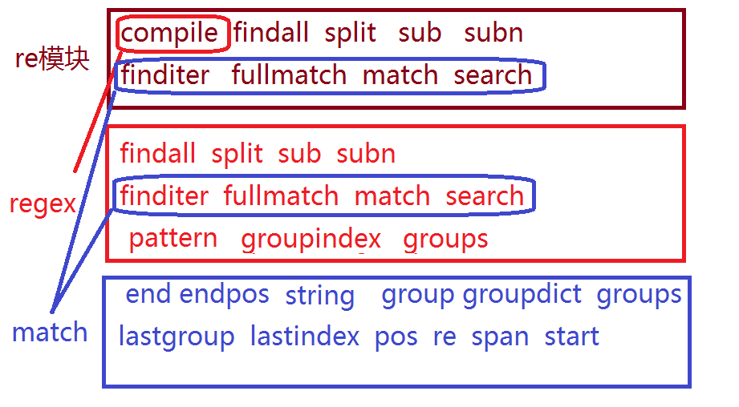

## 正则表达式

## 简介

1. 定义

> 即文本的高级匹配模式，提供搜索，替换等功能。其本质是由一系列字符和特殊符号构成的字串，这个字串即正则表达式。

2. 原理

> 通过普通字符和有特定含义的字符，来组成字符串，用以描述一定的字符串规则，比如：重复，位置等，来表达某类特定的字符串，进而匹配。

3. 目标

* 熟练掌握正则表达式元字符

* 能够读懂常用正则表达式，编辑简单的正则规则

* 能够熟练使用re模块操作正则表达式

## 元字符使用

#### ①、普通字符

* 匹配规则：每个普通字符匹配其对应的字符

```python
e.g.
In : re.findall('ab',"abcdefabcd")
Out: ['ab', 'ab']
```

* 注意事项：正则表达式在python中也可以匹配中文

#### ②、或关系

* 元字符: | 

* 匹配规则: 匹配 | 两侧任意的正则表达式即可

```python
e.g.
In : re.findall('com|cn',"www.baidu.com/www.tmooc.cn")
Out: ['com', 'cn']

```

#### ③、匹配单个字符----- . 

* 元字符： . 				------相当于通配符

* 匹配规则：匹配除换行外的任意一个字符

```python
e.g.
In : re.findall('张.丰',"张三丰,张四丰,张五丰")
Out: ['张三丰', '张四丰', '张五丰']
    
In [8]:  re.findall('...',"张三丰,张四丰,张五丰")
Out[8]: ['张三丰', ',张四', '丰,张']

```

#### ④、匹配字符集------ [字符集]

* 元字符： [字符集]

* 匹配规则: 匹配字符集中的任意一个字符

* 表达形式: 

>> [abc#!好] 表示 [] 中的任意一个字符
>> [0-9],[a-z],[A-Z] 表示区间内的任意一个字符
>> [_#?0-9a-z]  混合书写，一般区间表达写在后面

```python
e.g.
In : re.findall('[aeiou]',"How are you!")
Out: ['o', 'a', 'e', 'o', 'u']
 
In [12]: re.findall('[!a-m]',"How are you!")
Out[12]: ['a', 'e', '!']

In [10]: re.findall('[a-m]',"How are you!")
Out[10]: ['a', 'e']

```

#### ⑤、匹配字符集反集-----`[^`字符集]

* 元字符：`[^`字符集]----------------------字符集取反

* 匹配规则：匹配除了字符集以外的任意一个字符

```python
e.g.
In : re.findall('[^0-9]',"Use 007 port")
Out: ['U', 's', 'e', ' ', ' ', 'p', 'o', 'r', 't']
    
In [14]: re.findall('[^o]',"Use 007 port")
Out[14]: ['U', 's', 'e', ' ', '0', '0', '7', ' ', 'p', 'r', 't']

```

#### ⑥、匹配字符串开始位置---^

* 元字符: ^

* 匹配规则：匹配目标字符串的开头位置--------------如果能找出来代表这个字符就在这段字符的首位,否则为空.

```python
e.g.
In : re.findall('^Jame',"Jame,hello")
Out: ['Jame']
    
In [16]:  re.findall('Jame',"Jame,hello")
Out[16]: ['Jame']

In [17]:  re.findall('Jame',"hi,Jame")
Out[17]: ['Jame']

In [18]:  re.findall('^Jame',"hi,Jame")
Out[18]: []

```

#### ⑦、匹配字符串的结束位置---$

* 元字符:  $

* 匹配规则: 匹配目标字符串的结尾位置-----------------如果能找出来代表这个字符就在这段字符的末位,否则为空.

```python
e.g.
In : re.findall('Jame$',"Hi,Jame")
Out: ['Jame']
    
In [20]: re.findall('Jame$',"Hi,Jame,how are you")
Out[20]: []
    
In [21]: re.findall('^Jame$',"Hi,Jame,how are you")
Out[21]: []

In [22]: re.findall('^Jame$',"Jame")
Out[22]: ['Jame']

```

* 规则技巧: ^ 和 $必然出现在正则表达式的开头和结尾处。如果两者同时出现，则中间的部分必须匹配整个目标字符串的全部内容。


#### ⑧、匹配字符重复---*/+/?/{n}/{m,n}

* 元字符: *

* 匹配规则：匹配前面的字符出现0次或多次'ab*'-----a后面出现0个或者多个b

```python
e.g.
In : re.findall('wo*',"wooooo~~w!")
Out: ['wooooo', 'w']
    
In [25]: re.findall('o*',"wooooo~~w!")
Out[25]: ['', 'ooooo', '', '', '', '', '']
    
In [6]: re.findall('[0-9]*',"我的生日2006-8-8")
Out[6]: ['', '', '', '', '2006', '', '8', '', '8', '']


```
--------------------

* 元字符：+

* 匹配规则： 匹配前面的字符出现1次或多次

```python
e.g.
In : re.findall('[A-Z][a-z]+',"Hello World")
Out: ['Hello', 'World']
    
In [9]: re.findall('wo+',"wooooo~~w!")
Out[9]: ['wooooo']
    
In [11]: re.findall('[A-Z]',"How are you,Jame!")
Out[11]: ['H', 'J']

In [12]: re.findall('[A-Z][a-z]*',"How are you,Jame!")
Out[12]: ['How', 'Jame']

In [14]: re.findall('[A-Z][a-z]+',"How are you,A good boy,Jame!")
Out[14]: ['How', 'Jame']

In [15]: re.findall('[A-Z][a-z]*',"How are you,A good boy,Jame!")
Out[15]: ['How', 'A', 'Jame']

```
--------------------
* 元字符：?

* 匹配规则： 匹配前面的字符出现0次或1次

```python
e.g. 匹配整数
In [28]: re.findall('-?[0-9]+',"Jame,age:18, -26")
Out[28]: ['18', '-26']
          
 In [18]: re.findall('-?[0-9]+',"12,26,-38")
Out[18]: ['12', '26', '-38']
         
In [17]: re.findall('wo?',"wooooo~~w!")
Out[17]: ['wo', 'w']
    
In [20]: re.findall('-?[0-9]+/?[1-9]*',"12,26,-38,1/2,3/4")
Out[20]: ['12', '26', '-38', '1/2', '3/4']

In [21]: re.findall('-?[0-9]+/?[1-9]*',"2,12,26,-38,1/2,3/4")
Out[21]: ['2', '12', '26', '-38', '1/2', '3/4']
```

-----------------------
* 元字符：{n}

* 匹配规则： 匹配前面的字符出现n次

```python
e.g. 匹配手机号码
In : re.findall('1[0-9]{10}',"Jame:13886495728")
Out: ['13886495728']
    
 In [24]:  re.findall('1[0-9]{10}',"Wb:18706763178")
Out[24]: ['18706763178']

```
-----------------------
* 元字符：{m,n}

* 匹配规则： 匹配前面的字符出现m-n次

```python
e.g. 匹配qq号
In : re.findall('[1-9][0-9]{5,10}',"Baron:1259296994") 
Out: ['1259296994']
    
In [27]:  re.findall('wo{5,10}',"woooooooo~~w!") 
Out[27]: ['woooooooo']
    
In [29]:  re.findall('[1-9][0-9]{4,10}',"10001,453355686") 
Out[29]: ['10001', '453355686']
```

#### ⑨、匹配任意（非）数字字符---- \d   \D

* 元字符： \d   \D       digital：adj，数字的

* 匹配规则：\d 匹配任意数字字符，\D 匹配任意非数字字符

```python
e.g. 匹配端口
In : re.findall('\d{1,5}',"Mysql: 3306, http:80")
Out: ['3306', '80']
    
In [31]: re.findall('\D{1,5}',"Mysql: 3306, http:80")
Out[31]: ['Mysql', ': ', ', htt', 'p:']
    
In [32]: re.findall('\D+',"Mysql: 3306, http:80")
Out[32]: ['Mysql: ', ', http:']

```

#### ⑩、匹配任意（非）普通字符---\w   \W

* 元字符： \w   \W       w:  word

* 匹配规则: \w 匹配普通字符，\W 匹配非普通字符

* 说明: 普通字符指数字，字母，下划线，汉字。

```python
e.g.
In : re.findall('\w+',"server_port = 8888")
Out: ['server_port', '8888']
    
In [34]: re.findall('\w+',"server,こんばんは")
Out[34]: ['server', 'こんばんは']
In [34]: re.findall('\w+',"server,こんばんは")
Out[34]: ['server', 'こんばんは']
```

#### ⑪、匹配任意（非）空字符--- \s   \S

* 元字符： \s   \S

* 匹配规则: \s 匹配空字符，\S 匹配非空字符

* 说明：空字符指: 空格 \r (回车符),\n ,\t ,\v(垂直制表符) ,\f(换页符) 等字符

```python
e.g.
In : re.findall('\w+\s+\w+',"hello    world")
Out: ['hello    world']\

In [2]: re.findall('\S','hello    world')
Out[2]: ['h', 'e', 'l', 'l', 'o', 'w', 'o', 'r', 'l', 'd']
```

#### ⑫、匹配开头结尾位置---\A ==^,  \Z==$

* 元字符： \A ==^,  \Z==$

* 匹配规则： \A 表示开头位置，\Z 表示结尾位置

#### ⑬、匹配（非）单词的边界位置--- \b   \B

* 元字符： \b   \B

* 匹配规则： \b 表示单词边界，\B 表示非单词边界

* 说明：单词边界指数字字母(汉字)下划线与其他字符的交界位置。

```python
e.g.
In : re.findall(r'\bis\b',"This is a test.")
Out: ['is']
    
In [4]: re.findall('is',"This is a test.")
Out[4]: ['is', 'is']
    
不加r的结果:
In [5]: re.findall('\bis\b',"This is a test.")
Out[5]: []
    
找到this中的is:
In [7]: re.findall(r'\Bis\b',"This is a test.")
Out[7]: ['is']
```

| 类别     | 元字符                         |
| ------     | :-------------                   |
| 匹配字符  | . [...][^...] \d \D \w \W \s \S |
| 匹配重复 | * +  ?  {n}  {m,n}               |
| 匹配位置 | 开头:^  结尾:$  开头结尾:\A  \Z  边界:\b   \B |
| 其他     | `|`   ()    \                      |

```python
在线练习地址： http://tool.chinaz.com/regex/
```

综合练习:

```python
'''
1.匹配数字:
        12 1.6 -1.5 -32 46.8%  1/2
2.匹配邮箱:
        xxx@xxxx.com
        xxx@xxx.cm
3.匹配大写字母开头单词
        Hello CBD I iPython
'''
import re
# 1.匹配数字:
#         12 1.6 -1.5 -32 46.8%  1/2
re01=re.findall('-?\d+\.?/?\d*%?','12 1.6 -1.5 -32 46.8%  1/2')
print(re01)
re02=re.findall(r'\b[A-Z]+[a-z]*\b','Hello CBD I iPython')
print(re02)
# -------------------------------------------------->
# 目标字符串
s="Alex:1997,Sunny:1999"
# 正则表达式
pattern=r"(\w+):\d+"
#
l=re.findall(pattern,s)
print(l)
# ----------------------------------------------------->
#
regex=re.compile(pattern)
l=regex.findall(s,0,12)   #s[0:12]作为匹配目标
print(l)
# ------------------------------------------------------->
# 分割字符串
l=re.split(r'[:,]',s)
print(l)
# ------------------------------------------------------->
l=re.split(r'[:,]',s,2)
print(l)
# 字符串替换
s=re.sub(r':','-',s,1)
print(s)
# -------------------------------------------------------->
s="今年是2019年12月10日,"\
  "2019年初的目标实现了吗,"\
  "保持95斤的愿望还记得吗"
pattern=r'\d+'
# 获取匹配内容的迭代器
result=re.finditer(pattern,s)
for i in result:
    # 迭代得到每处匹配内容的match对象
    print(i.group())  #通过group可获取match对应的值
# --------------------------------------------------------->
#完全匹配
obj=re.fullmatch('\w+',s)
print(obj)
obj=re.fullmatch('.+',s)
print(obj)
# --------------------------------------------------------->
# 匹配开始位置
obj=re.match('\w+',s)
print(obj.group())
# --------------------------------------------------------->
# 匹配第一处
obj=re.search('\d+',s)
print(obj.group())
# --------------------------------------------------------->
'''
match对象说明
'''
pattern=r'(ab)cd(?P<pig>ef)'
regex=re.compile(pattern)
obj=regex.search("abcdefgh123") #得到match对象
# 属性变量
print(obj.pos)          		 #目标字符串开始位置----0
print(obj.endpos)       	#目标字符串结束位置---11
print(obj.lastgroup)       #最后一组名------pig
print(obj.lastindex)        #最后一组序号-----2
# 属性方法
print(obj.span())       		#匹配内容的起止位置-------(0, 6)
print(obj.start())      	 	 #获取匹配内容的开始位置----0
print(obj.end())       	    	 #获取匹配内容的结束位置----6
print(obj.groupdict())     #获取捕获组字典，组名为键，对应内容为值-----{'pig': 'ef'}
print(obj.groups())     	  #获取子组对应内容---------('ab', 'ef')
print(obj.group())             #match对象所对应的内容----abcdef
print(obj.group(1))       	  #第一组对应内容----ab
print(obj.group('pig'))  	#组名对应内容------ef
# ------------------------------------------------------------>
import os
s="""Hello
北京"""
# 只匹配ascii
regex=re.compile(r'\w+',flags=re.A)
l=regex.findall(s)
print(l)
# 不区分字母大小写
regex=re.compile(r'[a-z]+',flags=re.I)
l=regex.findall(s)
print(l)
#
regex=re.compile('.+',flags=re.S)
l=regex.findall(s)
print(l)
#
regex=re.compile('^北京',flags=re.M)
l=regex.findall(s)
print(l)
# --------------------------------------------------->
```


## 正则表达式的转义

1. 如果使用正则表达式匹配特殊字符则需要加 \ 表示转义。

>>特殊字符: . * + ? ^ $ [] () {} | \

```python
e.g. 匹配特殊字符 . 时使用 \. 表示本身含义
In : re.findall('-?\d+\.?\d*',"123,-123,1.23,-1.23")
Out: ['123', '-123', '1.23', '-1.23']
    
In [12]: print("\\$\\d+")
\$\d+

In [13]: print("\$\d+")
\$\d+

In [16]: re.findall('\\$\\d+','日薪:$120')
Out[16]: ['$120']
```

2. 在编程语言中，常使用原生字符串(原生字符串指的就是字节串,前面+r即可)书写正则表达式避免多重转义的麻烦。

```python
e.g.
python字符串  -->    正则    -->    目标字符串
"\\$\\d+"   解析为   \$\d+   匹配   "$100"

"\\$\\d+"  等同于  r"\$\d+"
```

## 贪婪模式和非贪婪模式

1. 定义

>贪婪模式: 默认情况下，匹配重复的元字符总是尽可能多的向后匹配内容。比如: *  +  ?  {m,n}

>非贪婪模式(懒惰模式): 让匹配重复的元字符尽可能少的向后匹配内容。

2. 贪婪模式转换为非贪婪模式

* 在匹配重复元字符后加 '?' 号即可
```python
*  :  *?
+  :  +?
?  :  ??
{m,n} : {m,n}?
```
```python
e.g.
In : re.findall(r'\(.+?\)',"(abcd)efgh(higk)")
Out: ['(abcd)', '(higk)']

In [26]: re.findall(r'ab??','abbbbbbbbbbbbbbbbbbbbbbbbbc')
Out[26]: ['a']

In [27]: re.findall(r'ab{3,5}','abbbbbbbbbbbbbbbbbbbbbbbbbc')
Out[27]: ['abbbbb']

In [28]: re.findall(r'ab{3,5}?','abbbbbbbbbbbbbbbbbbbbbbbbbc')
Out[28]: ['abbb']
    
In [33]: re.findall(r'\[.+?\]','张三[国务院办公厅6处--处长],李四[Zerb chairman CEO]')
Out[33]: ['[国务院办公厅6处--处长]', '[Zerb chairman CEO]']

```

## 正则表达式分组

1. 定义

> 在正则表达式中，以()建立正则表达式的内部分组，子组是正则表达式的一部分，可以作为内部整体操作对象。

2. 作用

* 可以被作为整体操作，改变元字符的操作对象

```python
e.g.  改变 +号 重复的对象
In : re.search(r'(ab)+',"ababababab").group()
Out: 'ababababab'

e.g. 改变 |号 操作对象
In : re.search(r'(王|李)\w{1,3}',"王者荣耀").group()
Out: '王者荣耀'
```

* 可以通过编程语言某些接口获取匹配内容中，子组对应的内容部分

```python
e.g. 获取url协议类型
re.search(r'(https|http|ftp|file)://\S+',"https://www.baidu.com").group(1)      #1代表第一组
```

3. 捕获组

可以给正则表达式的子组起一个名字，表达该子组的意义。这种有名称的子组即为**捕获组**。

>**格式**：`(?P<name>pattern)`

```python
e.g. 给子组命名为 "pig"
In : re.search(r'(?P<pig>ab)+',"ababababab").group('pig')
Out: 'ab'
```

4. 注意事项

* 一个正则表达式中可以包含多个子组
* 子组可以嵌套，但是不要重叠或者嵌套结构复杂
* 子组序列号一般从外到内，从左到右计数


## 正则表达式匹配原则

1. 正确性,能够正确的匹配出目标字符串.
2. 排他性,除了目标字符串之外尽可能少的匹配其他内容.
3. 全面性,尽可能考虑到目标字符串的所有情况,不遗漏.

## Python re模块使用

----------------------

#### ①、regex.compile()

```python
 regex = re.compile(pattern,flags = 0)
 功能: 生产正则表达式对象
 参数: pattern  正则表达式
      flags  功能标志位,扩展正则表达式的匹配
 返回值: 正则表达式对象
```
------------------------
#### ②、re.findall()

```python
 re.findall(pattern,string,flags = 0)
 功能: 根据正则表达式匹配目标字符串内容
 参数: pattern  正则表达式
      string 目标字符串
      flags  功能标志位,扩展正则表达式的匹配
 返回值: 匹配到的内容列表,如果正则表达式有子组则只能获取到子组对应的内容
```
------------------------
#### ③、regex.findall()

```python
 regex.findall(string,pos,endpos)
 功能: 根据正则表达式匹配目标字符串内容
 参数: string 目标字符串
      pos 截取目标字符串的开始匹配位置
      endpos 截取目标字符串的结束匹配位置
 返回值: 匹配到的内容列表,如果正则表达式有子组则只能获取到子组对应的内容
```
------------------------
#### ④、re.split()

 ```python
 re.split(pattern,string,max，flags = 0)
 功能: 使用正则表达式匹配内容,切割目标字符串
 参数: pattern  正则表达式
      string 目标字符串
      max 最多切割几部分
      flags  功能标志位,扩展正则表达式的匹配
 返回值: 切割后的内容列表
 ```
------------------------
#### ⑤、re.sub()

```python
 re.sub(pattern,replace,string,count,flags = 0)
 功能: 使用一个字符串替换正则表达式匹配到的内容
 参数: pattern  正则表达式
      replace  替换的字符串
      string 目标字符串
      count  最多替换几处,默认替换全部
      flags  功能标志位,扩展正则表达式的匹配
 返回值: 替换后的字符串
```
---------------------

#### ⑥、re.finditer()

```python
 re.finditer(pattern,string,flags = 0)
 功能: 根据正则表达式匹配目标字符串内容
 参数: pattern  正则表达式
      string 目标字符串
      flags  功能标志位,扩展正则表达式的匹配
 返回值: 匹配结果的迭代器
```
------------------------
#### ⑦、re.fullmatch()

```python
re.fullmatch(pattern,string,flags=0)
功能：完全匹配某个目标字符串
参数：pattern 正则
	string  目标字符串
返回值：匹配内容match object
```
------------------------
#### ⑧、re.match()

```python
re.match(pattern,string,flags=0)
功能：匹配某个目标字符串开始位置
参数：pattern 正则
	string  目标字符串
返回值：匹配内容match object
```
------------------------
#### ⑨、re.search()

```python
re.search(pattern,string,flags=0)
功能：匹配目标字符串第一个符合内容
参数：pattern 正则
	string  目标字符串
返回值：匹配内容match object
```
------------------------

案例：

```python
"""
regex.py  re模块功能演示
"""
import re

# 目标字符串
s = "Alex:1997,Sunny:1999"
# 正则表达式
pattern = r"(\w+):(\d+)"

# re模块调用
l = re.findall(pattern,s)
print(l)

# compile对象
regex = re.compile(pattern)
l = regex.findall(s,0,12) # s[0:12]作为匹配目标
print(l)

# 分割字符串
l = re.split(r'[:,]',s,2)
print(l)

# 字符串替换
s = re.sub(r':','-',s,1)
print(s)
```

```python
"""
正则演示2  生产match对象
"""
import re

s = "今年是2019年12月10日，" \
    "2019年初的目标实现了么，" \
    "保持95斤的愿望还记得么"
pattern = r'\d+'

# 获取匹配内容的迭代器
# result = re.finditer(pattern,s)
# for i in result:
#     # 迭代得到每处匹配内容的match对象
#     print(i.group()) # 获取match对象对应数值


# 完全匹配
# obj = re.fullmatch('.+',s)
# print(obj.group())

# 匹配开始位置
obj = re.match('\w+',s)
print(obj.group())

# 匹配第一处
obj = re.search('\d+',s)
print(obj.group())
```

### match对象的属性方法

1. 属性变量
	
* pos   匹配的目标字符串开始位置
* endpos  匹配的目标字符串结束位置
* lastgroup  最后一组的名称
* lastindex  最后一组的序号
	
2. 属性方法
	
* span()  获取匹配内容的起止位置

* start() 获取匹配内容的开始位置

* end()   获取匹配内容的结束位置

* groupdict()  获取捕获组字典，组名为键，对应内容为值

* groups() 获取子组对应内容
  
* group(n = 0)

	  功能：获取match对象匹配内容
	  参数：默认为0表示获取整个match对象内容，如果是序列号或者组名则表示获取对应子组内容
	  返回值：匹配字符串



***参考代码day11/regex2.py***

```python
"""
match对象说明
"""
import re

pattern = r'(ab)cd(?P<pig>ef)'
regex = re.compile(pattern)
obj = regex.search("abcdefgh123",0,9)# match对象

# 属性变量
print(obj.pos) #目标字符串开始位置
print(obj.endpos) #目标字符串结束位置
print(obj.lastgroup) # 最后一组名
print(obj.lastindex) # 最后一组序号

print("==============================")
# 属性方法
print(obj.span()) # 匹配内容的起止位置
print(obj.start()) #s[start():end()]
print(obj.end())
print(obj.groupdict()) # 捕获组字典
print(obj.groups()) # 子组对应内容
print(obj.group()) # match对象对应内容
print(obj.group(1))
print(obj.group('pig'))
```


### flags参数扩展

  1. 使用函数：re模块调用的匹配函数。如：re.compile,re.findall,re.search....

  2. 作用：扩展丰富正则表达式的匹配功能

  3. 常用flag
	
> A == ASCII  元字符只能匹配ascii码

> I == IGNORECASE  匹配忽略字母大小写

> S == DOTALL  使 . 可以匹配换行

> M == MULTILINE  使 ^  $可以匹配每一行的开头结尾位置

  4. 使用多个flag

     方法：使用按位或连接  
       e.g. ：  flags = re.I | re.A

     ***参考代码day11/flags.py***

     ```python
     """
     flags 功能扩展示例
     """
     import re
     
     s = """Hello
     北京
     """
     # 只匹配ascii
     # regex = re.compile(r'\w+',flags=re.A)
     
     # 不区分大小写
     # regex=re.compile(r'[a-z]+',flags=re.I)
     
     # . 可以匹配换行
     # regex = re.compile(".+",flags=re.S)
     
     # ^ $ 匹配每行开头结尾位置
     regex=re.compile("^\w+",flags=re.M)
     
     l = regex.findall(s)
     print(l)
     ```

     ***参考代码day11/exercise.py***

     ```python
     """
     编写一个函数，传入端口名称，返回
     这个端口描述信息中，对应的address值
     
       * 段与段之前有空行
       * 每段首单词是端口名
     """
     import re
     
     def get_address(port):
         f = open("exc.txt")
         while True:
             # 搞到每一段
             data = ""
             for line in f:
                 if line == '\n':
                     break
                 data += line
             # 文件结尾
             if not data:
                 return "没有该端口"
             # 获取首个单词
             obj = re.match(r"\S+",data)
             if port == obj.group():
                 # 找到目标段
                 # pattern = r"[0-9a-f]{4}\.[0-9a-f]{4}\.[0-9a-f]{4}"
                 pattern =r"(\d{1,3}\.){3}\d{1,3}/\d{1,3}|Unknow"
                 obj = re.search(pattern,data)
                 if obj:
                     return obj.group()
     if __name__ == '__main__':
         print(get_address('TenGigE0/0/2/3'))
     ```


